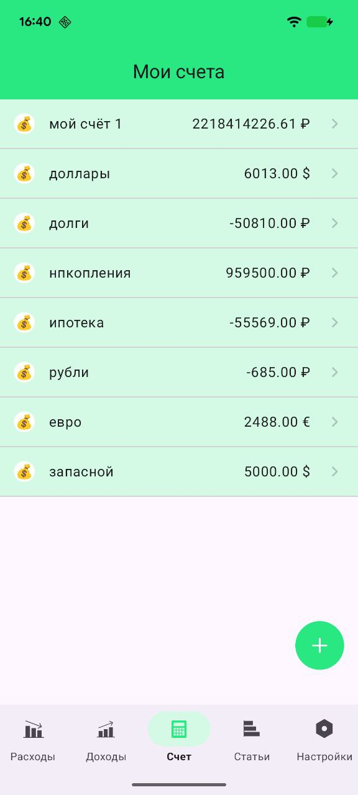
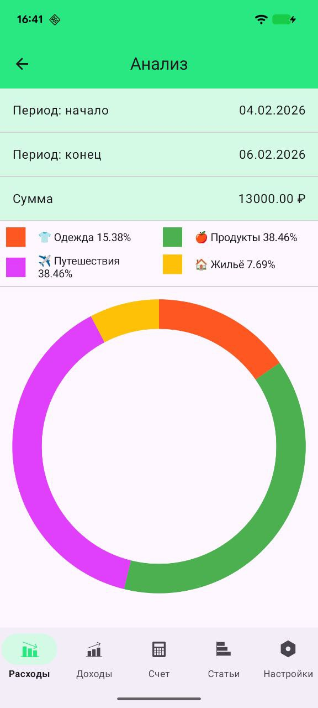
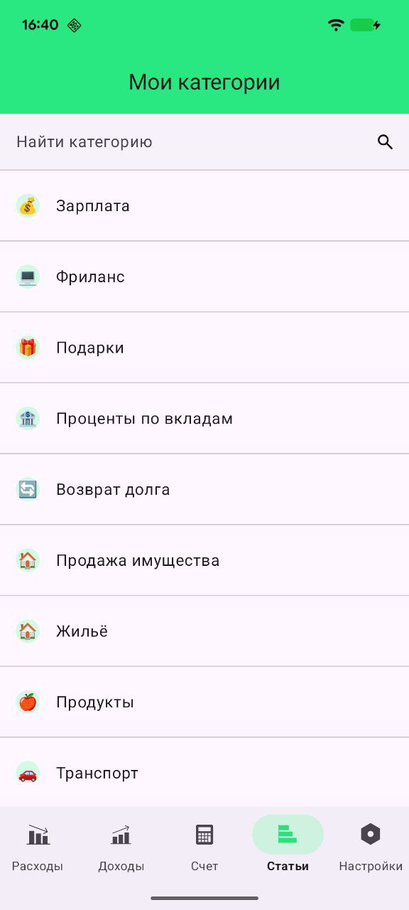
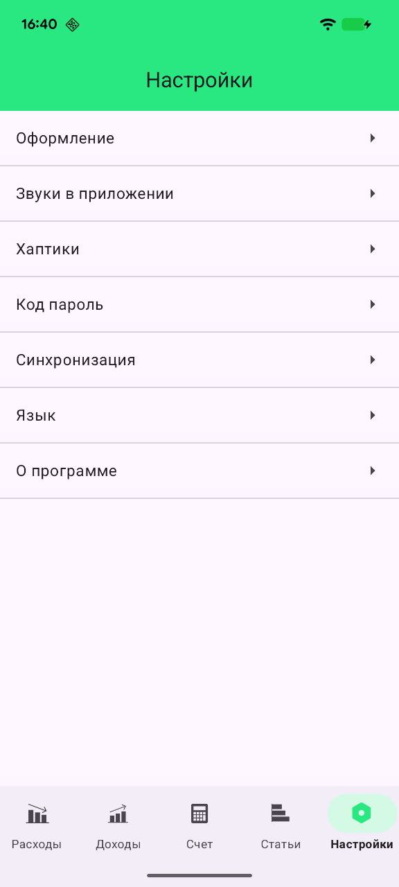

# Finance Manager 🚧 [Work in progress] 🚧

Android‑приложение для учёта личных финансов: доходы, расходы, счета, категории,
история операций, синхронизация и базовая аналитика. Проект задуман как pet‑project,
который показывает продуманную архитектуру, работу с данными и современные Android‑подходы.

## Documentation

Полная документация находится в папке `docs/`:

- [docs](./docs/README.md)

---

## Screenshots

| Expenses                        | My Accounts                     | Analytics                        | Category                        | Settings                        |
|---------------------------------|---------------------------------|----------------------------------|---------------------------------|---------------------------------|
|  |  |  |  |  |

---

## Features

- **Учёт транзакций**
    - Добавление доходов и расходов
    - Привязка к счетам и категориям
    - История операций

- **Счета и категории**
    - Управление счетами (баланс, валюта)
    - Предопределённые категории

- **Статистика и анализ**
    - Сводка по периодам
    - Анализ по категориям и счетам

- **Синхронизация**
    - Фоновая синхронизация через WorkManager (`:sync`)
    - Гибкая настройка интервала синка

- **Персонализация**
    - Тема оформления и дизайн‑настройки (`feature:design-app`)
    - Локаль / язык (`feature:languages`)
    - Вибрация и звуки (`feature:haptics`, `feature:sounds`)

- **Безопасность**
    - Модуль безопасности (`feature:security`) с PIN / биометрией
    - Работа через токен API

---

## Tech Stack

- **Язык**: Kotlin
- **UI**: Jetpack Compose (Material 3, кастомные компоненты в `core:uikit`)
- **Архитектура**:
    - Clean Architecture
    - MVVM (ViewModel + UiState)
    - Мультимодульная структура (core / feature)
- **DI**: Dagger Hilt
- **Асинхронность**: Coroutines + Flow
- **Локальное хранилище**:
    - Room (`FinanceManagerDatabase`)
    - DataStore
- **Сеть**:
    - Retrofit + OkHttp
    - Кастомные Interceptor’ы (Auth, Retry, NetworkConnection, Logging)
- **Фоновая работа**: WorkManager (синхронизация)
- **Качество кода**:
    - Detekt + свои правила
    - Android Lint + модуль `:lint` с кастомными чекерами
    - ktlint

## Задачи и планы

Задачи, баги и идеи ведутся на [доске задач](https://github.com/users/IliaVoskoboinikov/projects/5).
Путь к первому релизу — [milestone «v1.0 — Google Play»](https://github.com/IliaVoskoboinikov/Finance-Manager/milestone/1),
порядок работ записан в его описании. Как устроен процесс — [docs/task-tracking.md](./docs/task-tracking.md).

Продуктовые планы после релиза: [экспорт](https://github.com/IliaVoskoboinikov/Finance-Manager/issues/114)
и [импорт](https://github.com/IliaVoskoboinikov/Finance-Manager/issues/115) данных,
[подробная аналитика](https://github.com/IliaVoskoboinikov/Finance-Manager/issues/116),
[онбординг](https://github.com/IliaVoskoboinikov/Finance-Manager/issues/117),
[бюджеты по категориям](https://github.com/IliaVoskoboinikov/Finance-Manager/issues/118),
[мультивалютность](https://github.com/IliaVoskoboinikov/Finance-Manager/issues/62).

