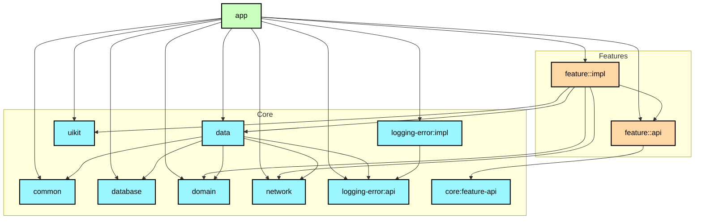

# `:app`

## Module dependency graph

Упрощённая диаграмма.

```mermaid

graph TB
    subgraph Core
        direction TB
        common[common]:::library
        database[database]:::library
        data[data]:::library
        domain[domain]:::library
        network[network]:::library
        uikit[uikit]:::library
        logging_api[logging-error:api]:::library
        logging_impl[logging-error:impl]:::library
        core_feature_api[core:feature-api]:::library
    end

    subgraph Features
        direction TB
        feature_api[feature:<name>:api]:::feature
        feature_impl[feature:<name>:impl]:::feature
    end

    app[app]:::app

%% App зависит на Core
    app --> common
    app --> database
    app --> data
    app --> domain
    app --> network
    app --> uikit
    app --> logging_api
    app --> logging_impl

%% App зависит на Features
    app --> feature_api
    app --> feature_impl

%% Feature паттерн
    feature_api --> core_feature_api
    feature_impl --> feature_api
    feature_impl --> data
    feature_impl --> domain
    feature_impl --> network
    feature_impl --> uikit

%% Core взаимозависимости
    data --> common
    data --> database
    data --> network
    data --> domain
    data --> logging_api

    logging_impl --> logging_api

    classDef app fill:#CAFFBF,stroke:#000,stroke-width:2px,color:#000;
    classDef feature fill:#FFD6A5,stroke:#000,stroke-width:2px,color:#000;
    classDef library fill:#9BF6FF,stroke:#000,stroke-width:2px,color:#000;


```