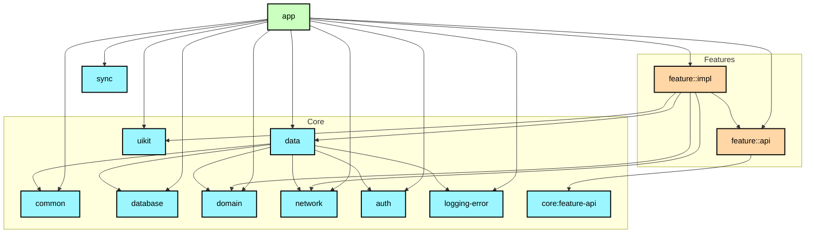

# `:app`

## Responsibility

Корневой модуль приложения — собирает все модули вместе:

- `App` (`@HiltAndroidApp`) и `MainActivity` (`@AndroidEntryPoint`) — точки входа.
- `presenter/navigation/RootNavGraph.kt` и `BottomNavGraph.kt` — корневой навигационный
  граф: внедряет `FeatureApi` всех фич через Hilt и вызывает их `registerGraph(...)`,
  так что фичи не ссылаются на экраны друг друга напрямую.
- `di/AppModule` и `db/DataBaseProviderModule` — app-уровневая DI-конфигурация.
- Конфигурация сборки: подпись, manifest-плейсхолдеры Yandex OAuth
  (`YANDEX_CLIENT_ID` из `local.properties` / CI-секрета, см. `:feature:auth:impl`).

`:app` зависит от всех `:core:*`, всех `:feature:*:api`/`:feature:*:impl` и `:sync`.
Граф модулей проверяется задачей `./gradlew :app:assertModuleGraph`.

## Module dependency graph

Упрощённая диаграмма.

