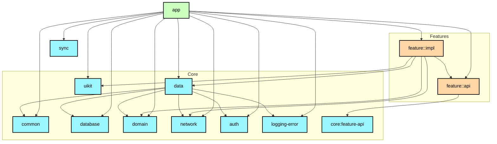

# `:app`

## Responsibility

Корневой модуль приложения — собирает все модули вместе:

- `App` (`@HiltAndroidApp`) и `MainActivity` (`@AndroidEntryPoint`) — точки входа.
- `presenter/navigation/RootNavGraph.kt` и `BottomNavGraph.kt` — корневой навигационный
  граф: внедряет `FeatureApi` всех фич через Hilt и вызывает их `registerGraph(...)`,
  так что фичи не ссылаются на экраны друг друга напрямую.
- `di/` — app-уровневая DI-конфигурация (`AppModule`, сборка графа фич).
- Доступ к локальным данным: `App` читает ключи базы до всего остального
  (`InitializeLocalDataUseCase`), `MainActivity` строит главный экран только при открытых данных
  (замок уровня PIN, экран потери ключа), ставит `FLAG_SECURE` до первого кадра;
  `lifecycle/LocalDataAutoLock` закрывает базу уровня PIN через 5 минут в фоне. См.
  [docs/encryption.md](../docs/encryption.md).
- Бэкапы: `res/xml/data_extraction_rules.xml` и `backup_rules.xml` исключают все данные из
  облачного бэкапа и переноса между устройствами.
- Конфигурация сборки: подпись, manifest-плейсхолдеры Yandex OAuth
  (`YANDEX_CLIENT_ID` из `local.properties` / CI-секрета, см. `:feature:auth:impl`).

`:app` зависит от всех `:core:*`, всех `:feature:*:api`/`:feature:*:impl` и `:sync`.
Граф модулей проверяется задачей `./gradlew :app:assertModuleGraph`.

## Module dependency graph

Упрощённая диаграмма.

```mermaid

graph TB
    subgraph Core
        direction TB
        common[common]:::library
        database[database]:::library
        data[data]:::library
        domain[domain]:::library
        network[network]:::library
        uikit[uikit]:::library
        auth[auth]:::library
        logging_error[logging-error]:::library
        core_feature_api[core:feature-api]:::library
    end

    subgraph Features
        direction TB
        feature_api[feature:<name>:api]:::feature
        feature_impl[feature:<name>:impl]:::feature
    end

    app[app]:::app
    sync[sync]:::library

%% App зависит на Core
    app --> common
    app --> database
    app --> data
    app --> domain
    app --> network
    app --> uikit
    app --> auth
    app --> logging_error
    app --> sync

%% App зависит на Features
    app --> feature_api
    app --> feature_impl

%% Feature паттерн
    feature_api --> core_feature_api
    feature_impl --> feature_api
    feature_impl --> data
    feature_impl --> domain
    feature_impl --> network
    feature_impl --> uikit

%% Core взаимозависимости
    data --> common
    data --> database
    data --> network
    data --> domain
    data --> auth
    data --> logging_error


    classDef app fill:#CAFFBF,stroke:#000,stroke-width:2px,color:#000;
    classDef feature fill:#FFD6A5,stroke:#000,stroke-width:2px,color:#000;
    classDef library fill:#9BF6FF,stroke:#000,stroke-width:2px,color:#000;


```
