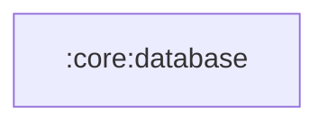

# `:core:database`

## Responsibility

Слой работы с базой данных приложения.

## Таблицы

| Таблица | Назначение |
|---|---|
| `transactions`, `account`, `category`, `currency` | доменные данные, Room — единственный источник истины |
| `outbox` | очередь исходящих операций: что нужно отправить на сервер, со статусом, счётчиком попыток и снимком запроса |

Очередь `outbox` наполняется **в той же Room-транзакции**, что и доменное изменение, поэтому
запись данных и намерение их отправить фиксируются атомарно. Дизайн и жизненный цикл записи —
[docs/outbox.md](../../docs/outbox.md), гарантии доставки — [docs/idempotency.md](../../docs/idempotency.md).

> Версия схемы (`@Database(version = …)`) обязана быть строго больше `user_version` прешипнутого
> ассета `category_db.db` (= 1). Любое изменение схемы — включая новую таблицу — требует поднятия
> версии.

## Module dependency graph

<!--region graph-->

