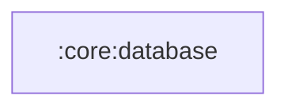

# `:core:database`

## Responsibility

Слой работы с базой данных приложения.

## Таблицы

| Таблица | Назначение |
|---|---|
| `transactions`, `account`, `category`, `currency` | доменные данные, Room — единственный источник истины |
| `outbox` | очередь исходящих операций: что нужно отправить на сервер, со статусом, счётчиком попыток и снимком запроса |

Очередь `outbox` наполняется **в той же Room-транзакции**, что и доменное изменение, поэтому
запись данных и намерение их отправить фиксируются атомарно. Дизайн и жизненный цикл записи —
[docs/outbox.md](../../docs/outbox.md), гарантии доставки — [docs/idempotency.md](../../docs/idempotency.md).

## Шифрование и доступ к базе

Файл базы всегда зашифрован SQLCipher (`SqlCipherDatabaseFactory`, готовый ключ `x'…'` —
`RawKey`). Базу можно закрыть (уровень PIN, автоблокировка, стирание), поэтому DAO не
инжектятся: доступ — через `DatabaseHolder` (`RoomDatabaseHolder`):

- `withDatabase { }` — разовая операция с арендой: база не закроется посреди неё;
- `observe { }` — поток, который молчит, пока база закрыта, и переподписывается после открытия.

Модуль ключей не знает — холдер получает готовые байты; ключами управляет `:core:data`. Провайдер
холдера тоже в `:core:data` (ему нужен `@IoDispatcher`). Дизайн —
[docs/encryption.md](../../docs/encryption.md).

## Схема, засев и миграции

- Схемы выгружаются Room Gradle plugin в `schemas/` (базовая — v8). Любое изменение схемы —
  включая новую таблицу или индекс — требует поднятия версии, `Migration(n, n + 1)` в
  `DatabaseMigrations.ALL` и теста в `MigrationTest`. Деструктивного отката при повышении версии
  нет.
- 24 категории по умолчанию засеваются кодом при создании базы (`SeedDatabaseCallback`,
  `DefaultCategories`) — прешипнутого ассета больше нет. Все сборщики базы, включая тестовые,
  используют `withAppDefaults()`.
- `DatabaseFiles` распознаёт незашифрованный файл от сборок до шифрования.

Инструментальные тесты (`src/androidTest`) — на настоящем SQLCipher:
`./gradlew :core:database:connectedDebugAndroidTest`.

## Module dependency graph

<!--region graph-->

```mermaid
---
config:
  layout: elk
  elk:
    nodePlacementStrategy: SIMPLE
---
graph TB
    :core:database 

    classDef android-library fill:#9BF6FF,stroke:#000,stroke-width:2px,color:#000;
```