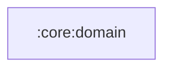

# `:core:domain`

## Responsibility

Бизнес-логика и модели предметной области приложения.

Доступ к локальным данным описан без Android и без ключей: `LocalDataState` (открыты, заперты
PIN-кодом, ключ утерян), `DataProtectionLevel`, результаты разблокировки и смены защиты,
репозитории `LocalDataAccessRepository` и `DataProtectionRepository`. Реализации — в
`:core:data`, дизайн — [docs/encryption.md](../../docs/encryption.md).

## Module dependency graph

<!--region graph-->

