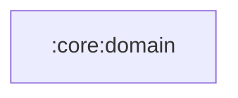

# `:core:domain`

## Responsibility

Бизнес-логика и модели предметной области приложения.

## Module dependency graph

<!--region graph-->

```mermaid
---
config:
  layout: elk
  elk:
    nodePlacementStrategy: SIMPLE
---
graph TB
    :core:domain

    classDef android-library fill:#9BF6FF,stroke:#000,stroke-width:2px,color:#000;
```