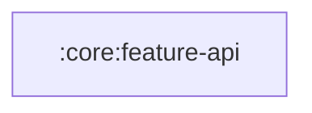

# `:core:feature-api`

## Responsibility

Контракт навигации между фичами:

- `FeatureApi` — интерфейс, который реализует каждая фича (`route` + `registerGraph(...)`);
  модуль `app` внедряет реализации через Hilt и собирает из них корневой навигационный граф.
- `RouteScope` — типобезопасный билдер маршрутов вместо ручной конкатенации строк.
- `NavExt` — навигационные расширения.

От этого модуля зависят все `:feature:*:api`.

## Module dependency graph

<!--region graph-->

