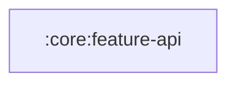

# `:core:feature-api`

## Responsibility

Контракт навигации между фичами поверх **Navigation 3**:

- `FeatureApi` — интерфейс, который реализует каждая фича (`key` + `registerEntries(...)`);
  модуль `app` внедряет реализации через Hilt и собирает из них общий `entryProvider`.
- `Navigator` — операции навигации, доступные фиче (`goTo` / `back`). Реализуется в `app`,
  поэтому фича не знает, как устроен back stack (общий он или отдельный на каждую вкладку).
- `NavExt` — расширение `EntryProviderScope<NavKey>.register(featureApi, ...)`.

Ключи экранов (`NavKey`) объявляются в `:feature:*:api` и обязаны быть `@Serializable` —
по ним Navigation 3 восстанавливает back stack после смерти процесса. Подробнее:
[`docs/navigation3.md`](../../docs/navigation3.md).

От этого модуля зависят все `:feature:*:api`.

## Module dependency graph

<!--region graph-->

```mermaid
---
config:
  layout: elk
  elk:
    nodePlacementStrategy: SIMPLE
---
graph TB
    :core:feature-api

    classDef android-library fill:#9BF6FF,stroke:#000,stroke-width:2px,color:#000;
```
