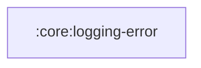

# `:core:logging-error`

## Responsibility

Логирование нефатальных ошибок: интерфейс `ErrorLogger` и его реализация
`CrashlyticsLogger` (Firebase Crashlytics, подключается через `CrashlyticsModule`).

В сообщения нельзя передавать PII, credentials и токены (см. `docs/agents/security.md`).

## Module dependency graph

<!--region graph-->

