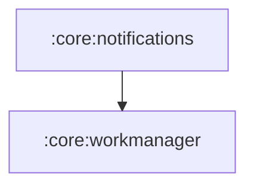

# `:core:notifications`

## Responsibility

Пользовательские уведомления приложения: показ локальных уведомлений, напоминание о
неактивности и приём push-сообщений Firebase Cloud Messaging.

Не путать с `SyncNotifications` из `:sync` — там служебное foreground-уведомление
синхронизации со своим каналом. Здесь канал `finance_manager_general` и всё, что видит
пользователь по смыслу «сообщение от приложения».

## Устройство

| Компонент | Роль |
|---|---|
| `NotificationHelper` | Показ уведомления. Сам создаёт канал и молча пропускает показ без разрешения. |
| `NotificationMessage` / `NotificationIds` | Модель уведомления и реестр id. |
| `InactivityReminderScheduler` | Взвод напоминания «вы давно не заходили». |
| `InactivityWorker` | `@HiltWorker`, показывающий это напоминание. |
| `FinanceFcmService` | Приём пушей. |
| `PushSubscriptionManager` | Подписка на topic рассылок. |

### Напоминание о неактивности

Отсчёт идёт от **последнего выхода приложения на передний план**: `MainActivity`
подписан на `ProcessLifecycleOwner` и на `ON_START` дёргает
`InactivityReminderScheduler.onUserActive()`, который перевзводит одноразовую
отложенную задачу (`ExistingWorkPolicy.REPLACE`, задержка `INACTIVITY_THRESHOLD_DAYS`).

### Push

`FinanceFcmService` читает и `notification`, и `data` payload: для notification-сообщений
система вызывает `onMessageReceived` только когда приложение на переднем плане, для
data-сообщений — всегда. Id уведомления выводится из `messageId`, чтобы разные пуши не
затирали друг друга в шторке.

**Модель адресации — широковещательная.** Устройство подписывается на topic `all`
(`PushSubscriptionManager`), чтобы рассылку «всем пользователям» мог слать бэкенд одним
запросом FCM HTTP v1 на `/topics/all`, не храня базу токенов. Firebase Console шлёт всем
и без topic — она адресует по app ID.

Адресная доставка на конкретное устройство (по device-token) — отдельный сценарий, он
намеренно не реализован: у бэкенда нет ручки регистрации токена. Что для него нужно
сделать на обеих сторонах — в [`docs/notifications.md`](../../docs/notifications.md).

### Разрешение

`POST_NOTIFICATIONS` объявлено в манифесте модуля, запрашивается в `MainActivity` на
Android 13+. Отказ — штатный сценарий: `NotificationHelper` тихо пропускает показ.

## Module dependency graph

<!--region graph-->

