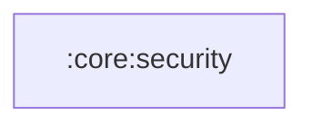

# `:core:security`

## Responsibility

Криптографические примитивы приложения: интерфейс `CryptoManager` и его реализация
`AndroidCryptoManager` (AES/GCM, ключ хранится в Android KeyStore).

Используется вместо устаревшего `androidx.security.crypto`:
- `:core:auth` шифрует JWT-токены перед сохранением в DataStore;
- `:feature:security` шифрует хэш PIN-кода (PBKDF2 + salt) перед сохранением в SharedPreferences.

## Module dependency graph

<!--region graph-->

