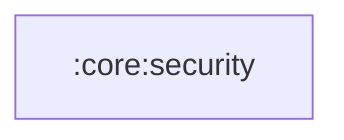

# `:core:security`

## Responsibility

Криптографические примитивы приложения.

- **`CryptoManager`** (`AndroidCryptoManager`, AES/GCM, ключ в Android KeyStore) — вместо
  устаревшего `androidx.security.crypto`:
  - `:core:auth` шифрует JWT-токены перед сохранением в DataStore;
  - `:feature:security` шифрует хэш PIN-кода (PBKDF2 + salt) перед сохранением в SharedPreferences.
- **Ключ базы (DEK) и его заворачивание** — для шифрования локальной базы SQLCipher:
  - `DekEnvelope` — заворачивание DEK на уровнях `OPEN` / `DEVICE` / `PIN` (на уровне PIN
    Keystore снаружи, ключ из PIN внутри); `BiometricEnvelope` — шифры для
    `BiometricPrompt.CryptoObject`;
  - `KeystoreKeys` (`AndroidKeystoreKeys`) — ключи Keystore с уникальным алиасом на каждое
    заворачивание; потерянный ключ **не пересоздаётся** — это `KeyUnavailableException`;
  - `KeysetStore` (`DataStoreKeysetStore`) — атомарное хранение набора ключей и учёта неверных PIN
    в `noBackupFilesDir/security/keyset.preferences_pb`;
  - `PinKeyDerivation` (PBKDF2-HMAC-SHA256), `PinAttemptPolicy` (паузы и стирание за неверный
    PIN), `AesGcm`.

Модуль знает о ключах, но не о базе: открывает базу `:core:database`, связывает одно с другим
`:core:data`. Дизайн — [docs/encryption.md](../../docs/encryption.md).

Инструментальные тесты (`src/androidTest`) проверяют заворачивание на настоящем Android Keystore и
время PBKDF2: `./gradlew :core:security:connectedDebugAndroidTest`.

## Module dependency graph

<!--region graph-->

```mermaid
---
config:
  layout: elk
  elk:
    nodePlacementStrategy: SIMPLE
---
graph TB
    :core:security

    classDef android-library fill:#9BF6FF,stroke:#000,stroke-width:2px,color:#000;
```
