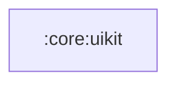

# `:core:uikit`

## Responsibility

Слой UI-компонентов общего назначения.

## Conventions

Компоненты проверяются Compose-правилами detekt (`io.nlopez.compose.rules`, секция
`Compose:` в `config/detekt/detekt.yml`):

- `modifier: Modifier = Modifier` — первый необязательный параметр, применяется к корню
  компонента один раз; content-слот (`ListItem.content`) — последним параметром.
- События называются в настоящем времени: `onDateSelect`, `onTimeSelect`, а не `...Selected`.
- Видимостью диалогов владеет вызывающий: `DeleteDialog` принимает `onDismissRequest`,
  а не `MutableState<Boolean>`.
- `@Preview` — `private`.

## Module dependency graph

<!--region graph-->

