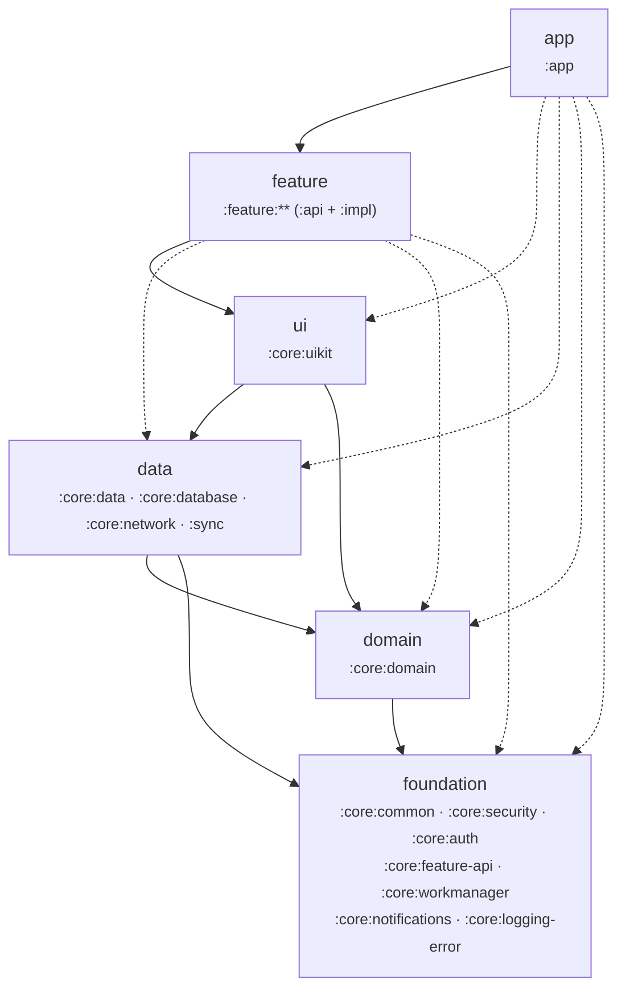

# Aalekh — контроль архитектуры графа модулей

[Aalekh](https://github.com/shivathapaa/Aalekh) — Gradle-плагин, который читает граф модулей
прямо во время сборки, проверяет его против описанного в коде контракта архитектуры и **роняет
сборку, когда структура «плывёт»**. Он даёт то, чего у проекта не было: машинно-проверяемые слои,
изоляцию фич, reachability-правила, метрики связности и интерактивный HTML-отчёт.

> 📊 Наглядный обзор интеграции (слои, правила, метрики, CI): **[Artifact-страница](https://claude.ai/code/artifact/41ca62f2-3664-4ae4-a47c-9000e19c1422)**.
> Закоммиченная копия отчёта — [`docs/graphs/aalekh/index.html`](graphs/aalekh/index.html),
> диаграмма графа — [`docs/graphs/aalekh/graph.md`](graphs/aalekh/graph.md).

## Зачем это, если уже есть проверки графа

В проекте несколько инструментов вокруг модулей, и они не пересекаются:

| Инструмент | Что делает | Чего НЕ делает |
|-----------|-----------|----------------|
| `CheckConventionsPlugin` (build-logic) | проверяет применение конвеншен-плагинов и грубые рёбра при каждом запуске | нет отчёта, нет метрик, нет диффа в PR |
| `:app:assertModuleGraph` (jraska) | должен проверять правила `moduleGraphAssert { }` | правила **не настроены** — задача по факту `UP-TO-DATE` (см. [help_comand.md](../help_comand.md)) |
| `buildHealth` (dependency-analysis) | неиспользуемые/неверно объявленные зависимости | не про слои и направление рёбер |
| **Aalekh** | **слои, изоляция фич, reachability, циклы, метрики, отчёт, дифф в PR** | — |

Aalekh закрывает именно пустоту, которую оставлял ненастроенный `assertModuleGraph`, — и делает это
декларативно, с человекочитаемыми сообщениями об ошибках (`file:line` конкретной зависимости).

## Модель слоёв

Слои повторяют Clean Architecture проекта. `canOnlyDependOn` перечисляет слои, «вниз» по которым
модулю разрешено зависеть; рёбра **внутри** слоя разрешены всегда. Модуль попадает в **первый**
подходящий по шаблону слой (порядок объявления важен).

| Слой | Модули | Может зависеть от |
|------|--------|-------------------|
| `foundation` | инфраструктурные core (common, security, auth, feature-api, workmanager, notifications, logging-error) | без ограничений |
| `domain` | `:core:domain` (чистый Kotlin) | foundation |
| `data` | `:core:data`, `:core:database`, `:core:network`, `:sync` | foundation, domain |
| `ui` | `:core:uikit` | foundation, domain, data |
| `feature` | `:feature:**` (`:api` контракты + `:impl` реализации) | foundation, domain, data, ui |
| `app` | `:app` | всё выше |
| `quality` | `:lint`, `:konsist` | (инструментальные, без продуктового кода) |

`foundation` намеренно без `canOnlyDependOn` — иначе ловятся ложные срабатывания
(например `:core:auth`, использующий `:core:network`). Важные инварианты для этого слоя закрыты
точечными reachability-правилами (см. ниже).

## Что проверяется — 13 правил

Все 13 сейчас **зелёные**. ERROR роняет сборку, WARNING только печатается.

| Правило | Severity | Смысл |
|---------|----------|-------|
| `no-cyclic-dependencies` | ERROR | граф — DAG; включён `preventRegression` (новый цикл роняет сборку) |
| `layer-dependency` | ERROR | зависимости только по разрешённым слоям |
| `no-feature-to-feature` | ERROR | `:feature:*:impl` не зависят друг от друга — только через чужие `:api` |
| `forbidden-transitive-dependency` | ERROR | `domain ↛ app`, `common ↛ feature`, `uikit ↛ data` (и транзитивно) |
| `unreachable-module` | ERROR | каждая `:feature:*:impl` достижима из `:app` |
| `forbidden-dependency` | ERROR | фичи `↛ :app`; `:core:domain ↛` Android-модули (pure Kotlin) |
| `metric-regression` | ERROR | quality gates: структурные метрики не ухудшаются vs baseline |
| `max-graph-height` | WARNING | самая длинная цепочка ≤ 12 |
| `max-transitive-dependencies` | WARNING | транзитивных зависимостей на модуль ≤ 50 |
| `no-orphan-modules` | WARNING | нет «висящих» модулей (инструментальные и контейнеры исключены) |
| `uncovered-module` | WARNING | каждый модуль отнесён к слою (`requireLayerForAllModules`) |

Изоляция фич настроена через `featureIsolation { featurePattern = ":feature:*:impl" }`: под шаблон
попадают только `:impl`, поэтому ребро `impl → чужой api` разрешено, а `impl → impl` — нет.

## Метрики графа (на момент интеграции)

66 модулей, 154 production-зависимости, **чистый DAG (0% в циклах)**.

| Метрика | Значение | Смысл |
|---------|---------:|-------|
| CCD (Lakos coupling) | 289 | суммарная связность; смысл в динамике, не в абсолюте |
| NCCD | 0.85 | ≈1 — «древовидно»; < 1 — независимее сбалансированного дерева |
| Критический путь | 7 модулей | пол параллелизма сборки |
| Влияние `:core:feature-api` | 50% проекта | самый влиятельный узел (контракт навигации) |
| Влияние `:core:uikit` | 26% проекта | дизайн-система |
| God-модулей | 1 | заморожено в baseline (это `:app`) |

## Файлы, которые коммитим

| Файл | Роль | Когда обновлять |
|------|------|-----------------|
| `aalekh-baseline.json` | заморозка нарушений (падаем только на новых) + снимок метрик для quality gates | `./gradlew aalekhBaseline` после осознанного изменения набора нарушений |
| `aalekh-snapshot.json` | слепок архитектуры для `aalekhDiff` | `./gradlew aalekhSnapshot` при изменении структуры графа |
| `.aalekh/modules.json` | назначение/владелец/слой ключевых модулей (то, что плагин не выводит сам) | вручную при появлении важного модуля |
| `docs/graphs/aalekh/index.html` | закоммиченная копия интерактивного отчёта | `aalekhReport` → `cp` (см. [help_comand.md](../help_comand.md)) |
| `docs/graphs/aalekh/graph.md` | диффабельная mermaid-диаграмма графа | `aalekhMermaid` → `cp` |

## CI

Джоба **`check-architecture`** в [`.github/workflows/ci.yml`](../.github/workflows/ci.yml) — блокирующая:

1. `aalekhCheck` (висит на `check`) — падает на любом ERROR-нарушении; текущие заморожены в
   baseline, поэтому падение только на **новых**;
2. SARIF (`aalekh-results.sarif`) → GitHub Code Scanning — инлайн-аннотации в диффе PR;
3. `aalekhReport` → HTML + CSV метрик в артефакты сборки;
4. на PR: `aalekhDiff` → один «липкий» комментарий о том, что изменение сделало с архитектурой.

`openBrowserAfterReport` выключен глобально — в CI браузер не открывается, локально путь к отчёту
печатается в лог (`open build/reports/aalekh/index.html`).

## Конфигурация и настройка

- Плагин применяется **settings-вариантом** в [`settings.gradle.kts`](../settings.gradle.kts)
  (обязательно на Gradle 9.x: project-вариант промахивается мимо configuration cache).
- Весь контракт архитектуры — в единственном блоке `aalekh { }` корневого
  [`build.gradle.kts`](../build.gradle.kts): слои, `featureIsolation`, `teams`, `rules`,
  `forbid { }`, `qualityGates`, а также `temporalCoupling`, `affected` и `mermaid`.
- Версия плагина — в [`gradle/libs.versions.toml`](../gradle/libs.versions.toml) (`aalekh`),
  дублируется литералом в `settings.gradle.kts` (каталог недоступен в блоке `plugins{}` settings).

## Ключевые файлы

| Файл | Что в нём |
|------|-----------|
| [`settings.gradle.kts`](../settings.gradle.kts) | применение плагина (settings-вариант) |
| [`build.gradle.kts`](../build.gradle.kts) | блок `aalekh { }` — слои, правила, метрики, quality gates |
| [`.aalekh/modules.json`](../.aalekh/modules.json) | назначение/владелец/слой ключевых модулей |
| [`aalekh-baseline.json`](../aalekh-baseline.json) | заморозка нарушений + снимок метрик |
| [`aalekh-snapshot.json`](../aalekh-snapshot.json) | слепок архитектуры для диффов |
| [`.github/workflows/ci.yml`](../.github/workflows/ci.yml) | джоба `check-architecture` |
| [`help_comand.md`](../help_comand.md) | все команды `aalekh*` |

## Ссылки

- Документация плагина: <https://github.com/shivathapaa/Aalekh> · [docs](https://github.com/shivathapaa/Aalekh/tree/main/docs) · [API reference](https://shivathapaa.github.io/Aalekh/api/)
- Совместимость: Gradle 9.0+, Kotlin 2.3+, AGP 9.1+, JDK 11/17/21 (у нас Gradle 9.7.1 / Kotlin 2.4.0 / AGP 9.2.1).
