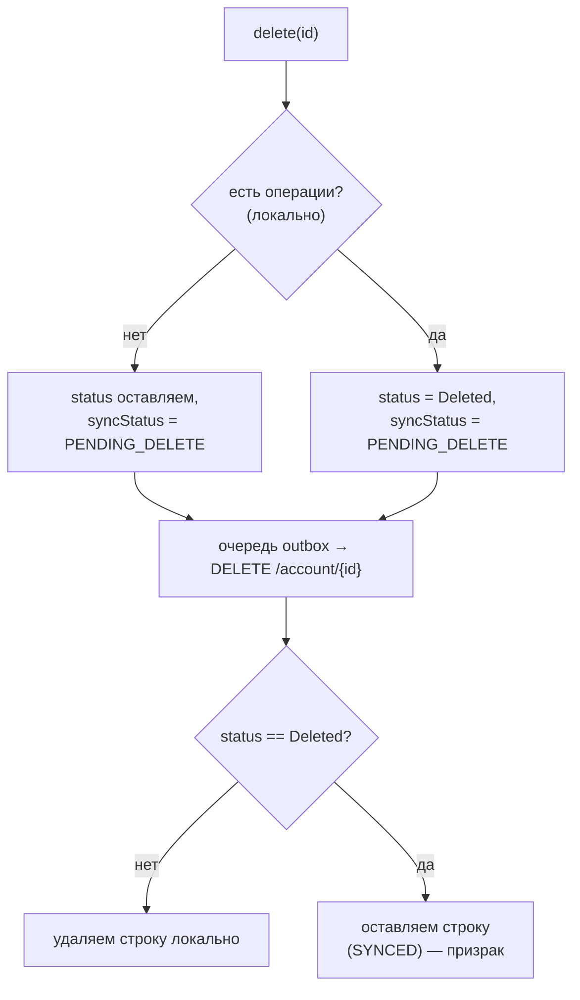

# Account status & archiving

Этот документ описывает, как в **Finance Manager** устроено удаление счёта и его
**архивация** через статусную модель: почему счёт с операциями нельзя удалить
физически, как это отражено на клиенте и сервере и как архивный («призрачный»)
счёт продолжает жить в истории операций.

## Задача, которую решаем

Счёт связан с операциями (транзакциями). Если пользователь удаляет счёт, на котором
**есть операции**, физическое удаление исказило бы историю и аналитику за прошлые
периоды. Поэтому:

- счёт **с операциями** не удаляется, а **архивируется** — пропадает из списков и
  пикера, но остаётся в БД, чтобы старые операции могли показать его имя/валюту;
- счёт **без операций** удаляется физически;
- архивация **необратима** (раз-архивации нет).

Решение построено на **статусе счёта**, а не на булевом флаге — это зеркалит
серверную модель и оставляет задел на будущее (скрытие счетов).

## Серверный контракт (источник истины)

Бэкенд (`FinanceManagerBackend`) отдаёт у каждого счёта поле `status` — enum
`EStatus`, сериализуемый **именами** через `JsonStringEnumConverter`:

```
Active    // виден и доступен для операций
Hidden    // скрыт из списков, но доступен для операций (зарезервировано)
Deleted   // «архивный»: скрыт из списков и операций, но остаётся для истории
```

Поведение эндпоинтов (`/api/v1/account`):

| Метод | Поведение |
|-------|-----------|
| `GET /account` | возвращает счета, где `status != Deleted` (архивные **исключены** сервером) |
| `GET /account/{id}` | возвращает счёт **с любым** статусом (нужно для истории) |
| `POST` / `PUT` | тело **не содержит** `status`; `PUT` архивным счётом сбросил бы его в `Active` — поэтому архивацию через `PUT` слать нельзя |
| `DELETE /account/{id}` | «умное» удаление: **нет операций** → физическое удаление; **есть операции** → `status = Deleted`; в обоих случаях `200 OK` |

Ключевой вывод: **и удаление, и архивация инициируются одним запросом `DELETE`** —
решение (снести или заархивировать) принимает сервер.

## Клиентская модель

Клиент зеркалит серверный enum, оставаясь offline-first (Room — SSOT).

- **Домен** (`core:domain`): enum
  [`AccountStatus`](../core/domain/src/main/java/soft/divan/financemanager/core/domain/model/AccountStatus.kt)
  `{ Active, Hidden, Deleted }` c `fromWire(raw)` (неизвестное/пустое → `Active`, чтобы
  дрейф enum или legacy-строки не скрыли счёт). Поле `Account.status: AccountStatus`.
- **База** (`core:database`): `AccountEntity.status: String` хранит **имя** статуса.
  `core:database` намеренно не зависит от `core:domain`, поэтому сущность держит строку
  (как `TransactionEntity.type`), а преобразование строка↔enum живёт в data-слое.
  Добавление поля — изменение схемы → **версия БД поднята** (см. `bd.md`).
- **Data** (`core:data`): `AccountDto.status: String`; маппинг конвертирует на границе
  (`fromWire` при чтении, `.name` при записи). `UpdateAccountRequestDto` статус **не несёт**.

```
DTO(status: String "Active"/"Hidden"/"Deleted")
   │  AccountStatus.fromWire(...).name
   ▼
AccountEntity(status: String)   ← SSOT (Room)
   │  AccountStatus.fromWire(status)
   ▼
Account(status: AccountStatus)  → презентация
```

Правило «архивный» одно на всех слоях: **`status == Deleted`**. `Hidden` пока трактуется
как видимый (см. [«Про Hidden»](#про-hidden)).

## Поток удаления/архивации

`AccountRepositoryImpl.delete(id)` считает наличие операций **локально** (для мгновенного
offline-отражения и текста диалога) и в обоих случаях зовёт серверный `DELETE`. Отличается
только локальная запись; какую именно судьбу применить после ответа сервера, определяет
статус самой записи.



- **Список/пикер**: [`AccountRepositoryImpl.getAll()`](../core/data/src/main/java/soft/divan/financemanager/core/data/repository/AccountRepositoryImpl.kt)
  отдаёт только `status != Deleted` (и без `PENDING_DELETE`). Архивный счёт исчезает из UI
  сразу — ещё до подтверждения сервером.
- **Синхронизация**: [`AccountOutboxSender`](../core/data/src/main/java/soft/divan/financemanager/core/data/outbox/AccountOutboxSender.kt)
  после успешного серверного `DELETE` по статусу решает: `Deleted` → оставить запись и пометить
  `SYNCED`; иначе → удалить физически. `serverId == null` (счёт не был на сервере) — сетевого
  вызова нет: архивную запись оставляем локально, обычную удаляем.
- **Pull не воскрешает архив**: сервер исключает `Deleted` из `GET /account`, поэтому
  архивный счёт не приедет обратно и останется призраком с корректным именем.

## Отображение призрачного счёта в операциях

Пикер счёта для новой операции исключает архивные, но **старая** операция может ссылаться на
уже архивный счёт. Чтобы показать его имя:

- `TransactionViewModel` в режиме редактирования, если счёт операции **отсутствует** в
  пикер-списке (он `Deleted` и отфильтрован `getAll`), подтягивает его по id через
  `GetAccountByIdUseCase` (идёт в `getByLocalId`/`GET /{id}`, которые архивные не фильтруют);
- `Account.toUi()` выставляет `archived = status == Deleted`, и экран рисует имя с пометкой
  **«(архив)»**; выбрать такой счёт для новой операции нельзя.

## Адаптивный диалог удаления

`feature:account:impl` перед удалением показывает
[`DeleteAccountDialog`](../feature/account/impl/src/main/java/soft/divan/financemanager/feature/account/impl/precenter/screens/DeleteAccountDialog.kt)
с текстом по ситуации. Наличие операций определяет `HasAccountTransactionsUseCase`
(поверх `TransactionRepository.hasTransactions`), результат кладётся в
`AccountUiState.Success.hasTransactions`:

- есть операции → «Заархивировать счёт? …скрыт из списков, но операции сохранятся в истории»;
- нет операций → «Удалить счёт? …удалён навсегда».

## Про Hidden

`Hidden` смоделирован в enum, но **пока не используется** (как и на бэкенде). Его семантика —
«скрыт из списков, но доступен для операций» — потребует различать фильтрацию для списка счетов
и для пикера операций. Сейчас `Hidden` трактуется как видимый/обычный, а «призраком» является
только `Deleted`. Полноценная поддержка скрытия — отдельная будущая задача.

## Ключевые файлы

| Слой | Файл | Роль |
|------|------|------|
| domain | `core/domain/.../model/AccountStatus.kt` | enum + `fromWire` |
| domain | `core/domain/.../model/Account.kt` | `status: AccountStatus` |
| domain | `core/domain/.../repository/TransactionRepository.kt` | `hasTransactions` |
| domain | `core/domain/.../usecase/GetAccountByIdUseCase.kt` | резолв счёта по id (не фильтрует) |
| data | `core/data/.../dto/AccountDto.kt` | поле `status` на проводе |
| data | `core/data/.../mapper/AccountDataMapper.kt` | конвертация строка↔enum |
| data | `core/data/.../repository/AccountRepositoryImpl.kt` | `delete` / `getAll` фильтр |
| data | `core/data/.../outbox/AccountOutboxSender.kt` | удаление на сервере: оставить архивную запись или удалить |
| database | `core/database/.../entity/AccountEntity.kt` | `status: String` |
| feature | `feature/account/impl/.../HasAccountTransactionsUseCase.kt` | флаг для диалога |
| feature | `feature/account/impl/.../screens/DeleteAccountDialog.kt` | адаптивный диалог |
| feature | `feature/transaction/impl/.../mapper/AccountPresenterMapper.kt` | `archived = status == Deleted` |

## См. также

- [Bd](./bd.md) — локальная схема и правила версий/миграций.
- [Synchronization](./synchronization.md) — как устроен фоновый синк.
- [DomainResult & errors](./domain-result.md) — результаты и ошибки доменного слоя.
