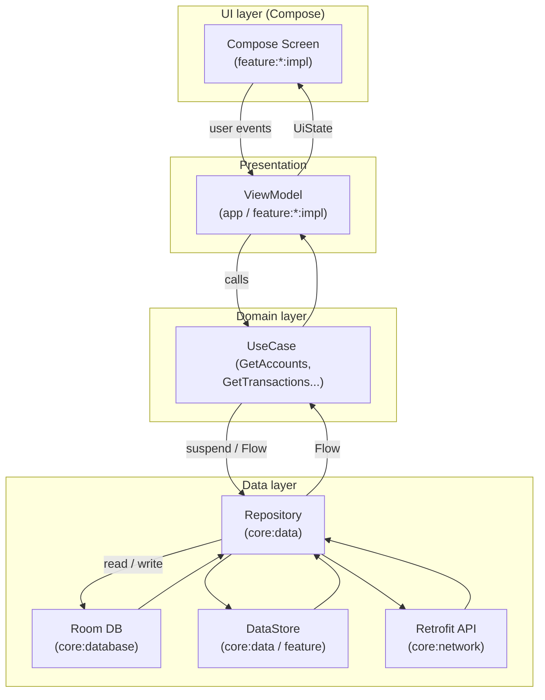

# Architecture

В этом документе описана архитектура приложения **Finance Manager**: его слои,
ключевые модули и то, как данные проходят путь от локальной БД и сети до UI.

## Goals and requirements

Основные цели архитектуры:

- следовать рекомендациям [Guide to app architecture](https://developer.android.com/jetpack/guide);
- использовать понятные и широко принятые подходы (Clean Architecture + MVVM);
- поддерживать мультимодульный проект и командную разработку;
- упростить написание юнит‑ и интеграционных тестов;
- сохранить разумное время сборки даже при росте проекта.

## Architecture overview

Архитектура проекта трёхслойная:

- **UI / Presentation layer** — экраны Jetpack Compose, ViewModel, навигация.
- **Domain layer** (`core:domain`) — бизнес‑логика в виде use case’ов и доменных моделей.
- **Data layer** (`core:data`, `core:database`, `core:network`) — репозитории, Room, DataStore, сеть.

Используется реактивная модель с **unidirectional data flow**:

- события от UI идут **вниз** (в ViewModel → UseCase → Repository);
- данные поднимаются **вверх** (из Repository → UseCase → ViewModel → UI);
- потоки реализованы через `Kotlin Flow`.

### Общая схема потока данных

### Пример: экран "Мои счета"

Упрощённая последовательность шагов при открытии экрана **My Accounts**:

1. Пользователь открывает раздел "Мои счета" в приложении.
2. Навигация в `app` модуле создаёт Compose‑экран и `MyAccountsViewModel`.
3. `MyAccountsViewModel` вызывает use case `GetAccountsUseCase`.
4. `GetAccountsUseCase` обращается к `AccountRepository` из `core:data`.
5. `AccountRepository` читает данные из `FinanceManagerDatabase` (Room) и, инициирует обновление из сети.
6. Репозиторий возвращает `Flow<DomainResult<List<Account>>>`.
7. ViewModel маппит доменные модели в UI‑модели (`MyAccountsUiModel`) и формирует `MyAccountsUiState`.
8. Compose‑экран подписывается на `uiState` через `collectAsStateWithLifecycle()` и отображает список
   счетов.

## Data layer

Data‑слой реализован как **offline‑first**: локальная БД (Room) является source of truth, а сеть
используется для синхронизации.

Основные модули:

- `core:data`
    - реализация репозиториев для доменных интерфейсов:
        - `AccountRepository`, `CategoryRepository`, `TransactionRepository`, `CurrencyRepository` и
          т.д.;
    - data sources (локальные и удалённые);
    - маппинг между entity / dto / domain‑моделями.

- `core:database`
    - `FinanceManagerDatabase` (Room);
    - DAO для сущностей (аккаунты, категории, транзакции);
    - конвертеры типов и миграции.

- `core:network`
    - настройка `Retrofit` + `OkHttpClient`;
    - набор `Interceptor`’ов:
        - `AuthInterceptor` — подставляет API‑токен;
        - `NetworkConnectionInterceptor` — проверка доступности сети;
        - `RetryInterceptor` — повтор запросов при временных ошибках;
        - `LoggingInterceptor` — логирование запросов/ответов;
    - `NetworkMonitor` для отслеживания состояния сети.

- `DataStore` (в `core:data`, `sync`, feature‑модулях)
    - хранение пользовательских настроек:
        - тема оформления,
        - язык,
        - звуки и вибрация,
        - параметры синхронизации и т.п.

### Чтение данных

- Репозитории отдают **потоки** (`Flow<T>`), а не "снимки".
- Источник истины — локальное хранилище (Room / DataStore).
- Ошибки сети не ломают чтение из локальной БД — UI продолжает работать с последними валидными данными.

### Запись и синхронизация

- Запись выполняется через `suspend`‑методы репозиториев.
- Репозитории отвечают за согласование локального и удалённого источников:
    - при успешном запросе к API данные сохраняются в Room;
    - UI получает обновления из локальной БД.

Отдельный модуль `sync`:

- планирование фоновой синхронизации через WorkManager;
- управление интервалом синка через use case’ы;
- уведомления пользователя о статусе синхронизации.

## Domain layer

Модуль `core:domain` содержит:

- **доменные модели** (`Transaction`, `Account`, `Category` и др.);
- **контракты репозиториев** (интерфейсы без знания реализации);
- **use case’ы**: `GetAccountsUseCase`, `GetCategoriesUseCase` и др.;

Основные принципы:

- UI не знает, откуда реально приходят данные (сеть / БД / кеш).
- Повторно используем бизнес‑логику между экранами через общие use case’ы.
- Удобное, точечное тестирование (моки репозиториев, проверка поведения use case’ов).

## UI / Presentation layer

UI‑слой реализован на **Jetpack Compose** и делится на:

- `app` модуль
    - `MainActivity`, `App` (`Application` с `@HiltAndroidApp`);
    - навигация (root‑граф, bottom bar, графы фич);
    - high‑level state (`MainViewModel` и общие `UiState`).

- `feature:*:impl`
    - экраны фич (например, `MyAccountsScreen`, `HistoryScreen`, `SettingsScreen`);
    - ViewModel’и фич;
    - DI‑модули с биндингом use case’ов и репозиториев;
    - собственный UI‑state (sealed‑классы, data‑классы).

- `core:uikit`
    - общие компоненты (кнопки, списки, TopBar, иконки и т.п.);
    - темы и цвета (Material 3‑базис + кастомизация).

### Моделирование UI state

Для состояния экранов используются:

- **Immutable data‑классы** для конкретного состояния (например, `MyAccountsUiState.Success`);
- **sealed‑классы** для описания всех вариантов (`Loading`, `Error`, `EmptyData`, `Success`).

Паттерн:

- репозитории → `Flow<DomainModel>`;
- use case’ы комбинируют/трансформируют потоки;
- ViewModel маппит доменные модели в UI‑state;
- Compose‑экран читает state и рендерит UI.

### Обработка пользовательских действий

- Compose‑компоненты получают лямбды (`onClick`, `onNavigateToX`, `onRetry`).
- Эти лямбды вызывают методы ViewModel.
- ViewModel:
    - вызывает соответствующие use case’ы / репозитории;
    - обновляет `UiState` (через `MutableStateFlow` / `MutableStateFlow` внутри);
    - триггерит навигацию / отправку эффектов при необходимости.

Такой подход обеспечивает:

- явный и легко отслеживаемый поток данных;
- предсказуемость поведения (UDF);
- удобство для тестирования и отладки.

## Navigation

Навигация реализована по мотивам подхода `api` / `impl`:

- `core:feature-api` и `feature:*:api` содержат общие контракты и навигационные ключи;
- `feature:*:impl` реализует сами экраны и регистрирует маршруты в навграфе;
- `app` модуль связывает всё вместе через root‑граф и bottom‑navigation.

Каждая фича определяет свой API‑контракт (маршруты, аргументы) в `api`‑модуле и реализацию
экранов в `impl`, что уменьшает связность между фичами и облегчает рефакторинг.
