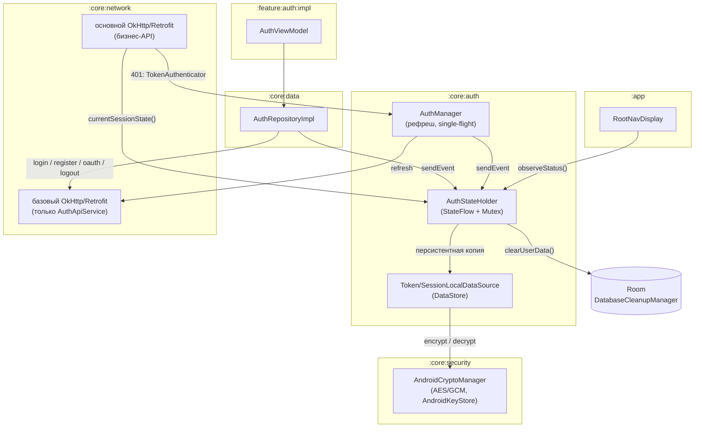
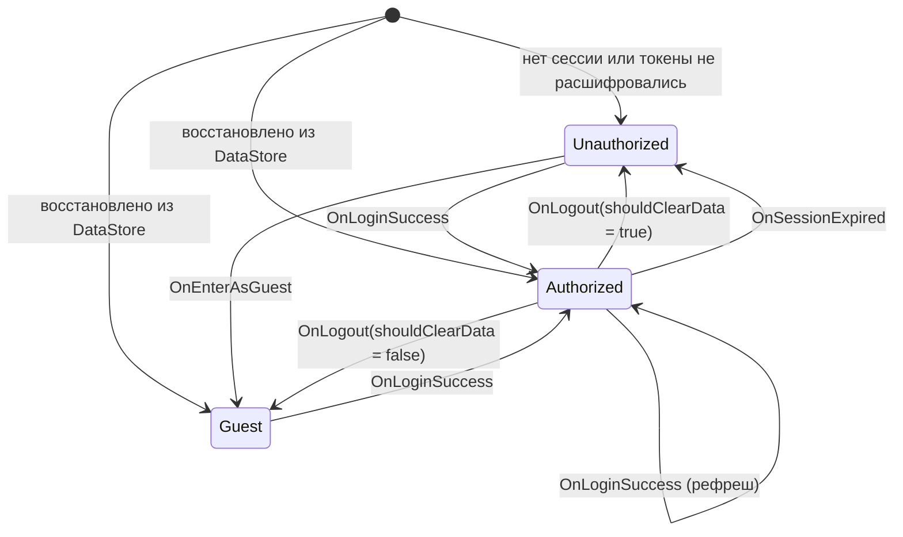
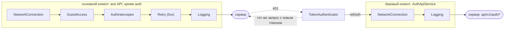
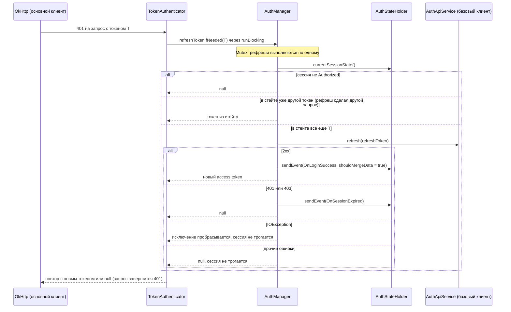

# Авторизация и управление сессией

Этот документ описывает, как в **Finance Manager** устроены сессия пользователя и JWT-токены:
стейт-машина сессии, работа сетевого слоя с токенами, их хранение и реакция навигации на
смену статуса.

## Цели

- Один источник истины о сессии, который одинаково видят UI, навигация и сетевой слой.
- Сетевые интерцепторы получают токен синхронно, без чтения DataStore на каждый запрос.
- Гость и неавторизованный пользователь не ходят в бизнес-API.
- Истечение сессии в любой момент (в том числе во время фонового синка) приводит к одному и
  тому же результату: токены и приватные данные стёрты, пользователь на экране входа.
- Токены не хранятся на диске в открытом виде.

## Общая схема

Сессией владеет `:core:auth`, но в сценарии участвуют несколько модулей:

- `:core:auth` — стейт-машина `AuthStateHolder`, хранилища токенов и статуса, `AuthManager`
  (рефреш), `TokenAuthenticator`, `GuestAccessInterceptor`, `AuthApiService`;
- `:core:security` — `CryptoManager` (шифрование токенов);
- `:core:network` — сборка OkHttp/Retrofit и `AuthInterceptor`;
- `:core:data` — `AuthRepositoryImpl`: вызывает Auth API и отправляет события в стейт-машину;
- `:feature:auth:impl` — экраны входа и профиля, `AuthViewModel`;
- `:app` — `RootNavDisplay`, корневой back stack.

## 1. Состояния и модели

### `AuthStatus`

Перечисление `AUTHORIZED`, `GUEST`, `UNAUTHORIZED`. Именно его видят UI и навигация, и именно
оно сохраняется в DataStore.

### `SessionState`

Атомарный снимок сессии: статус и токены читаются одним значением, поэтому интерцептор не
может увидеть «статус уже `AUTHORIZED`, а токена ещё нет».

- `Authorized(accessToken, refreshToken)` — наличие токенов гарантировано типом.
- `Guest` — локальный режим: данные только на устройстве, сеть закрыта.
- `Unauthorized` — сессии нет. Это же значение по умолчанию до восстановления с диска.

### `AuthEvent`

Изменить сессию можно только событием через `AuthStateProvider.sendEvent(...)`:
`OnLoginSuccess`, `OnLogout`, `OnSessionExpired`, `OnEnterAsGuest`, `OnClearData`.

`AuthStateProvider` — интерфейс, через который с сессией работают все остальные модули:
`observeStatus()` (реактивный статус), `currentStatus()` / `currentSessionState()`
(синхронное чтение для интерцепторов) и `sendEvent(...)`.

## 2. Стейт-машина (`AuthStateHolder`)

`AuthStateHolder` — singleton-реализация `AuthStateProvider` и единственный источник истины о
сессии. `GetAuthStatusUseCase` тоже читает статус отсюда, а не из DataStore.

### Принципы

1. **Memory-first.** Текущее состояние хранится в `MutableStateFlow<SessionState>`. При
   переходе сначала обновляется оно, затем идёт запись в DataStore (токены шифруются через
   `CryptoManager`) и очистка БД. Запись при этом не «фоновая»: она выполняется внутри того же
   `sendEvent` и ожидается. Единственное исключение из порядка — вход из гостя без слияния:
   локальные данные стираются *до* переключения сессии.
2. **`sendEvent` — suspend.** Вызывающий код (репозиторий, `AuthManager`) продолжает работу
   только после завершения всех побочных эффектов, включая `DatabaseCleanupManager.clearUserData()`.
3. **`Mutex`.** Переходы выполняются строго по одному, параллельные события не перемешивают
   свои побочные эффекты.
4. **Синхронное чтение.** `currentStatus()` / `currentSessionState()` читают `StateFlow.value`.
   `StateFlow` потокобезопасен, отдельный диспетчер для чтения не нужен: интерцептор на
   потоке OkHttp получает токен из памяти без похода в DataStore. Сам `sendEvent` выполняется в
   контексте вызывающего (`viewModelScope` или `runBlocking` аутентификатора). `Main.immediate`
   используется только в `@ApplicationScope`, где запускается восстановление при холодном
   старте.
5. **Холодный старт.** Пока сессия восстанавливается из DataStore, в памяти лежит дефолтный
   `Unauthorized`, который не отражает реальную сессию. Поэтому:
   - `observeStatus()` начинает эмитить только после восстановления, и навигация не
     перебрасывает авторизованного пользователя на экран входа;
   - синхронные `currentStatus()` / `currentSessionState()` один раз ждут восстановления через
     `runBlocking`. Это допустимо только на фоновых потоках OkHttp. С главного потока до
     завершения восстановления их вызывать нельзя: восстановление идёт на `Main.immediate`, и
     заблокированный главный поток его не дождётся.
6. **Fail-closed при восстановлении.** Статус `AUTHORIZED` без обоих токенов (токен не
   расшифровался, запись прервалась между шагами) восстанавливается как `Unauthorized`.

### Диаграмма состояний

Стейт-машина не проверяет исходное состояние: любое событие принимается в любом состоянии.
На диаграмме — переходы, которые реально использует приложение.

### Матрица переходов

| Событие (`AuthEvent`) | Кто отправляет | Итоговое состояние | Побочные эффекты |
| :--- | :--- | :--- | :--- |
| **`OnLoginSuccess`** | `AuthRepositoryImpl` (логин, регистрация, Яндекс); `AuthManager` (рефреш) | `Authorized` | Если предыдущий статус `GUEST` и `shouldMergeData = false` — сначала `clearUserData()`. Затем токены и статус `AUTHORIZED` записываются в DataStore. |
| **`OnLogout(shouldClearData)`** | `AuthRepositoryImpl.logout` | `true` → `Unauthorized`, `false` → `Guest` | Токены удаляются всегда. При `true` дополнительно `clearUserData()`. Статус сохраняется в DataStore. |
| **`OnSessionExpired`** | `AuthManager`, когда refresh вернул 401/403 | `Unauthorized` | Удаление токенов, `clearUserData()`, статус `UNAUTHORIZED`. |
| **`OnEnterAsGuest`** | `AuthRepositoryImpl.loginAsGuest` | `Guest` | Удаление токенов. Локальные данные остаются. |
| **`OnClearData`** | `AuthRepositoryImpl.clearUserData` | *без изменений* | Только `DatabaseCleanupManager.clearUserData()`. |

`clearUserData()` удаляет транзакции и счета, но не категории: они системные и приходят из
предзаполненной БД.

### Слияние гостевых данных при входе

Ветка «вход из гостя со стиранием данных» внутри `OnLoginSuccess` есть в контракте, но UI её
сейчас не использует. `AuthViewModel` всегда входит с `shouldMergeData = true`, а решение о
слиянии принимает *после* успешного входа:

1. Перед входом запоминается, был ли пользователь гостем.
2. Вход → `OnLoginSuccess(shouldMergeData = true)` → `Authorized`, локальные данные целы.
3. Если пользователь был гостем, показывается диалог слияния. Ответ «не объединять»
   отправляет отдельное событие `OnClearData`.
4. Первичный синк (`SyncCoordinator.syncAll()`), затем переход на главный экран.

Рефреш тоже отправляет `OnLoginSuccess` с `shouldMergeData = true`. Статус при этом не
меняется (`AUTHORIZED` → `AUTHORIZED`), и `observeStatus()` ничего не эмитит: в нём стоит
`distinctUntilChanged`.

## 3. Сетевой слой

### Два OkHttp-клиента и два Retrofit

Оба клиента собираются в `:core:network` (`NetworkProviderModule`).

1. **Основной** — для всех бизнес-API. Цепочка: `NetworkConnectionInterceptor` →
   `GuestAccessInterceptor` → `AuthInterceptor` → `RetryInterceptor` (повторы на 5xx) →
   логирование. Плюс `TokenAuthenticator` и HTTP-кэш.
2. **Базовый** (`@BaseRetrofitQualifier`) — только для `AuthApiService`
   (`api/v1/auth/register`, `login`, `oauth/yandex`, `refresh`, `logout`). В нём только проверка
   сети и логирование, без интерцепторов авторизации.

Базовый клиент нужен по двум причинам:

- **Нет рекурсии при рефреше.** Если бы `refresh` шёл через основной клиент, его 401 снова
  вызвал бы `TokenAuthenticator`, а тот ждал бы `Mutex` рефреша, который сам же и держит.
- **Вход возможен без сессии.** Логин и регистрация выполняются в статусе `GUEST` или
  `UNAUTHORIZED`, а `GuestAccessInterceptor` основного клиента такие запросы блокирует.

Запрос, который вернул `TokenAuthenticator`, OkHttp повторяет внутри своей follow-up-логики,
то есть *после* application-интерцепторов. Поэтому `AuthInterceptor` не перезаписывает
выставленный аутентификатором заголовок.

### `GuestAccessInterceptor`

Пропускает запрос только в статусе `AUTHORIZED`. В `GUEST` бросает
`GuestModeNetworkBlockedException`, в `UNAUTHORIZED` — `UnauthorizedNetworkBlockedException`.
Оба исключения — подклассы `IOException`, поэтому OkHttp и Retrofit корректно пробрасывают
их вызывающему. `safeApiCall` в `:core:data` превращает их в `DomainError.GuestModeBlocked` и
`DomainError.Unauthorized`. Так гостевой режим блокирует и синк.

Заголовок `X-Allow-Guest: true` снимает блокировку для публичных методов. Сейчас ни один
Retrofit-интерфейс его не использует.

### `AuthInterceptor`

Берёт access token из памяти (`AuthManager.getAccessToken()` → `currentSessionState()`) и
добавляет `Authorization: Bearer …`. Ни DataStore, ни `runBlocking` здесь нет, кроме
однократного ожидания восстановления на холодном старте (см. принцип 5). Если токена нет,
запрос уходит без заголовка.

### `TokenAuthenticator` и рефреш

OkHttp вызывает `TokenAuthenticator` на 401 основного клиента. API `Authenticator`
синхронный, поэтому здесь `runBlocking` неизбежен. Он выполняется на потоке OkHttp, не на
главном. Число повторов одного запроса ограничено заголовком `Retry-Attempt`: не больше 5.

`AuthManager.refreshTokenIfNeeded(oldToken)` работает как single-flight. Под собственным
`Mutex` он сравнивает токен, с которым ушёл упавший запрос, с текущим в стейте. Если токен уже
другой, рефреш выполнил параллельный запрос, и сеть не нужна.

Сессию завершает только явный отказ сервера (401/403 на `refresh`). Сетевой сбой — нет:
офлайн-приложение не должно разлогинивать пользователя в метро.

Порядок блокировок всегда один: `AuthManager.mutex` → `AuthStateHolder.mutex` (`sendEvent`
внутри рефреша). Обратного пути нет, поэтому взаимной блокировки тоже нет.

## 4. Хранение токенов и KeyStore

### Где лежат данные

| DataStore | Ключи | Содержимое |
| :--- | :--- | :--- |
| `token_preferences` | `access_token`, `refresh_token` | Токены, зашифрованные `CryptoManager` |
| `session_preferences` | `auth_status` | Имя `AuthStatus` в открытом виде (не секрет) |

### Как шифруется

`AndroidCryptoManager` из `:core:security`:

- `AES/GCM/NoPadding`, ключ AES-256 в `AndroidKeyStore`;
- для каждого токена свой ключ (alias `access_token_alias` / `refresh_token_alias`). Ключ
  создаётся при первом шифровании;
- случайный IV на каждое шифрование (12 байт), тег аутентичности 128 бит. На диск пишется
  Base64 от `IV ‖ шифротекст ‖ тег`;
- ключ не привязан к аутентификации пользователя (`setUserAuthenticationRequired(false)`):
  токены нужны фоновому синку без участия пользователя. StrongBox не запрашивается.

GCM проверяет целостность: подменённый или повреждённый шифротекст не расшифруется.
Любая ошибка расшифровки трактуется как «токена нет», и сессия восстанавливается как
`Unauthorized` (fail-closed). Если ключ в KeyStore недоступен, `AndroidCryptoManager`
пересоздаёт его. Старые токены тогда тоже не расшифруются, и это равносильно выходу.

### От чего это защищает, а от чего нет

Ключевой материал **неэкспортируемый**: он живёт в системном KeyStore (на большинстве
устройств — в TEE) и в процесс приложения не попадает. Поэтому:

- **Защищает** от чтения токенов из скопированного файла DataStore: бэкап, перенос данных
  на другое устройство, снятый образ хранилища. Без ключа на *этом* устройстве шифротекст
  бесполезен.
  На новом устройстве ключа нет, и пользователь просто увидит экран входа.
- **Не защищает** на root-устройстве и при выполнении кода в процессе приложения. KeyStore
  не даёт *извлечь* ключ, но разрешает им *пользоваться* любому коду с UID приложения.
  Атакующий с root может действовать от имени приложения и попросить KeyStore расшифровать
  токены, а подтверждения пользователем ключ не требует. Кроме того, на время сессии
  расшифрованные токены лежат в памяти процесса (`SessionState.Authorized`).

Итого: шифрование закрывает утечку файлов хранилища, но не компрометацию устройства или
процесса.

Тот же `CryptoManager` используется в `:feature:security` для хэша PIN-кода.

## 5. Навигация и UI

Корневой back stack (`RootNavDisplay` в `:app`, Navigation 3) подписан на
`GetAuthStatusUseCase` → `AuthStateProvider.observeStatus()`. Подробно про корневой стек —
[`navigation3.md`](./navigation3.md), раздел «Корневой back stack».

| Ситуация | Что происходит |
| :--- | :--- |
| Splash закончился, статус `UNAUTHORIZED` | `replaceAll(AuthKey)` |
| Splash закончился, статус `AUTHORIZED` или `GUEST` | `replaceAll(MainKey)` |
| На `AuthKey`: успешный вход (после первичного синка) или вход гостем | `replaceAll(MainKey)` |
| Статус стал `UNAUTHORIZED` в любой момент | `replaceAll(AuthKey)`, реактивно через `LaunchedEffect` |
| Статус стал `GUEST` (выход без очистки данных) | Навигация не меняется: пользователь остаётся в приложении с локальными данными |

Корневой стек сбрасывается по факту смены статуса, а не по конкретному сценарию. Поэтому выход
с очисткой данных и `OnSessionExpired` из фонового запроса (например, синка) обрабатываются
одинаково: весь стек, включая `MainKey` со стеками вкладок, заменяется экраном входа. Если в
момент истечения сессии UI не запущен, статус `UNAUTHORIZED` уже сохранён, и при следующем
запуске splash отправит на `AuthKey`.

Гость входит повторно из профиля: `ProfileKey` → `ProfileAuthKey`. Это экран входа внутри
стека вкладки «Настройки»; после успеха выполняется `back()`, корневой стек не трогается.

## Ограничения

- `POST api/v1/auth/logout` уходит через базовый клиент, то есть **без** заголовка
  `Authorization`. Результат запроса игнорируется, локальный выход выполняется в любом
  случае. Если серверу для отзыва сессии нужен токен, серверная сессия при выходе не
  закрывается — [FM-101](https://github.com/IliaVoskoboinikov/Finance-Manager/issues/101).
- Рефреш не проверяет пустые токены в ответе: `null` превращается в `""`. Логин такую проверку
  делает: `AuthRepositoryImpl` считает пустые токены ошибкой —
  [FM-173](https://github.com/IliaVoskoboinikov/Finance-Manager/issues/173).
- Ветка стирания данных в `OnLoginSuccess` (`shouldMergeData = false`) из UI не вызывается.
  Слияние решается отдельным `OnClearData` (см. «Слияние гостевых данных при входе») —
  [FM-102](https://github.com/IliaVoskoboinikov/Finance-Manager/issues/102).

## Связанные задачи

Все открытые задачи по авторизации — [фильтр `area:auth`](https://github.com/IliaVoskoboinikov/Finance-Manager/issues?q=is%3Aissue%20is%3Aopen%20label%3Aarea%3Aauth).
Кроме перечисленных в «Ограничениях»:

| Задача | О чём |
| :--- | :--- |
| [FM-161](https://github.com/IliaVoskoboinikov/Finance-Manager/issues/161) | гонка очистки данных при выходе: данные прошлого пользователя возвращаются |
| [FM-162](https://github.com/IliaVoskoboinikov/Finance-Manager/issues/162) | диалог слияния гостевых данных: вход до вопроса, зависание при закрытии |
| [FM-104](https://github.com/IliaVoskoboinikov/Finance-Manager/issues/104) | слияние гостевых данных: двойной учёт баланса |
| [FM-202](https://github.com/IliaVoskoboinikov/Finance-Manager/issues/202) | удаление аккаунта — требование Google Play |

## Ключевые файлы

| Модуль | Файл | Роль |
| :--- | :--- | :--- |
| `core:auth` | `core/auth/.../domain/model/SessionState.kt` | `SessionState` и `AuthEvent` |
| `core:auth` | `core/auth/.../domain/model/AuthStatus.kt` | Статусы сессии |
| `core:auth` | `core/auth/.../domain/provider/AuthStateProvider.kt` | Контракт стейт-машины для остальных модулей |
| `core:auth` | `core/auth/.../data/provider/AuthStateHolder.kt` | Стейт-машина: переходы, восстановление, побочные эффекты |
| `core:auth` | `core/auth/.../data/authenticator/AuthManager.kt` | Single-flight рефреш, `OnSessionExpired` |
| `core:auth` | `core/auth/.../data/authenticator/TokenAuthenticator.kt` | Реакция OkHttp на 401, лимит повторов |
| `core:auth` | `core/auth/.../data/interceptor/GuestAccessInterceptor.kt` | Блокировка сети для `GUEST` / `UNAUTHORIZED` |
| `core:auth` | `core/auth/.../data/api/AuthApiService.kt` | Эндпоинты `api/v1/auth/*` |
| `core:auth` | `core/auth/.../data/source/impl/TokenLocalDataSourceImpl.kt` | Зашифрованные токены в DataStore |
| `core:auth` | `core/auth/.../data/source/impl/SessionLocalDataSourceImpl.kt` | Статус в DataStore |
| `core:auth` | `core/auth/.../di/AuthProviderModule.kt` | `AuthApiService` на базовом Retrofit, аутентификатор, guest-интерцептор |
| `core:security` | `core/security/.../impl/AndroidCryptoManager.kt` | AES/GCM на ключах `AndroidKeyStore` |
| `core:security` | `core/security/.../di/SecurityModule.kt` | `AndroidKeyStore`, `KeyGenerator`, `Cipher` |
| `core:network` | `core/network/.../di/NetworkProviderModule.kt` | Основной и базовый OkHttp/Retrofit |
| `core:network` | `core/network/.../interceptor/AuthInterceptor.kt` | `Authorization: Bearer` из памяти |
| `core:data` | `core/data/.../repository/AuthRepositoryImpl.kt` | Вызовы Auth API → события стейт-машины |
| `core:data` | `core/data/.../util/safeCall/SafeApiCall.kt` | Блокировки guest/unauth → `DomainError` |
| `core:database` | `core/database/.../util/DatabaseCleanupManagerImpl.kt` | Удаление счетов и транзакций |
| `feature:auth` | `feature/auth/impl/.../presenter/viewModel/AuthViewModel.kt` | Вход, диалог слияния, первичный синк, выход |
| `app` | `app/.../di/AppModule.kt` | `@ApplicationScope` на `Main.immediate` |
| `app` | `app/.../presenter/navigation/RootNavDisplay.kt` | Сброс корневого стека по статусу |
