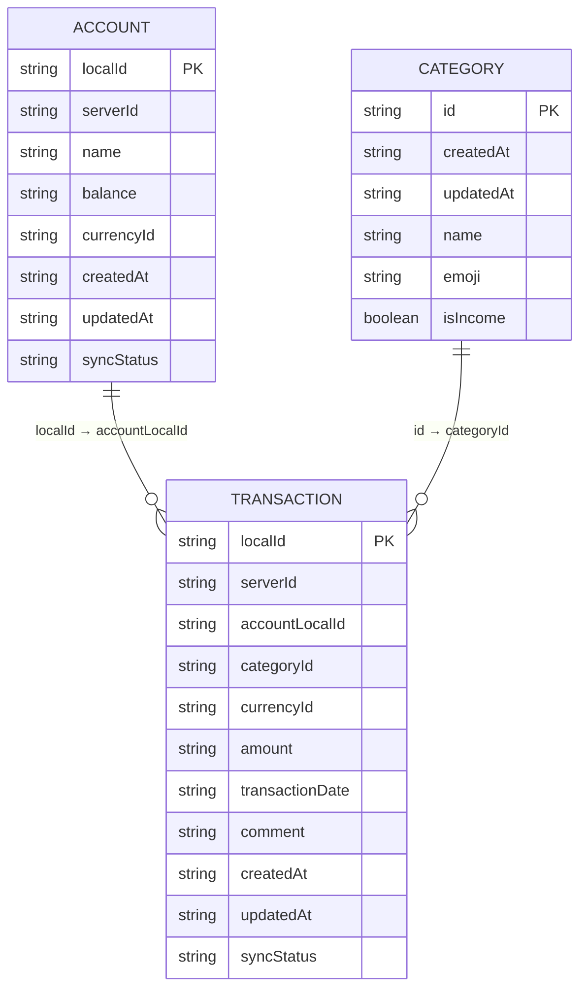

# Local Database

## Overview

Локальная база данных используется для хранения финансовых данных пользователя
в offline-first режиме и служит источником данных для слоя `core:data`.

База данных хранит:

- счета пользователя
- категории доходов и расходов
- транзакции
- состояние синхронизации с сервером

Модель данных спроектирована с учетом:

- офлайн-работы
- последующей синхронизации
- разделения `localId` и `serverId`

---

## Entities & Relationships

> **Связи логические, а не enforced-FK.** В Room-сущностях намеренно **не**
> используются `@ForeignKey` и `@Index`:
>
> - **offline-first:** транзакция ссылается на счёт по `accountLocalId`, при этом
>   счёт может быть создан офлайн и ещё не иметь `serverId` — жёсткий FK мешал бы
>   промежуточным состояниям;
> - **мягкие удаления:** записи не удаляются сразу, а помечаются
>   `syncStatus = PENDING_DELETE` до подтверждения сервером;
> - **порядок синка** (категории → счета → транзакции) и разрешение конфликтов
>   (last-write-wins) реализованы в коде, а не констрейнтами БД.
>
> Целостность данных обеспечивают репозитории и sync-менеджеры. Индексы
> (например, `transactions(accountLocalId, transactionDate)` и `transactions(serverId)`)
> имеет смысл добавить как оптимизацию при росте объёма транзакций — с
> обязательным увеличением версии схемы.