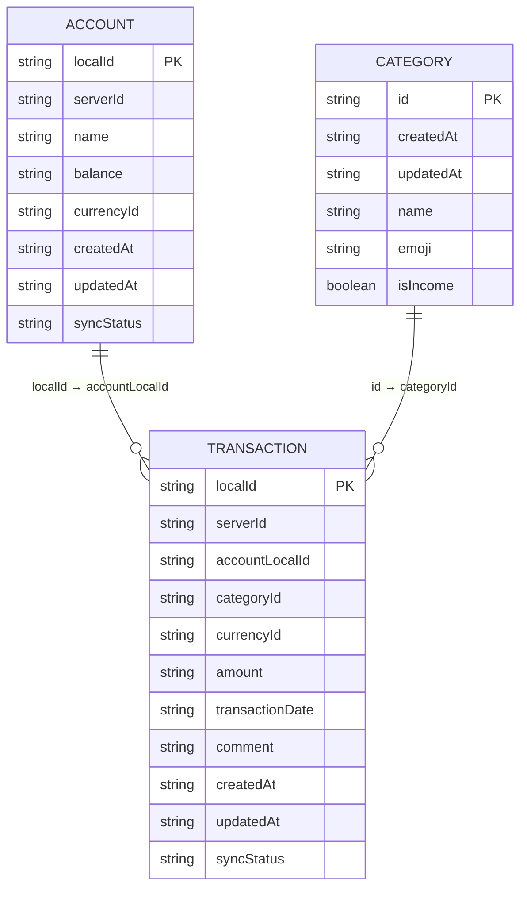

# Локальная база данных

Локальная база данных используется для хранения финансовых данных пользователя
в offline-first режиме и служит источником данных для слоя `core:data`.

База данных хранит:

- счета пользователя
- категории доходов и расходов
- транзакции
- состояние синхронизации с сервером

Модель данных спроектирована с учетом:

- офлайн-работы
- последующей синхронизации
- разделения `localId` и `serverId`

---

## Сущности и связи

```mermaid
erDiagram
    ACCOUNT {
        string localId PK
        string serverId
        string name
        string balance
        string currencyId
        string createdAt
        string updatedAt
        string syncStatus
    }

    CATEGORY {
        string id PK
        string createdAt
        string updatedAt
        string name
        string emoji
        boolean isIncome
    }

    TRANSACTION {
        string localId PK
        string serverId
        string accountLocalId
        string categoryId
        string currencyId
        string amount
        string transactionDate
        string comment
        string createdAt
        string updatedAt
        string syncStatus
    }

    ACCOUNT ||--o{ TRANSACTION: "localId → accountLocalId"
    CATEGORY ||--o{ TRANSACTION: "id → categoryId"
```

## Решения и почему

**Связи логические, а не enforced-FK.** В Room-сущностях намеренно **не**
используются `@ForeignKey` и `@Index`:

- **offline-first:** транзакция ссылается на счёт по `accountLocalId`, при этом
  счёт может быть создан офлайн и ещё не иметь `serverId` — жёсткий FK мешал бы
  промежуточным состояниям;
- **мягкие удаления:** записи не удаляются сразу, а помечаются
  `syncStatus = PENDING_DELETE` до подтверждения сервером;
- **порядок синка** (категории → счета → транзакции) и разрешение конфликтов
  (last-write-wins) реализованы в коде, а не констрейнтами БД.

Целостность данных обеспечивают репозитории и sync-менеджеры. Индексы
(например, `transactions(accountLocalId, transactionDate)` и `transactions(serverId)`)
имеет смысл добавить как оптимизацию при росте объёма транзакций — с
обязательным увеличением версии схемы.

## Ограничения

- **Миграций нет.** До релиза база собирается с `fallbackToDestructiveMigration`: при смене
  схемы локальные данные стираются и заново приходят с сервера. Это допустимо, пока нет
  реальных пользователей.
- **Версия схемы и ассет.** База создаётся из ассета `category_db.db` (`createFromAsset`), у
  которого `user_version = 1`. Версия `@Database` обязана быть строго больше: при равной
  версии и другой схеме Room падает на проверке identity hash. Обратная сторона: ассет старше
  схемы, миграции из него нет, поэтому на свежей установке деструктивная миграция выбрасывает
  его вместе с категориями ([FM-128](https://github.com/IliaVoskoboinikov/Finance-Manager/issues/128)).

## Связанные задачи

| Задача | О чём |
| :--- | :--- |
| [FM-107](https://github.com/IliaVoskoboinikov/Finance-Manager/issues/107) | настоящие миграции Room и `MigrationTestHelper` вместо деструктивной миграции |
| [FM-199](https://github.com/IliaVoskoboinikov/Finance-Manager/issues/199) | заморозка схемы v1: все изменения схемы до релиза |
| [FM-106](https://github.com/IliaVoskoboinikov/Finance-Manager/issues/106) | индексы для `transactions` |

## Ключевые файлы

| Файл | Роль |
| :--- | :--- |
| `core/database/.../db/FinanceManagerDatabase.kt` | `@Database`: сущности, версия схемы |
| `core/database/.../entity/*Entity.kt` | Room-сущности: счёт, категория, транзакция, валюта |
| `core/database/.../di/DataBaseProviderModule.kt` | сборка базы: ассет, деструктивная миграция |
| `app/src/main/assets/database/category_db.db` | предзагруженные категории |
