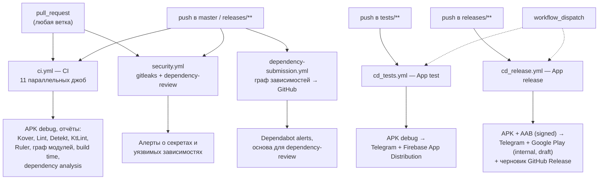
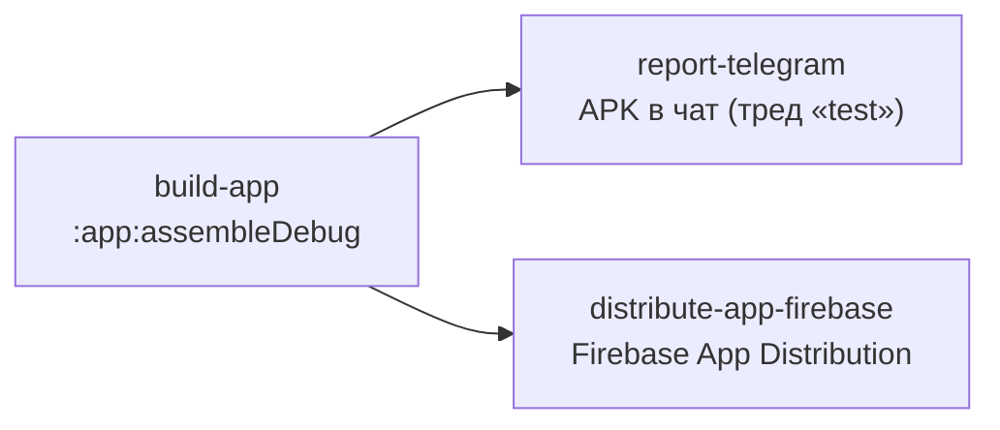
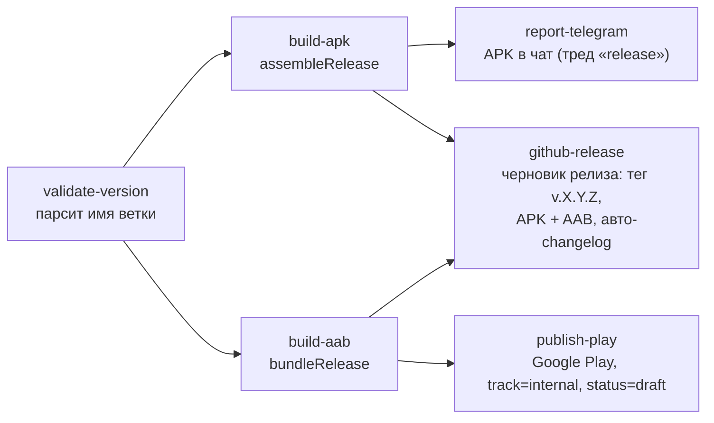

# CI/CD

Документ описывает, как в **Finance Manager** устроены непрерывная интеграция и доставка:
какие workflow есть, чем они триггерятся, что именно проверяют, какие артефакты и отчёты
производят, какие секреты для этого нужны — и что в этой инфраструктуре ещё не сделано.

Всё построено на **GitHub Actions**. Логика намеренно тонкая: workflow лишь дёргают Gradle,
а вся «умная» часть (пороги покрытия, правила статического анализа, проверка архитектуры,
подпись, версии) живёт в сборке — в корневом `build.gradle.kts` и конвеншен-плагинах
`build-logic`. Повторяющиеся шаги вынесены в **composite actions** (`.github/actions/*`).

## Общая картина



Workflow разделены по назначению:

| Workflow | Файл | Назначение |
|---|---|---|
| **CI** | [`.github/workflows/ci.yml`](../.github/workflows/ci.yml) | Гейт качества: сборка, тесты, покрытие, статический анализ, размер приложения, граф модулей, здоровье зависимостей. |
| **Security** | [`.github/workflows/security.yml`](../.github/workflows/security.yml) | Поиск утёкших секретов (gitleaks) и уязвимых зависимостей в PR (dependency-review). |
| **Dependency submission** | [`.github/workflows/dependency-submission.yml`](../.github/workflows/dependency-submission.yml) | Отдаёт GitHub граф зависимостей — без него не работают Dependabot alerts. |
| **App test** | [`.github/workflows/cd_tests.yml`](../.github/workflows/cd_tests.yml) | Доставка тестовой (debug) сборки тестировщикам. |
| **App release** | [`.github/workflows/cd_release.yml`](../.github/workflows/cd_release.yml) | Подписанный релиз: APK + AAB, публикация в Google Play, черновик GitHub Release. |

Обновление зависимостей автоматизировано **Renovate** ([`.github/renovate.json5`](../.github/renovate.json5)):
он читает `gradle/libs.versions.toml`, `gradle-wrapper.properties` и версии actions,
группирует связанные обновления (Kotlin + KSP + Hilt, AndroidX Compose, Firebase) и
раз в неделю открывает PR. Патчи инструментов статического анализа и минорные обновления
actions мержатся автоматически, major — только через Dependency Dashboard.
Требует установки GitHub App **Mend Renovate** на репозиторий.

Общие настройки во всех workflow, запускающих Gradle:

```yaml
env:
  gradleFlags: --parallel --stacktrace --no-configuration-cache --no-daemon
  API_TOKEN: ${{ secrets.API_TOKEN }}
  GOOGLE_SERVICES_JSON: ${{ secrets.GOOGLE_SERVICES_JSON }}
```

`--no-configuration-cache` и `--no-daemon` — потому что раннер одноразовый: кеш конфигурации
негде переиспользовать, а демон только держит память.

JDK **21** во всех джобах, ставится в [`init-gradle`](../.github/actions/init-gradle/action.yaml).
Раньше там стоял 17, а джоба `nav-graph` переопределяла его на 21 ради Layoutlib — разные JDK
в разных джобах обесценивали общий build cache. Байткод при этом по-прежнему собирается
под Java 11 (`Const.JAVA_VERSION`): версия JDK, на котором работает Gradle, и целевая версия
байткода — разные вещи.

## CI (`ci.yml`)

Триггеры — `pull_request` (любая ветка) и `push` в `master` / `releases/**`. Ветки без PR
CI не гоняют намеренно: у `push` и `pull_request` разные `github.ref`, а значит разные группы
`concurrency`, и раньше каждый push в ветку с открытым PR запускал прогон дважды.
`paths-ignore` на `pull_request` **нет**: пропущенный workflow не создаёт чек-ранов, и PR
с правками только в `*.md` навсегда зависал бы в «Expected — Waiting for status to be reported».
Прогон на устаревший коммит отменяется (`concurrency` + `cancel-in-progress`), кроме `master`.
Одиннадцать джоб, запускаются параллельно и между собой не связаны `needs`: падение одной
не останавливает остальные, и в сводке прогона видно сразу все проблемы. Десять из них
блокирующие, `dependency-analysis` — рекомендательная (`continue-on-error`).

| Джоба | Команда / action | Что проверяет | Артефакты и отчёты |
|---|---|---|---|
| `build-app` | `./gradlew assembleDebug` | Проект компилируется. | `debug-apk`; таблица времени сборки в Step Summary. |
| `run-tests` | `./gradlew test` (master) / `runAffectedUnitTests` (ветки и PR) | Юнит-тесты (JVM + Robolectric) и архитектурные тесты `:konsist`. | Аннотации на упавших тестах в diff, `unit-tests-html` при падении. |
| `check-dependency-guard` | `./gradlew :app:dependencyGuard` | Release-classpath не разошёлся со слепком. | — |
| `dependency-analysis` | `./gradlew buildHealth` | Неиспользуемые и неверно объявленные зависимости. Не блокирует (`continue-on-error`). | `dependency-analysis-report`; первые 200 строк отчёта в Step Summary. |
| `run-coverage` | [`actions/coverage`](../.github/actions/coverage/action.yml) | Порог покрытия Kover. | `kover-coverage-html`; таблица LINE/BRANCH в Step Summary. |
| `run-lint` | `./gradlew lint` | Android Lint + кастомные чекеры модуля `:lint`. | `lint-html` (HTML-отчёты всех модулей). |
| `run-detekt` | `./gradlew detekt --continue` | Статический анализ Kotlin. | `detekt.html`, SARIF в Code Scanning, Markdown в Step Summary. |
| `run-ktlint` | [`actions/ktlint`](../.github/actions/ktlint/action.yml) | Форматирование/стиль. | `ktlint-html-report`, SARIF в Code Scanning, Markdown в Step Summary. |
| `check-app-size` | `./gradlew :app:analyzeDebugBundle` | Размер приложения (Ruler). | `ruler-report.html`. |
| `check-module-graph` | `./gradlew :app:assertModuleGraph` + `generateModulesGraphvizText` | Архитектурные границы модулей. | `all_modules.png` (Graphviz), DOT-граф в Step Summary. |
| `nav-graph` | [`actions/nav-graph`](../.github/actions/nav-graph/action.yml) | Карта экранов и галерея `@Preview` собираются без ошибок. | `nav-graph-report` (PNG + интерактивный HTML + `index.html`). |

### Как устроены отдельные джобы

**`run-coverage`.** Вся логика — в composite action `coverage`: сначала генерируются
отчёты (`:koverHtmlReportFull`, `:koverXmlReportFull`), потом Python-скрипт парсит XML и
печатает таблицу покрытия в `$GITHUB_STEP_SUMMARY`, и только затем запускается гейт
`:koverVerifyFull`. Порядок важен: HTML-отчёт и сводка доступны, даже если порог не пройден.
Само число порога задаётся **только** в корневом `build.gradle.kts`
(`kover { reports { verify { rule { minBound(...) } } } }`) — CI его не дублирует.
Подробности про фильтры и что исключено из знаменателя — в [Testing & Coverage](./testing.md).

**`run-detekt`.** Шаг с Detekt помечен `continue-on-error: true`, чтобы успели выполниться
шаги публикации отчётов; фактический провал джобы делает последний шаг — `grep -q "<error"`
по `detekt.xml`. SARIF уходит в GitHub Code Scanning с `category: detekt`.

**`run-ktlint`.** `ktlintCheck --continue` собирает SARIF по всем модулям, action склеивает
их в один `merged-ktlint.sarif` через `jq`, отдельно строит подробный Markdown-отчёт
(таблица «модуль → число нарушений» + список с файлами и строками), а
[`actions/report-renderer`](../.github/actions/report-renderer/action.yml) рендерит его в
HTML через Pandoc.

**`check-module-graph`.** Задача `:app:assertModuleGraph` раскрывается в две:
`assertMaxHeight` (высота графа — 6 рёбер, зафиксирована по факту без запаса) и
`assertRestrictions` (запрещённые рёбра регулярками). Правила живут в
[`ModuleGraphConventionPlugin`](../build-logic/convention/src/main/kotlin/ModuleGraphConventionPlugin.kt)
и дополняют, а не дублируют `CheckConventionsPlugin`: самое ценное — `:core:domain` не имеет
права зависеть от data-слоя, чего проверка конвеншенов не ловит вовсе. Оговорка: задача
не считает свою конфигурацию входом, поэтому после правки правил локально нужен
`--rerun-tasks`; в CI каждый прогон и так с чистого листа.
Параллельно архитектуру проверяет конвеншен-плагин `soft.divan.check.conventions`
([`CheckConventionsPlugin.kt`](../build-logic/convention/src/main/kotlin/CheckConventionsPlugin.kt)):
он на `projectsEvaluated` обходит все модули и падает `GradleException`, если
`core` зависит от `feature`, `feature:*:api` — от `impl`, или один `impl` — от чужого `impl`.
Работает это на **любом** запуске Gradle, а не только в этой джобе. Джоба всё равно полезна
(она гарантированно конфигурирует проект и рисует граф), но название вводит в заблуждение —
см. раздел «Что нужно доделать».

**`run-tests`.** На `master` гоняется полный `./gradlew test`. На ветках и в PR —
`runAffectedUnitTests` из плагина
[AffectedModuleDetector](https://github.com/dropbox/AffectedModuleDetector): он сравнивает
диффс merge-base `master`, строит список изменённых модулей и их обратных зависимостей и
запускает тесты только для них. Поэтому `checkout` здесь с `fetch-depth: 0` — без полной
истории merge-base не найти. Правка `gradle/libs.versions.toml`, `build-logic`, корневых
`*.gradle.kts` или `gradle.properties` считается задевающей всё (`pathsAffectingAllModules`)
и возвращает полный прогон. Модуль `:konsist` из детектора исключён и запускается явно: он
читает исходники всех модулей с диска, и граф зависимостей Gradle этой связи не видит.
Результаты публикует `mikepenz/action-junit-report` — упавший тест виден аннотацией прямо
на строке, а не только в логе.

**`check-dependency-guard` и `dependency-analysis`.** Две проверки, намеренно разнесённые
по разным джобам: сначала они были склеены, и падение рекомендательного отчёта утаскивало
за собой блокирующий гейт, который даже не успевал запуститься.

* `buildHealth` ([dependency-analysis](https://github.com/autonomousapps/dependency-analysis-gradle-plugin))
  — **рекомендательный**: ищет неиспользуемые зависимости, `api` вместо `implementation`
  и использование транзитивных зависимостей без явного объявления. Все категории настроены
  на `severity("warn")` в корневом `build.gradle.kts`: на текущей кодовой базе отчёт занимает
  ~950 строк, и разбирать его нужно постепенно. По мере разбора категории переводятся
  на `fail` поштучно. Джоба помечена `continue-on-error` и не входит в required-чеки:
  на холодном кэше это ~6700 задач и заметно дольше остальных джоб, поэтому merge её
  не ждёт. Там же свои настройки памяти. Задачи плагина исполняются через
  `IsolatedClassloaderWorker` — каждый work item получает собственный classloader, и его
  классы оседают в Metaspace. Дефолтного `-XX:MaxMetaspaceSize=1g` из `gradle.properties`
  на такой объём не хватает: джоба падала с `OutOfMemoryError: Metaspace`. Поэтому здесь
  `-XX:MaxMetaspaceSize=2g` и `--max-workers=2` вместо `--parallel`.
  Локально это воспроизводится только с `--rerun-tasks`: на тёплом кэше почти все задачи
  становятся `UP-TO-DATE`, и холодный путь не проверяется вовсе.
* `:app:dependencyGuard` ([dependency-guard](https://github.com/dropbox/dependency-guard))
  — **блокирующий**: сверяет release-runtime-classpath приложения со слепком
  [`app/dependencies/releaseRuntimeClasspath.txt`](../app/dependencies/releaseRuntimeClasspath.txt).
  Любое изменение дерева зависимостей, включая транзитивное, приезжает в PR явным diff'ом.
  Обновить слепок осознанно: `./gradlew :app:dependencyGuardBaseline`.

## Security (`security.yml`)

Две джобы, триггеры те же, что у `ci.yml` (`pull_request` + `push` в `master` / `releases/**`):

* **`secret-scan`** — [gitleaks](https://github.com/gitleaks/gitleaks-action) по всей истории
  (`fetch-depth: 0`, иначе секрет, удалённый последним коммитом, не найдётся). Прямо
  поддерживает требование [`docs/agents/security.md`](./agents/security.md): пароли от
  keystore, `API_TOKEN`, `YANDEX_CLIENT_ID` и JWT живут только в `local.properties` и
  CI-секретах. Лицензия нужна только организациям — для личного аккаунта бесплатно.
* **`dependency-review`** (только на PR) — блокирует добавление зависимости с известной
  уязвимостью уровня `high` и выше. Работает поверх графа, который публикует
  `dependency-submission.yml`, поэтому без него бесполезен.

## CD: тестовые сборки (`cd_tests.yml`)

Триггер — `push` в `tests/**` либо ручной `workflow_dispatch`.



`build-app` собирает debug-APK и заливает его артефактом `app-debug`; обе следующие джобы
скачивают этот артефакт (пересборки нет). Телеграм-джоба помечена `continue-on-error: true` —
недоступность бота не должна валить доставку. Раздача в Firebase идёт на группы из секрета
`FIREBASE_GROUPS`, в release notes попадают версия, ветка, сообщение коммита и ссылка на прогон.

## CD: релиз (`cd_release.yml`)

Триггер — `push` в `releases/**` либо `workflow_dispatch`.



Джоба `github-release` создаёт именно **черновик**: тег и release notes GitHub собирает сам
(`generate_release_notes: true` — из PR и коммитов с прошлого тега), а публикует релиз
человек кнопкой Publish. Симметрично `status: draft` в Play — ни одна из двух публикаций
не происходит автоматически.

**Версия берётся из имени ветки.** Джоба `validate-version` требует, чтобы ветка
заканчивалась на `v.X.Y.Z` (например `releases/v.1.2.3`), иначе прогон падает. Из неё
вычисляются:

```
VERSION_NAME = X.Y.Z
VERSION_CODE = X * 1_000_000 + Y * 1_000 + Z
```

и передаются в Gradle как `-PversionCode` / `-PversionName`. Конвеншен-плагин
[`AndroidAppConventionPlugin`](../build-logic/convention/src/main/kotlin/AndroidAppConventionPlugin.kt)
читает эти проектные свойства и подставляет их в `defaultConfig`, откатываясь на
константы из [`Const.kt`](../build-logic/convention/src/main/kotlin/Const.kt) (`0.0.1` / `1`),
если свойств нет — то есть локальная сборка всегда собирается как `0.0.1`.

**Подпись.** Keystore хранится в секрете `JKS_KS` в base64, шаг `Decode Keystore`
раскладывает его в `app/release.jks` (файл в `.gitignore`). Сам `signingConfig` объявлен в
[`ConfigureBaseAndroid.kt`](../build-logic/convention/src/main/kotlin/soft/divan/financemanager/ConfigureBaseAndroid.kt)
и читает пароли **только** из переменных окружения `KEYSTORE_PASSWORD`, `KEY_ALIAS`,
`KEY_PASSWORD` — в репозитории их нет. Для `:app` в release дополнительно включены
`isMinifyEnabled` и `isShrinkResources` (R8 + шринк ресурсов).

**Публикация.** `r0adkll/upload-google-play@v1` кладёт AAB на трек `internal` со статусом
`draft` — то есть релиз создаётся, но не раскатывается; финальную публикацию делает человек
в Play Console.

## Composite actions

Переиспользуемые кирпичи в `.github/actions/`:

| Action | Что делает |
|---|---|
| [`android-setup`](../.github/actions/android-setup/action.yml) | Зонтичный: checkout → `init-gradle` → `create-google-services`. Одна строка в джобе вместо трёх. |
| [`init-gradle`](../.github/actions/init-gradle/action.yaml) | JDK 21 (Temurin) + `gradle/actions/setup-gradle` + `chmod +x gradlew`. |
| [`create-google-services`](../.github/actions/create-google-services/action.yml) | Декодирует секрет `GOOGLE_SERVICES_JSON` (base64) в `app/google-services.json`; падает, если секрет пуст. |
| [`coverage`](../.github/actions/coverage/action.yml) | Kover: отчёты → сводка в Step Summary → гейт `koverVerifyFull`. |
| [`ktlint`](../.github/actions/ktlint/action.yml) | `ktlintCheck`, склейка SARIF по модулям, подробный Markdown-отчёт. |
| [`report-renderer`](../.github/actions/report-renderer/action.yml) | Markdown → styled HTML через Pandoc (со светлой и тёмной темой). |
| [`build-time-report`](../.github/actions/build-time-report/action.yaml) | CSV от `build-time-tracker` → Markdown-таблица в Step Summary (`csv2md.sh`). |
| [`draw-graph`](../.github/actions/draw-graph/action.yaml) | DOT → PNG через Graphviz. |
| [`send-file-tg`](../.github/actions/send-file-tg/action.yaml) | Отправка файла и подписи в Telegram (`sendDocument`, поддержка тредов). |

## Секреты

Все — на уровне репозитория (GitHub Actions secrets); окружений (Environments) с
protection rules сейчас нет.

| Секрет | Где используется | Зачем |
|---|---|---|
| `API_TOKEN` | все workflow (env) | Токен бэкенда, читается сборкой `:core:network` (локально — из `local.properties`). |
| `GOOGLE_SERVICES_JSON` | все workflow (env) | base64 `google-services.json` для Firebase/Crashlytics. |
| `JKS_KS` | `cd_release` | base64 release-keystore. |
| `JKS_KS_PASS`, `JKS_ALIAS`, `JKS_KEY_PASS` | `cd_release` | Пароль стора, алиас и пароль ключа. |
| `PLAY_SERVICE_ACCOUNT_JSON`, `PLAY_PACKAGE_NAME` | `cd_release` | Сервисный аккаунт и applicationId для Play Publishing API. |
| `FIREBASE_APP_ID_DEBUG`, `FIREBASE_SERVICE_ACCOUNT`, `FIREBASE_GROUPS` | `cd_tests` | App Distribution. |
| `TG_TOKEN`, `TG_CHAT_BUILD`, `TG_THREAD_TEST`, `TG_THREAD_RELEASE` | `cd_tests`, `cd_release` | Бот, чат и треды для отчётов о сборках. |

> `YANDEX_CLIENT_ID` (см. [`app/build.gradle.kts`](../app/build.gradle.kts)) читается по той же
> схеме «env или `local.properties`», но как CI-секрет пока **не** заведён — в CI-сборках
> плейсхолдер пустой.

## Что на стороне Gradle

CI намеренно тонкий, поэтому «где что настроено» полезно держать в голове:

| Инструмент | Где настроен | Задача |
|---|---|---|
| Kover (покрытие + гейт) | корневой `build.gradle.kts` | `koverHtmlReportFull`, `koverXmlReportFull`, `koverVerifyFull` |
| Detekt | корневой `build.gradle.kts` + `config/detekt/detekt.yml` | `detekt` (xml + html + sarif + md) |
| KtLint | `subprojects { … }` в корневом `build.gradle.kts` | `ktlintCheck` / `ktlintFormat` |
| Android Lint + кастомные правила | конвеншен-плагины, модуль `:lint` | `lint` |
| Ruler (размер приложения) | [`RulerConventionPlugin`](../build-logic/convention/src/main/kotlin/RulerConventionPlugin.kt) | `:app:analyzeDebugBundle` |
| Время сборки | [`BuildTimeTrackerConventionPlugin`](../build-logic/convention/src/main/kotlin/BuildTimeTrackerConventionPlugin.kt) | CSV в `app/build/reports/buildTimeTracker/` |
| Архитектурные границы | [`CheckConventionsPlugin`](../build-logic/convention/src/main/kotlin/CheckConventionsPlugin.kt) | выполняется на любом запуске Gradle |
| Граф модулей | [`ModuleGraphConventionPlugin`](../build-logic/convention/src/main/kotlin/ModuleGraphConventionPlugin.kt) | `:app:assertModuleGraph` (высота + запрещённые рёбра), `:app:generateModulesGraphvizText` |
| Архитектура на уровне классов | модуль [`:konsist`](../konsist/README.md) | `:konsist:test` (входит в обычный `test`) |
| Анализ зависимостей | корневой `build.gradle.kts` + `AndroidBaseConventionPlugin` / `JvmLibraryConventionPlugin` | `buildHealth` |
| Слепок release-classpath | [`DependencyGuardConventionPlugin`](../build-logic/convention/src/main/kotlin/DependencyGuardConventionPlugin.kt) | `:app:dependencyGuard`, `:app:dependencyGuardBaseline` |
| Отбор затронутых модулей | корневой `build.gradle.kts` (AffectedModuleDetector) | `runAffectedUnitTests` |
| Диагностика скорости сборки | корневой `build.gradle.kts` (Gradle Doctor) | выполняется на любом запуске Gradle |
| Build scan | `settings.gradle.kts` (Develocity) | `--scan -Pdevelocity.tos.agree=true` |
| Версия и подпись | `AndroidAppConventionPlugin`, `ConfigureBaseAndroid`, `Const.kt` | `-PversionName` / `-PversionCode`, `signingConfigs` |

**Gradle Doctor** ([`com.osacky.doctor`](https://github.com/runningcode/gradle-doctor)) печатает
«рецепты» после каждой сборки: промахи build cache, время в GC, зависимости от `clean`,
незаданный `JAVA_HOME` (из-за него переключение между Android Studio и терминалом вызывает
полную пересборку). Настроен предупреждать, а не ронять сборку: `javaHome.failOnError = false`
и выключен `disallowMultipleDaemons` — CI и так гоняет Gradle с `--no-daemon`.

**Build scan** публикуется на публичный `scans.gradle.com`, поэтому по умолчанию выключен:
это требует согласия с условиями использования Gradle. Включается явно одним запуском —
`./gradlew assembleDebug --scan -Pdevelocity.tos.agree=true`.

## Локальный прогон «как в CI»

```bash
./gradlew assembleDebug test koverVerifyFull lint detekt ktlintCheck :app:assertModuleGraph :app:dependencyGuard
./gradlew buildHealth
```

`buildHealth` вынесен во второй запуск намеренно: dependency-analysis добавляет по десятку
своих задач на каждый модуль, и вместе с полной сборкой это укладывает Gradle-демон по
памяти (`Gradle build daemon disappeared unexpectedly`). В CI они и так живут в разных
джобах, так что проблема только локальная.

Быстрее — проверять только затронутые модули (`./gradlew :feature:<name>:impl:check`),
а полный набор гонять перед пушем.

---

## Что нужно доделать

Список отсортирован по важности. Актуальный чеклист дублируется в
[TODO.md → CI/CD](../TODO.md); здесь — обоснование каждого пункта.

### 🔴 Критично

- [ ] **Инъекция шелла через сообщение коммита.** В [`send-file-tg`](../.github/actions/send-file-tg/action.yaml)
      вход `text` подставляется прямо в `run:` (`-F caption="${{ inputs.text }}"`), а приходит
      туда `${{ github.event.head_commit.message }}`. Коммит с `$(...)` или `"; …` выполнит
      произвольную команду на раннере — который в релизном пайплайне имеет доступ к keystore
      и секретам Play. Лечится передачей значений через `env:` и использованием `"$VAR"`
      внутри скрипта (то же касается `tg-token`, `tg-chat`, `file`).
- [ ] **Релиз не зависит от гейта качества.** `cd_release.yml` не запускает ни тестов, ни
      линтеров: пуш в `releases/**` может уехать в Play даже при красном CI. Нужно либо
      вынести проверки в reusable workflow и добавить `needs:`, либо требовать зелёный CI
      через branch protection.
- [ ] **Нет `permissions:` ни в одном workflow.** Токен получает права по умолчанию
      организации/репозитория. Шаги `upload-sarif` требуют `security-events: write`; всё
      остальное обходится `contents: read`. Явный минимальный блок в каждом workflow.
- [ ] **Release-сборка не проверяется в CI.** Для `:app` в release включён R8 + шринк
      ресурсов, но `assembleRelease` собирается только на релизной ветке. Ошибки в
      `proguard-rules.pro` (упавшая рефлексия Gson/Room/Hilt) обнаруживаются в момент
      релиза. Нужен `assembleRelease` (с debug-подписью) хотя бы по расписанию или на PR
      в master.

### 🟠 Важно

- [ ] **Telegram сообщает неверную версию.** Джобы `report-telegram` берут версию из
      `./gradlew -q printVersionName`, а эта задача печатает `Const.VERSION_NAME` (`0.0.1`)
      и не знает про `-PversionName`. В релизе нужно брать
      `needs.validate-version.outputs.version_name`, а саму задачу — научить читать
      проектное свойство.
- [ ] **Часть CD-джоб не использует `android-setup`.** В `ci.yml` это починено, но обе
      `report-telegram` и `distribute-app-firebase` по-прежнему запускают Gradle без
      `init-gradle` — на JDK раннера по умолчанию и без кеша Gradle. Версия JDK не
      зафиксирована: смена образа `ubuntu-latest` может неожиданно сломать сборку.
- [ ] **Восемь джоб = восемь холодных сборок.** `run-tests` и `run-coverage` прогоняют тесты
      дважды (Kover требует своего прогона). Стоит либо объединить их, либо включить
      общий remote/GHA build cache.
- [ ] **`run-tests` гоняет `./gradlew test`** — это debug + release варианты, вдвое дольше
      нужного. В `CLAUDE.md` и в документации указан `testDebugUnitTest`; надо привести к
      одному.
- [ ] **Порог покрытия рассинхронизирован в документации.** Фактическое значение —
      `minBound(95)` в корневом `build.gradle.kts`; при этом KDoc рядом говорит про 98 %,
      `docs/testing.md` — про 99 % и 98 %, `TODO.md` — про 99 %. Нужно решить целевое число
      и починить все упоминания (единственный источник истины — `build.gradle.kts`).
- [ ] **CI и CD пересекаются на `releases/**`.** Это осознанно: релизная ветка проходит
      полный гейт качества параллельно со сборкой. Правильнее связать их через `needs`,
      чтобы публикация не стартовала при красном CI — см. пункт про гейт выше.

### 🟡 Улучшения

- [ ] **Gradle-кеш для сборок.** Тестовые прогоны — с кешем, релизные — принципиально без.
- [ ] **AI-ревьюер на PR.**
- [ ] **Пин actions по SHA.** Сейчас `uses:` запинены только по мажору. Renovate умеет
      переводить их на digest — достаточно добавить `helpers:pinGitHubActionDigests`
      в `extends` его конфига.
- [ ] **`timeout-minutes` на джобах** — сейчас зависшая сборка висит до дефолтных 6 часов.
- [ ] **`retention-days` для артефактов** — APK и HTML-отчёты хранятся 90 дней по умолчанию.
- [ ] **Гейт на размер приложения.** Ruler строит отчёт, но порога/сравнения с baseline нет —
      рост размера никто не заметит.
- [ ] **Гейт на время сборки.** То же самое: `build-time-report` печатает таблицу, регрессия
      не ловится.
- [ ] **Lint без SARIF.** Загрузка в Code Scanning закомментирована в `ci.yml` (для Detekt и
      KtLint она работает) — включить и добавить lint baseline.
- [ ] **Instrumented-тесты на эмуляторе** (`reactivecircus/android-emulator-runner`). Понадобятся
      обязательно, когда появятся настоящие Room-миграции и `MigrationTestHelper` — сейчас в
      CI только JVM/Robolectric.
- [ ] **Скриншот-тесты** — отложенный «трек 4» плана покрытия. Официальный
      **Compose Preview Screenshot Testing** (`com.android.compose.screenshot`) сейчас
      **не подключается**: его source set включается только глобальным флагом
      `android.experimental.enableScreenshotTest=true` в корневом `gradle.properties`
      (плагин читает флаг в момент применения, `android.experimentalProperties` и
      `gradle.properties` внутри модуля не работают), а с этим флагом ktlint 14.2.0 падает
      в `:app` с `Cannot add task 'runKtlintCheckOverAndroidTestSourceSet' as a task with
      that name already exists`. Более новой версии ktlint-плагина нет. Рабочая
      альтернатива — **Roborazzi** (Robolectric, обычный `test`-source set, без
      экспериментальных флагов AGP).
- [ ] **Release notes для Play** (`whatsNewDirectory`) и осознанный переход
      `draft → completed` / promote между треками.
- [ ] **`workflow_dispatch` для релиза фактически не работает** из произвольной ветки:
      `validate-version` требует имя, оканчивающееся на `v.X.Y.Z`. Стоит добавить
      входной параметр `version` для ручного запуска.
- [ ] **Подозрительный `ANDROID_SDK_ROOT: /usr/lib/android-sdk`** в обоих CD-workflow: на
      раннерах GitHub SDK лежит по другому пути (`ANDROID_HOME=/usr/local/lib/android/sdk`).
      Переменная либо игнорируется, либо когда-нибудь сломает сборку — проверить и убрать.
- [ ] **`YANDEX_CLIENT_ID` не заведён как CI-секрет** — CI-сборки собираются с пустым
      client_id, вход через Яндекс в них не работает.
- [ ] **Организационные файлы:** `CODEOWNERS`, шаблон PR, `SECURITY.md`, бейджи статуса
      сборки в `README.md`.

## Ключевые файлы

| Файл | Роль |
|---|---|
| [`.github/workflows/ci.yml`](../.github/workflows/ci.yml) | Гейт качества на каждый push. |
| [`.github/workflows/cd_tests.yml`](../.github/workflows/cd_tests.yml) | Тестовая раздача (Telegram + Firebase). |
| [`.github/workflows/cd_release.yml`](../.github/workflows/cd_release.yml) | Подписанный релиз и публикация в Play. |
| [`.github/workflows/security.yml`](../.github/workflows/security.yml) | gitleaks + dependency-review. |
| [`.github/workflows/dependency-submission.yml`](../.github/workflows/dependency-submission.yml) | Граф зависимостей для Dependabot alerts. |
| [`.github/renovate.json5`](../.github/renovate.json5) | Правила автообновления зависимостей и actions. |
| [`.github/actions/`](../.github/actions/) | Composite actions: setup, отчёты, доставка. |
| [`konsist/`](../konsist/README.md) | Архитектурные тесты уровня классов. |
| [`app/dependencies/`](../app/dependencies/) | Слепок release-classpath (dependency-guard). |
| [`build.gradle.kts`](../build.gradle.kts) | Kover (фильтры + порог), Detekt, KtLint. |
| [`build-logic/convention/`](../build-logic/convention/) | Версия, подпись, R8, Ruler, build-time tracker, проверка архитектуры. |
| [`config/detekt/detekt.yml`](../config/detekt/detekt.yml) | Правила Detekt. |
| [`TODO.md`](../TODO.md) | Технический бэклог, раздел CI/CD. |
