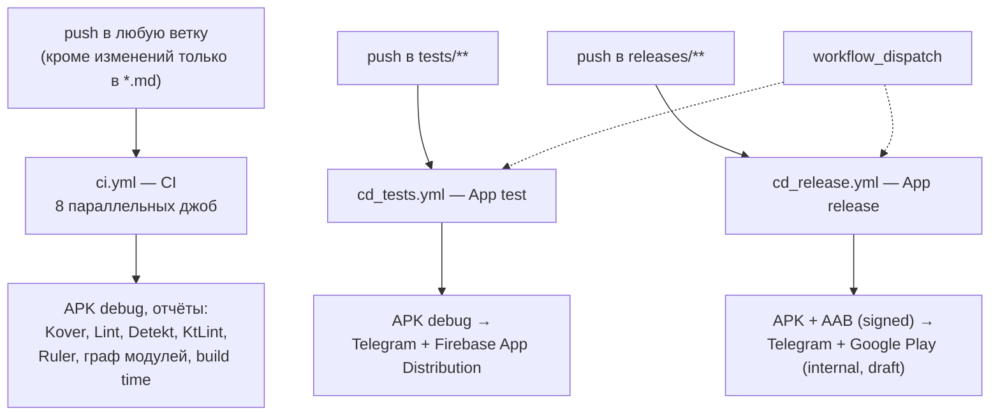
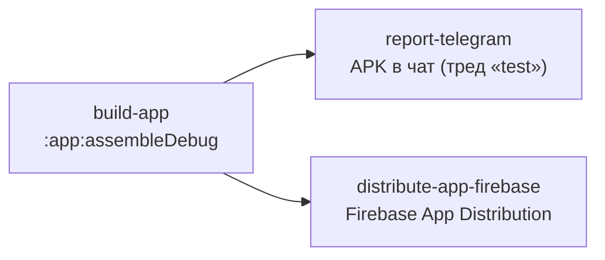
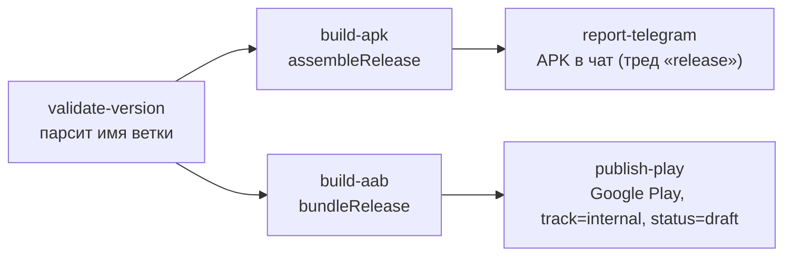

# CI/CD

Документ описывает, как в **Finance Manager** устроены непрерывная интеграция и доставка:
какие workflow есть, чем они триггерятся, что именно проверяют, какие артефакты и отчёты
производят, какие секреты для этого нужны — и что в этой инфраструктуре ещё не сделано.

Всё построено на **GitHub Actions**. Логика намеренно тонкая: workflow лишь дёргают Gradle,
а вся «умная» часть (пороги покрытия, правила статического анализа, проверка архитектуры,
подпись, версии) живёт в сборке — в корневом `build.gradle.kts` и конвеншен-плагинах
`build-logic`. Повторяющиеся шаги вынесены в **composite actions** (`.github/actions/*`).

## Общая картина



Три workflow разделены по назначению:

| Workflow | Файл | Назначение |
|---|---|---|
| **CI** | [`.github/workflows/ci.yml`](../.github/workflows/ci.yml) | Гейт качества: сборка, тесты, покрытие, статический анализ, размер приложения, граф модулей. |
| **App test** | [`.github/workflows/cd_tests.yml`](../.github/workflows/cd_tests.yml) | Доставка тестовой (debug) сборки тестировщикам. |
| **App release** | [`.github/workflows/cd_release.yml`](../.github/workflows/cd_release.yml) | Подписанный релиз: APK + AAB, публикация в Google Play. |

Общие настройки во всех трёх:

```yaml
env:
  gradleFlags: --parallel --stacktrace --no-configuration-cache --no-daemon
  API_TOKEN: ${{ secrets.API_TOKEN }}
  GOOGLE_SERVICES_JSON: ${{ secrets.GOOGLE_SERVICES_JSON }}
```

`--no-configuration-cache` и `--no-daemon` — потому что раннер одноразовый: кеш конфигурации
негде переиспользовать, а демон только держит память. `paths-ignore: ['**.md']` не гоняет
сборку на правки документации.

## CI (`ci.yml`)

Триггер — **любой** `push` (без ограничения по веткам). Восемь независимых джоб,
запускаются параллельно, между собой не связаны `needs` — то есть падение одной не
останавливает остальные, и в сводке прогона видно сразу все проблемы.

| Джоба | Команда / action | Что проверяет | Артефакты и отчёты |
|---|---|---|---|
| `build-app` | `./gradlew assembleDebug` | Проект компилируется. | `debug-apk`; таблица времени сборки в Step Summary. |
| `run-tests` | `./gradlew test` | Все юнит-тесты (JVM + Robolectric). | — |
| `run-coverage` | [`actions/coverage`](../.github/actions/coverage/action.yml) | Порог покрытия Kover. | `kover-coverage-html`; таблица LINE/BRANCH в Step Summary. |
| `run-lint` | `./gradlew lint` | Android Lint + кастомные чекеры модуля `:lint`. | `lint-html` (HTML-отчёты всех модулей). |
| `run-detekt` | `./gradlew detekt --continue` | Статический анализ Kotlin. | `detekt.html`, SARIF в Code Scanning, Markdown в Step Summary. |
| `run-ktlint` | [`actions/ktlint`](../.github/actions/ktlint/action.yml) | Форматирование/стиль. | `ktlint-html-report`, SARIF в Code Scanning, Markdown в Step Summary. |
| `check-app-size` | `./gradlew :app:analyzeDebugBundle` | Размер приложения (Ruler). | `ruler-report.html`. |
| `check-module-graph` | `./gradlew :app:assertModuleGraph` + `generateModulesGraphvizText` | Архитектурные границы модулей. | `all_modules.png` (Graphviz), DOT-граф в Step Summary. |

### Как устроены отдельные джобы

**`run-coverage`.** Вся логика — в composite action `coverage`: сначала генерируются
отчёты (`:koverHtmlReportFull`, `:koverXmlReportFull`), потом Python-скрипт парсит XML и
печатает таблицу покрытия в `$GITHUB_STEP_SUMMARY`, и только затем запускается гейт
`:koverVerifyFull`. Порядок важен: HTML-отчёт и сводка доступны, даже если порог не пройден.
Само число порога задаётся **только** в корневом `build.gradle.kts`
(`kover { reports { verify { rule { minBound(...) } } } }`) — CI его не дублирует.
Подробности про фильтры и что исключено из знаменателя — в [Testing & Coverage](./testing.md).

**`run-detekt`.** Шаг с Detekt помечен `continue-on-error: true`, чтобы успели выполниться
шаги публикации отчётов; фактический провал джобы делает последний шаг — `grep -q "<error"`
по `detekt.xml`. SARIF уходит в GitHub Code Scanning с `category: detekt`.

**`run-ktlint`.** `ktlintCheck --continue` собирает SARIF по всем модулям, action склеивает
их в один `merged-ktlint.sarif` через `jq`, отдельно строит подробный Markdown-отчёт
(таблица «модуль → число нарушений» + список с файлами и строками), а
[`actions/report-renderer`](../.github/actions/report-renderer/action.yml) рендерит его в
HTML через Pandoc.

**`check-module-graph`.** Здесь важный нюанс: задача `:app:assertModuleGraph` приходит из
плагина `com.jraska.module.graph.assertion`, но блока `moduleGraphAssert { … }` в проекте
нет — то есть **сама задача сейчас пустая** (`SKIPPED`, ноль ассертов). Реальную проверку
архитектуры делает конвеншен-плагин `soft.divan.check.conventions`
([`CheckConventionsPlugin.kt`](../build-logic/convention/src/main/kotlin/CheckConventionsPlugin.kt)):
он на `projectsEvaluated` обходит все модули и падает `GradleException`, если
`core` зависит от `feature`, `feature:*:api` — от `impl`, или один `impl` — от чужого `impl`.
Работает это на **любом** запуске Gradle, а не только в этой джобе. Джоба всё равно полезна
(она гарантированно конфигурирует проект и рисует граф), но название вводит в заблуждение —
см. раздел «Что нужно доделать».

## CD: тестовые сборки (`cd_tests.yml`)

Триггер — `push` в `tests/**` либо ручной `workflow_dispatch`.



`build-app` собирает debug-APK и заливает его артефактом `app-debug`; обе следующие джобы
скачивают этот артефакт (пересборки нет). Телеграм-джоба помечена `continue-on-error: true` —
недоступность бота не должна валить доставку. Раздача в Firebase идёт на группы из секрета
`FIREBASE_GROUPS`, в release notes попадают версия, ветка, сообщение коммита и ссылка на прогон.

## CD: релиз (`cd_release.yml`)

Триггер — `push` в `releases/**` либо `workflow_dispatch`.



**Версия берётся из имени ветки.** Джоба `validate-version` требует, чтобы ветка
заканчивалась на `v.X.Y.Z` (например `releases/v.1.2.3`), иначе прогон падает. Из неё
вычисляются:

```
VERSION_NAME = X.Y.Z
VERSION_CODE = X * 1_000_000 + Y * 1_000 + Z
```

и передаются в Gradle как `-PversionCode` / `-PversionName`. Конвеншен-плагин
[`AndroidAppConventionPlugin`](../build-logic/convention/src/main/kotlin/AndroidAppConventionPlugin.kt)
читает эти проектные свойства и подставляет их в `defaultConfig`, откатываясь на
константы из [`Const.kt`](../build-logic/convention/src/main/kotlin/Const.kt) (`0.0.1` / `1`),
если свойств нет — то есть локальная сборка всегда собирается как `0.0.1`.

**Подпись.** Keystore хранится в секрете `JKS_KS` в base64, шаг `Decode Keystore`
раскладывает его в `app/release.jks` (файл в `.gitignore`). Сам `signingConfig` объявлен в
[`ConfigureBaseAndroid.kt`](../build-logic/convention/src/main/kotlin/soft/divan/financemanager/ConfigureBaseAndroid.kt)
и читает пароли **только** из переменных окружения `KEYSTORE_PASSWORD`, `KEY_ALIAS`,
`KEY_PASSWORD` — в репозитории их нет. Для `:app` в release дополнительно включены
`isMinifyEnabled` и `isShrinkResources` (R8 + шринк ресурсов).

**Публикация.** `r0adkll/upload-google-play@v1` кладёт AAB на трек `internal` со статусом
`draft` — то есть релиз создаётся, но не раскатывается; финальную публикацию делает человек
в Play Console.

## Composite actions

Переиспользуемые кирпичи в `.github/actions/`:

| Action | Что делает |
|---|---|
| [`android-setup`](../.github/actions/android-setup/action.yml) | Зонтичный: checkout → `init-gradle` → `create-google-services`. Одна строка в джобе вместо трёх. |
| [`init-gradle`](../.github/actions/init-gradle/action.yaml) | JDK 17 (Temurin) + `gradle/actions/setup-gradle` + `chmod +x gradlew`. |
| [`create-google-services`](../.github/actions/create-google-services/action.yml) | Декодирует секрет `GOOGLE_SERVICES_JSON` (base64) в `app/google-services.json`; падает, если секрет пуст. |
| [`coverage`](../.github/actions/coverage/action.yml) | Kover: отчёты → сводка в Step Summary → гейт `koverVerifyFull`. |
| [`ktlint`](../.github/actions/ktlint/action.yml) | `ktlintCheck`, склейка SARIF по модулям, подробный Markdown-отчёт. |
| [`report-renderer`](../.github/actions/report-renderer/action.yml) | Markdown → styled HTML через Pandoc (со светлой и тёмной темой). |
| [`build-time-report`](../.github/actions/build-time-report/action.yaml) | CSV от `build-time-tracker` → Markdown-таблица в Step Summary (`csv2md.sh`). |
| [`draw-graph`](../.github/actions/draw-graph/action.yaml) | DOT → PNG через Graphviz. |
| [`send-file-tg`](../.github/actions/send-file-tg/action.yaml) | Отправка файла и подписи в Telegram (`sendDocument`, поддержка тредов). |

## Секреты

Все — на уровне репозитория (GitHub Actions secrets); окружений (Environments) с
protection rules сейчас нет.

| Секрет | Где используется | Зачем |
|---|---|---|
| `API_TOKEN` | все workflow (env) | Токен бэкенда, читается сборкой `:core:network` (локально — из `local.properties`). |
| `GOOGLE_SERVICES_JSON` | все workflow (env) | base64 `google-services.json` для Firebase/Crashlytics. |
| `JKS_KS` | `cd_release` | base64 release-keystore. |
| `JKS_KS_PASS`, `JKS_ALIAS`, `JKS_KEY_PASS` | `cd_release` | Пароль стора, алиас и пароль ключа. |
| `PLAY_SERVICE_ACCOUNT_JSON`, `PLAY_PACKAGE_NAME` | `cd_release` | Сервисный аккаунт и applicationId для Play Publishing API. |
| `FIREBASE_APP_ID_DEBUG`, `FIREBASE_SERVICE_ACCOUNT`, `FIREBASE_GROUPS` | `cd_tests` | App Distribution. |
| `TG_TOKEN`, `TG_CHAT_BUILD`, `TG_THREAD_TEST`, `TG_THREAD_RELEASE` | `cd_tests`, `cd_release` | Бот, чат и треды для отчётов о сборках. |

> `YANDEX_CLIENT_ID` (см. [`app/build.gradle.kts`](../app/build.gradle.kts)) читается по той же
> схеме «env или `local.properties`», но как CI-секрет пока **не** заведён — в CI-сборках
> плейсхолдер пустой.

## Что на стороне Gradle

CI намеренно тонкий, поэтому «где что настроено» полезно держать в голове:

| Инструмент | Где настроен | Задача |
|---|---|---|
| Kover (покрытие + гейт) | корневой `build.gradle.kts` | `koverHtmlReportFull`, `koverXmlReportFull`, `koverVerifyFull` |
| Detekt | корневой `build.gradle.kts` + `config/detekt/detekt.yml` | `detekt` (xml + html + sarif + md) |
| KtLint | `subprojects { … }` в корневом `build.gradle.kts` | `ktlintCheck` / `ktlintFormat` |
| Android Lint + кастомные правила | конвеншен-плагины, модуль `:lint` | `lint` |
| Ruler (размер приложения) | [`RulerConventionPlugin`](../build-logic/convention/src/main/kotlin/RulerConventionPlugin.kt) | `:app:analyzeDebugBundle` |
| Время сборки | [`BuildTimeTrackerConventionPlugin`](../build-logic/convention/src/main/kotlin/BuildTimeTrackerConventionPlugin.kt) | CSV в `app/build/reports/buildTimeTracker/` |
| Архитектурные границы | [`CheckConventionsPlugin`](../build-logic/convention/src/main/kotlin/CheckConventionsPlugin.kt) | выполняется на любом запуске Gradle |
| Граф модулей | плагин `com.jraska.module.graph.assertion` | `:app:assertModuleGraph`, `:app:generateModulesGraphvizText` |
| Версия и подпись | `AndroidAppConventionPlugin`, `ConfigureBaseAndroid`, `Const.kt` | `-PversionName` / `-PversionCode`, `signingConfigs` |

## Локальный прогон «как в CI»

```bash
./gradlew assembleDebug test koverVerifyFull lint detekt ktlintCheck :app:assertModuleGraph
```

Быстрее — проверять только затронутые модули (`./gradlew :feature:<name>:impl:check`),
а полный набор гонять перед пушем.

---

## Что нужно доделать

Список отсортирован по важности. Актуальный чеклист дублируется в
[TODO.md → CI/CD](../TODO.md); здесь — обоснование каждого пункта.

### 🔴 Критично

- [ ] **Инъекция шелла через сообщение коммита.** В [`send-file-tg`](../.github/actions/send-file-tg/action.yaml)
      вход `text` подставляется прямо в `run:` (`-F caption="${{ inputs.text }}"`), а приходит
      туда `${{ github.event.head_commit.message }}`. Коммит с `$(...)` или `"; …` выполнит
      произвольную команду на раннере — который в релизном пайплайне имеет доступ к keystore
      и секретам Play. Лечится передачей значений через `env:` и использованием `"$VAR"`
      внутри скрипта (то же касается `tg-token`, `tg-chat`, `file`).
- [ ] **Релиз не зависит от гейта качества.** `cd_release.yml` не запускает ни тестов, ни
      линтеров: пуш в `releases/**` может уехать в Play даже при красном CI. Нужно либо
      вынести проверки в reusable workflow и добавить `needs:`, либо требовать зелёный CI
      через branch protection.
- [ ] **Нет `permissions:` ни в одном workflow.** Токен получает права по умолчанию
      организации/репозитория. Шаги `upload-sarif` требуют `security-events: write`; всё
      остальное обходится `contents: read`. Явный минимальный блок в каждом workflow.
- [ ] **`assertModuleGraph` ничего не проверяет.** Задача есть, но конфигурации
      `moduleGraphAssert { maxHeight = …, allowed = […] }` нет — задача выполняется как
      `SKIPPED`. Либо настроить правила (высота графа, белый список рёбер), либо честно
      переименовать джобу в «граф модулей» и опираться на `CheckConventionsPlugin`.
- [ ] **Release-сборка не проверяется в CI.** Для `:app` в release включён R8 + шринк
      ресурсов, но `assembleRelease` собирается только на релизной ветке. Ошибки в
      `proguard-rules.pro` (упавшая рефлексия Gson/Room/Hilt) обнаруживаются в момент
      релиза. Нужен `assembleRelease` (с debug-подписью) хотя бы по расписанию или на PR
      в master.

### 🟠 Важно

- [ ] **Нет триггера `pull_request`.** Сейчас проверки идут только на `push`, поэтому нет
      required status checks на PR и невозможно защитить `master`.
- [ ] **Нет `concurrency` + `cancel-in-progress`.** Каждый пуш в ветку запускает ещё восемь
      джоб; устаревшие прогоны не отменяются и просто жгут минуты.
- [ ] **Флаги Gradle не долетают до команд.**
      В `ci.yml` в джобе `build-app` флаги попали в *название* шага
      (`name: Build project $gradleFlags`), а команда — просто `./gradlew assembleDebug`.
      В `cd_release.yml` обе сборки используют `$GRADLE_FLAGS`, тогда как объявлена
      переменная `gradleFlags` — подставляется пустая строка.
- [ ] **Telegram сообщает неверную версию.** Джобы `report-telegram` берут версию из
      `./gradlew -q printVersionName`, а эта задача печатает `Const.VERSION_NAME` (`0.0.1`)
      и не знает про `-PversionName`. В релизе нужно брать
      `needs.validate-version.outputs.version_name`, а саму задачу — научить читать
      проектное свойство.
- [ ] **Половина джоб не использует `android-setup`.** `run-detekt` и `check-module-graph`
      (и обе `report-telegram`, и `distribute-app-firebase`) запускают Gradle без
      `init-gradle` — на JDK раннера по умолчанию и без кеша Gradle. Версия JDK не
      зафиксирована: смена образа `ubuntu-latest` может неожиданно сломать сборку.
- [ ] **Кеш настроен наполовину.** `init-gradle` одновременно включает `cache: gradle` в
      `actions/setup-java@v3` и `gradle/actions/setup-gradle@v4`, которые кешируют одно и то
      же. Нужно оставить только `setup-gradle` и продумать стратегию (`cache-read-only` для
      не-`master`, отдельный `build-cache` между джобами). Плюс `actions/setup-java@v3` уже
      устарел.
- [ ] **Восемь джоб = восемь холодных сборок.** `run-tests` и `run-coverage` прогоняют тесты
      дважды (Kover требует своего прогона). Стоит либо объединить их, либо включить
      общий remote/GHA build cache.
- [ ] **`run-tests` гоняет `./gradlew test`** — это debug + release варианты, вдвое дольше
      нужного. В `CLAUDE.md` и в документации указан `testDebugUnitTest`; надо привести к
      одному.
- [ ] **Порог покрытия рассинхронизирован в документации.** Фактическое значение —
      `minBound(95)` в корневом `build.gradle.kts`; при этом KDoc рядом говорит про 98 %,
      `docs/testing.md` — про 99 % и 98 %, `TODO.md` — про 99 %. Нужно решить целевое число
      и починить все упоминания (единственный источник истины — `build.gradle.kts`).
- [ ] **`ci.yml` дублирует CD-прогоны.** Триггер без фильтра веток: пуш в `tests/**` или
      `releases/**` запускает и CI, и CD одновременно. Либо это осознанно (и стоит
      зафиксировать в документе), либо нужен `branches-ignore`.

### 🟡 Улучшения

- [ ] **Gradle-кеш для сборок.** Тестовые прогоны — с кешем, релизные — принципиально без.
- [ ] **Dependabot / Renovate** для автообновления зависимостей и версий actions
      (сейчас `.github/dependabot.yml` нет; actions запинены только по мажору).
- [ ] **AI-ревьюер на PR** (после появления `pull_request`-триггера).
- [ ] **`timeout-minutes` на джобах** — сейчас зависшая сборка висит до дефолтных 6 часов.
- [ ] **`retention-days` для артефактов** — APK и HTML-отчёты хранятся 90 дней по умолчанию.
- [ ] **Гейт на размер приложения.** Ruler строит отчёт, но порога/сравнения с baseline нет —
      рост размера никто не заметит.
- [ ] **Гейт на время сборки.** То же самое: `build-time-report` печатает таблицу, регрессия
      не ловится.
- [ ] **Lint без SARIF.** Загрузка в Code Scanning закомментирована в `ci.yml` (для Detekt и
      KtLint она работает) — включить и добавить lint baseline.
- [ ] **Instrumented-тесты на эмуляторе** (`reactivecircus/android-emulator-runner`). Понадобятся
      обязательно, когда появятся настоящие Room-миграции и `MigrationTestHelper` — сейчас в
      CI только JVM/Robolectric.
- [ ] **Скриншот-тесты** (Paparazzi / Roborazzi) — отложенный «трек 4» плана покрытия.
- [ ] **Автоматизация релиза:** тег + GitHub Release + changelog из истории коммитов;
      сейчас есть только ветка `releases/**` и draft в Play.
- [ ] **Release notes для Play** (`whatsNewDirectory`) и осознанный переход
      `draft → completed` / promote между треками.
- [ ] **`workflow_dispatch` для релиза фактически не работает** из произвольной ветки:
      `validate-version` требует имя, оканчивающееся на `v.X.Y.Z`. Стоит добавить
      входной параметр `version` для ручного запуска.
- [ ] **Подозрительный `ANDROID_SDK_ROOT: /usr/lib/android-sdk`** в обоих CD-workflow: на
      раннерах GitHub SDK лежит по другому пути (`ANDROID_HOME=/usr/local/lib/android/sdk`).
      Переменная либо игнорируется, либо когда-нибудь сломает сборку — проверить и убрать.
- [ ] **`YANDEX_CLIENT_ID` не заведён как CI-секрет** — CI-сборки собираются с пустым
      client_id, вход через Яндекс в них не работает.
- [ ] **Организационные файлы:** `CODEOWNERS`, шаблон PR, `SECURITY.md`, бейджи статуса
      сборки в `README.md`.

## Ключевые файлы

| Файл | Роль |
|---|---|
| [`.github/workflows/ci.yml`](../.github/workflows/ci.yml) | Гейт качества на каждый push. |
| [`.github/workflows/cd_tests.yml`](../.github/workflows/cd_tests.yml) | Тестовая раздача (Telegram + Firebase). |
| [`.github/workflows/cd_release.yml`](../.github/workflows/cd_release.yml) | Подписанный релиз и публикация в Play. |
| [`.github/actions/`](../.github/actions/) | Composite actions: setup, отчёты, доставка. |
| [`build.gradle.kts`](../build.gradle.kts) | Kover (фильтры + порог), Detekt, KtLint. |
| [`build-logic/convention/`](../build-logic/convention/) | Версия, подпись, R8, Ruler, build-time tracker, проверка архитектуры. |
| [`config/detekt/detekt.yml`](../config/detekt/detekt.yml) | Правила Detekt. |
| [`TODO.md`](../TODO.md) | Технический бэклог, раздел CI/CD. |
