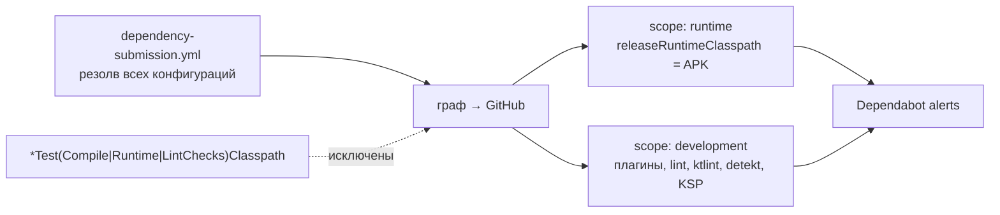

# Уязвимости зависимостей (Dependabot)

Документ фиксирует, откуда берутся алерты Dependabot в этом проекте, где именно в сборке
резолвятся уязвимые версии и почему часть из них закрыта не обновлением, а
**dependency constraints**. Здесь же — реестр действующих constraints и условия их удаления.

## Откуда алерты

GitHub не умеет разбирать `libs.versions.toml` и convention-плагины сам, поэтому граф ему
отдаёт [`dependency-submission.yml`](../.github/workflows/dependency-submission.yml): он
резолвит **все** конфигурации Gradle, кроме тестовых. Поэтому алерты покрывают не только APK,
но и всё build-tooling: buildscript classpath плагинов, lint, ktlint, detekt, KSP.

* **Scope.** `DEPENDENCY_GRAPH_RUNTIME_INCLUDE_CONFIGURATIONS=releaseRuntimeClasspath` помечает
  runtime только то, что уезжает пользователю; остальное — `development`. В списке алертов
  фильтр `scope:runtime` показывает то, что действительно попадает в APK.
* **Исключения.** Кроме `*TestCompileClasspath`/`*TestRuntimeClasspath` исключены
  `*TestLintChecksClasspath`: эти конфигурации AGP 9 наследуют `testImplementation`, и через
  них в граф протекали robolectric, mockk и junit.
* Слепок APK-classpath отдельно фиксирует dependency-guard (`app/dependencies/`), а новые
  уязвимые зависимости в PR блокирует `dependency-review` (см. [CI/CD](./ci-cd.md)).

## Политика исправления

1. **Сначала обновить родителя.** Если у плагина или библиотеки, которая тянет уязвимую версию,
   есть релиз с исправлением, обновляем её в `libs.versions.toml`.
2. **Родитель уже на последней версии — constraint.** Constraint, а не `force`/`resolutionStrategy`:
   он только **поднимает** версию при конфликте и никогда её не опускает. Если родитель
   потом сам перейдёт на более новую версию, победит она.
3. **Версии — в каталоге**, в секции `Security constraints`: Renovate видит их и предлагает
   обновления. Bundles `security-constraints-*` сгруппированы по месту резолва.
4. **APK constraints не трогают.** Все действующие constraints относятся к build-tooling.
   Если уязвимость попадёт в `releaseRuntimeClasspath`, её чинят обновлением зависимости
   приложения, и это видно diff'ом слепка dependency-guard.

## Где резолвятся уязвимые версии

Constraint действует только на ту конфигурацию, к которой он добавлен, поэтому подключение
повторяет четыре места, где резолвится tooling:

| Место | Что резолвит | Куда добавлен constraint |
|---|---|---|
| `buildscript.classpath` корня | AGP, Kover, Ruler и прочие плагины из `plugins { … apply false }` | `buildscript { dependencies { constraints } }` в корневом `build.gradle.kts` |
| `androidLintTool` каждого модуля | lint (отдельный classloader, buildscript сюда не доходит) | `allprojects { configurations.matching { … } }` в корне |
| `ktlint` каждого модуля и build-logic | ktlint CLI | `subprojects { plugins.withId(ktlint) }` в корне, `dependencies.constraints` в build-logic |
| `buildscript.classpath` build-logic | KGP, который тянет `kotlin-dsl` | `buildscript` в `build-logic/convention/build.gradle.kts` |

## Реестр constraints

| Библиотека | Было → стало | Кто тянет | Закрывает | Место | Удалить, когда |
|---|---|---|---|---|---|
| bcprov/bcpkix/bcutil-jdk18on | 1.80.2 → 1.86 | AGP 9.4.1 / lint 32.4.1 → sdk-common | GHSA-9pwp, -qp49, -c3fc, -wg6q | classpath, androidLintTool | sdk-common тянет ≥ 1.85 |
| commons-lang3 | 3.16.0 → 3.21.0 | AGP / lint → commons-compress 1.27.1 | GHSA-j288 | classpath, androidLintTool | commons-compress тянет ≥ 3.18.0 |
| httpclient | 4.5.6 → 4.5.14 | lint → sdklib → httpmime | GHSA-7r82 | androidLintTool (в classpath уже 4.5.14) | sdklib тянет ≥ 4.5.13 |
| jose4j | 0.9.5 → 0.9.7 | AGP → bundletool 1.18.3 | GHSA-3677 | classpath | bundletool тянет ≥ 0.9.6 |
| jdom2 | 2.0.6 → 2.0.6.1 | AGP → jetifier-processor | GHSA-2363 | classpath | jetifier уйдёт из AGP или обновится |
| freemarker | 2.3.32 → 2.3.35 | Kover 0.9.11 → intellij coverage-report | GHSA-27j2 | classpath | coverage-report тянет ≥ 2.3.35 |
| snakeyaml | 1.30 → 2.7 | Ruler 2.0.0-beta-3 | GHSA-mjmj, -3mc7, -98wm, -9w3m, -c4r9, -hhhw, -w37g | classpath | Ruler тянет ≥ 2.0 |
| logback-classic/core | 1.3.16 → 1.5.38 | ktlint-cli 1.8.0 | GHSA-jhq6, -p47f, -qqpg | ktlint | ktlint-cli тянет ≥ 1.5.34 |
| kotlin-gradle-plugin | 2.4.0 → `libs.versions.kotlin` | `kotlin-dsl` (встроенный Kotlin Gradle 9.7.1) | GHSA-r937 | classpath build-logic | встроенный Kotlin в Gradle ≥ версии проекта (Gradle 9.8 — всё ещё 2.4.10) |

О реальном риске. Ни одна из этих библиотек не попадает в APK, а уязвимый код в сборке
практически недостижим: Ruler читает YAML только из `ownershipFile`, который не настроен;
Jetifier выключен; шаблоны Kover встроены в плагин; logback у ktlint пишет только в консоль.
Constraints нужны, чтобы список алертов оставался пустым и новый алерт был виден сразу,
а не терялся среди известных.

### Побочный эффект: предупреждение `kotlin-dsl`

Constraint на KGP в build-logic вызывает при конфигурации build-logic предупреждение
`Unsupported Kotlin plugin version … Kotlin 2.4.0 … requested version 2.4.20`. Разница —
патч внутри 2.4, сборка build-logic и его TestKit-тесты проходят. Предупреждение уйдёт
вместе с constraint, когда Gradle встроит Kotlin ≥ 2.4.20.

## Ревизия после обновлений

После обновления AGP, Kover, Ruler, ktlint или Gradle проверьте, не стал ли constraint
лишним: `./gradlew buildEnvironment` и `./gradlew :app:dependencies --configuration
androidLintTool` показывают `X -> Y`. Если родитель уже тянет версию не ниже нашей, стрелки
нет и constraint можно удалить вместе с записью в каталоге.

Полный граф можно воспроизвести локально тем же плагином, что использует CI
(`org.gradle:github-dependency-graph-gradle-plugin`, init-скрипт +
`:ForceDependencyResolutionPlugin_resolveAllDependencies`), а затем прогнать полученный
JSON через OSV (`POST https://api.osv.dev/v1/querybatch`, ecosystem `Maven`). Счёт совпадает
с Dependabot, если считать уникальные пары «пакет + advisory».

## Ключевые файлы

| Файл | Роль |
|---|---|
| [`gradle/libs.versions.toml`](../gradle/libs.versions.toml) | Секция `Security constraints`: версии, библиотеки, bundles `security-constraints-*`. |
| [`build.gradle.kts`](../build.gradle.kts) | Constraints для buildscript classpath, `androidLintTool` и `ktlint`. |
| [`build-logic/convention/build.gradle.kts`](../build-logic/convention/build.gradle.kts) | Constraint на KGP для `kotlin-dsl`, версия ktlint и constraints для logback в build-logic. |
| [`.github/workflows/dependency-submission.yml`](../.github/workflows/dependency-submission.yml) | Какие конфигурации попадают в граф и как размечается scope. |
| [`app/dependencies/releaseRuntimeClasspath.txt`](../app/dependencies/releaseRuntimeClasspath.txt) | Слепок того, что реально уезжает в APK. |
