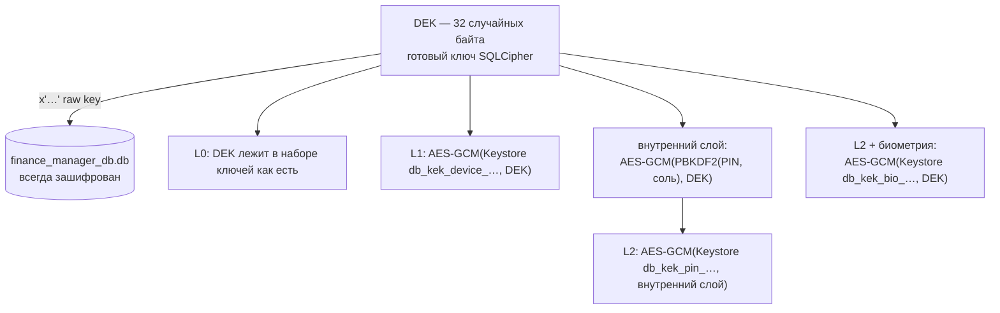
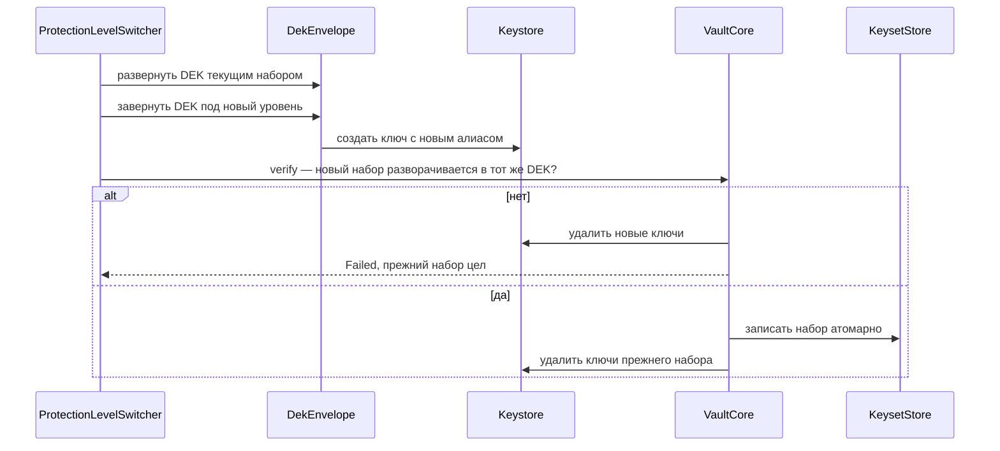
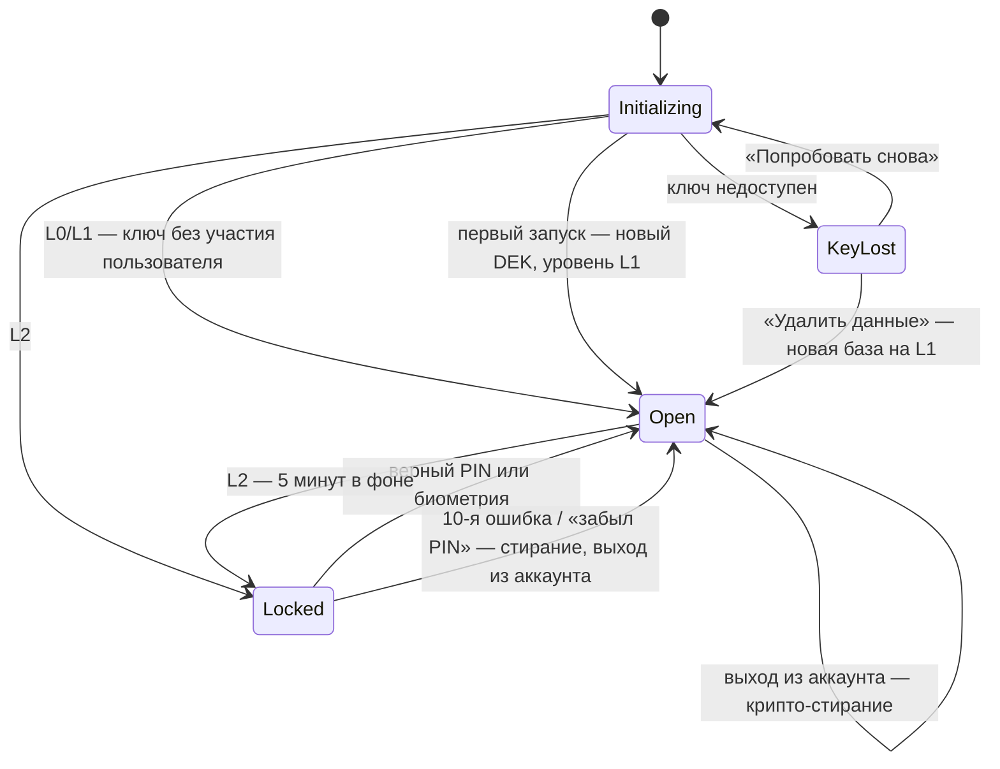
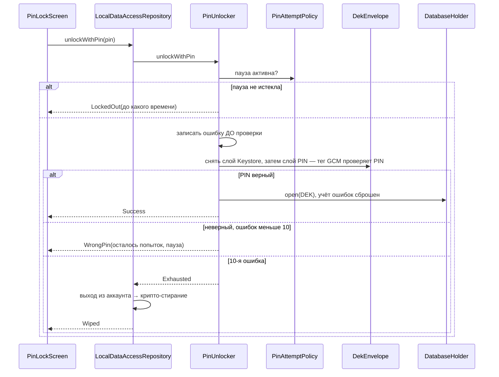
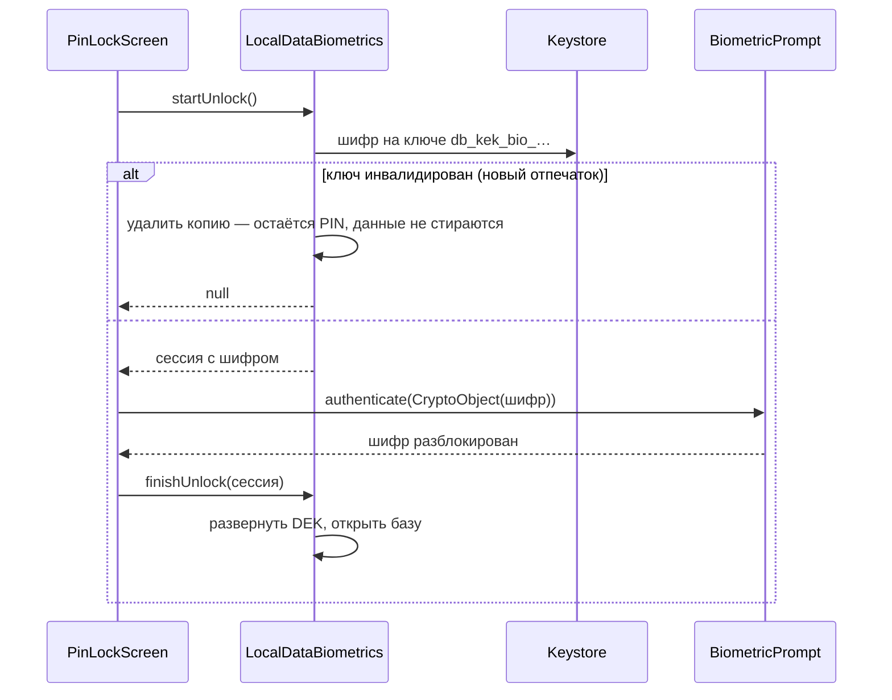
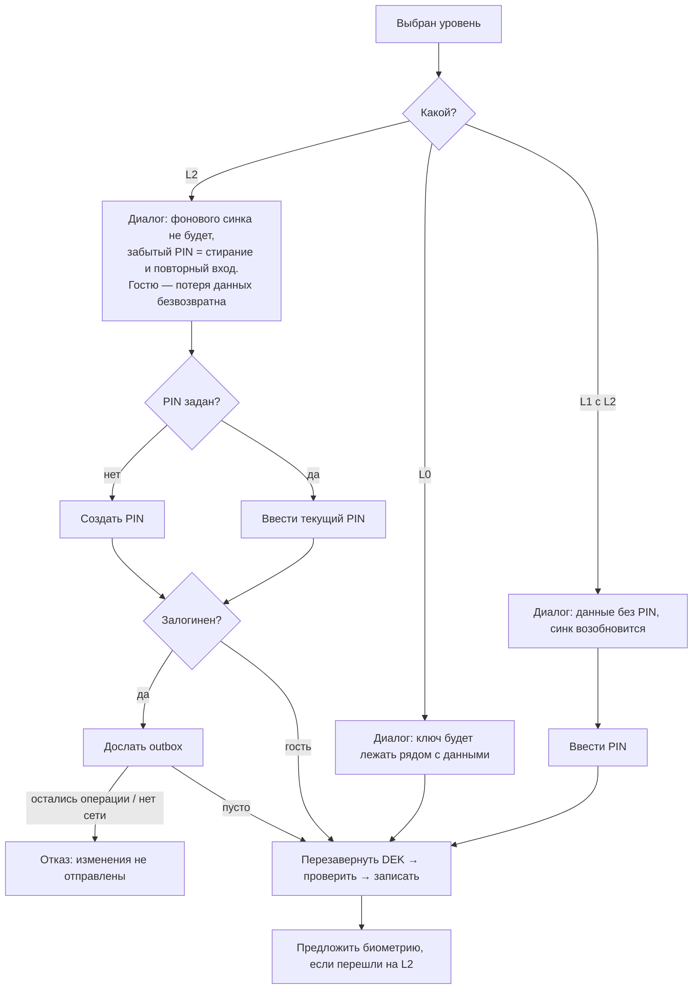

# Шифрование локальных данных

Локальная база (`finance_manager_db.db`) **всегда** зашифрована SQLCipher. Пользователь выбирает
не «шифровать или нет», а **чем закрыт ключ базы** — это и есть уровень защиты. Смена уровня
перезаворачивает 32 байта ключа и не трогает саму базу, поэтому она мгновенна при любом объёме
данных.

| Уровень | Как хранится ключ базы (DEK) | Что видит пользователь | Фоновый синк |
|---|---|---|---|
| **L0** «Без защиты ключа» (`NONE` / `OPEN`) | как есть, рядом с базой | ничего | работает |
| **L1** «Ключ устройства» (`DEVICE`) — по умолчанию | завёрнут неизвлекаемым ключом Keystore | ничего | работает |
| **L2** «PIN-код» (`PIN`) | завёрнут ключом из PIN, а снаружи — ключом Keystore | база открывается только по PIN или отпечатку | **нет**: синк только пока приложение открыто |

Имена уровней в домене — `DataProtectionLevel.NONE / DEVICE / PIN`, в `core:security` —
`KeyLevel.OPEN / DEVICE / PIN`; сопоставляет их `ProtectionLevelMapper` в `core:data`.

---

## 1. Модель угроз

| Угроза | L0 | L1 | L2 |
|---|:-:|:-:|:-:|
| Скопирован файл базы (без остальных файлов приложения) | ✅ | ✅ | ✅ |
| Скопированы все файлы приложения (эксплойт, криминалистика, перенос на другое устройство) | ❌ | ✅ | ✅ |
| Чужой человек с разблокированным телефоном открывает приложение | ❌¹ | ❌¹ | ✅ |
| Перебор PIN через интерфейс | — | — | ✅ паузы + стирание |
| Кнопка «Забыли PIN?» как обход | — | — | ✅ стирание + выход из аккаунта² |
| Root с доступом к Keystore приложения | ❌ | ❌ | ❌³ |
| Дамп памяти процесса | ❌ | ❌ | частично⁴ |

¹ Если задан PIN, его спрашивает UI-замок, но база при этом уже открыта — это защита интерфейса,
а не данных.
² Защищены **локальные** данные. После стирания данные залогиненного пользователя вернутся с
сервера при повторном входе — то есть уровень L2 не сильнее защиты аккаунта. Если на телефоне уже
выполнен вход в аккаунт Яндекса, повторный вход по SSO может занять одно нажатие: L2 защищает от
того, кто держит телефон, но не от того, кто владеет аккаунтом.
³ С root можно вызывать Keystore от имени приложения, а четырёхзначный PIN — это 10 000
вариантов. От root локальное шифрование не защищает принципиально.
⁴ Ключ затирается после открытия базы и при её закрытии, но JVM и нативная часть SQLCipher не
гарантируют отсутствие копий в памяти — это best effort. Замороженный системой процесс держит
базу открытой до возвращения в приложение или смерти процесса (см. раздел 6.4).

---

## 2. Схема ключей (envelope)



### Почему Keystore — снаружи, а PIN — внутри

```
неверно:  хранится = AES-GCM(PIN-ключ,  AES-GCM(Keystore, DEK))
верно:    хранится = AES-GCM(Keystore,  AES-GCM(PIN-ключ,  DEK))
```

В неверном варианте внешний слой снимается одним PIN-ключом, а тег GCM сразу говорит, угадан ли
PIN: скопировав файлы, все 10 000 PIN можно проверить **офлайн, без телефона**, за секунды. В
верном до слоя с PIN не добраться без неизвлекаемого ключа конкретного устройства — каждая
попытка требует телефона и проходит через счётчик попыток. Отсюда и различие ошибок в
`DekEnvelope`: сбой внешнего слоя — `KeyUnavailableException` (ключ потерян или данные испорчены),
сбой внутреннего — неверный PIN.

### Ключи Keystore

Все — AES-256-GCM, случайный IV задаёт сам Keystore. **Каждое заворачивание получает новый
алиас** (`<префикс>_<uuid>`), общий префикс — `db_kek_`: по нему находятся осиротевшие ключи.

| Префикс | Уровень | Параметры | Почему так |
|---|---|---|---|
| `db_kek_device` | L1 | без аутентификации пользователя | фоновый синк открывает базу без участия пользователя |
| `db_kek_pin` | L2 | `setUnlockedDeviceRequired(true)` (API 28+) | на L2 фонового синка и так нет; на заблокированном экране ключ недоступен |
| `db_kek_bio` | L2 + биометрия | `setUserAuthenticationRequired(true)`, аутентификация на **каждую** операцию, только `BIOMETRIC_STRONG`, `setInvalidatedByBiometricEnrollment(true)` | только так биометрия действительно выдаёт ключ, а не просто разрешает показать экран |

`setUnlockedDeviceRequired` не везде работает (нет безопасной блокировки экрана, баги прошивок).
Тогда `AndroidKeystoreKeys` создаёт ключ L2 без этого флага: это по-прежнему неизвлекаемый ключ,
просто доступный и на заблокированном экране. Отсутствующий или инвалидированный ключ **никогда не
пересоздаётся молча** — для ключа базы это означало бы безвозвратную потерю данных; вместо этого
состояние `KeyLost` и экран восстановления.

### Готовый ключ вместо парольной фразы

SQLCipher получает DEK литералом `x'<64 hex>'` (`RawKey`): парольную фразу он прогоняет через
собственный PBKDF2 на каждом открытии. Строка собирается сразу в `ByteArray`, минуя `String`
(строку нельзя затереть), исходный ключ затирается сразу после сборки, а сама фраза — при закрытии
базы.

### Ключ из PIN

`PinKeyDerivation` — PBKDF2-HMAC-SHA256 с **собственной** солью (не солью хеша PIN: ключ и хеш
не должны совпадать ни при каких условиях). Число итераций хранится в наборе ключей рядом с солью,
поэтому его можно поднять позже без миграции: старые наборы разворачиваются со своим значением.
Стойкость L2 даёт не число итераций, а внешний слой Keystore — итерации лишь удорожают перебор на
уже взломанном устройстве.

---

## 3. Набор ключей (keyset)

Всё, что нужно для разворачивания DEK, хранится в Preferences DataStore
`noBackupFilesDir/security/keyset.preferences_pb` (`KeysetStore` → `DataStoreKeysetStore`):
уровень, открытый ключ (L0) или завёрнутый блоб с алиасом, соль и итерации PIN, биометрическая
копия. В том же файле, но отдельными ключами, — учёт неверных PIN (`PinAttempts`): запись набора
его не трогает.

- **Атомарность.** DataStore переписывает файл целиком через временный файл и переименование —
  одна транзакция `edit` означает атомарную запись всего набора.
- **`noBackupFilesDir`.** Система не включает каталог ни в облачный бэкап, ни в перенос на новое
  устройство: завёрнутые ключи там бесполезны (ключи Keystore не переезжают), а открытый ключ L0
  попадать туда не должен.
- **Порча.** Испорченное значение внутри файла — `KeyUnavailableException`, а не `null` (иначе
  выглядело бы как первый запуск). Испорченный файл целиком DataStore заменяет пустым; пустой
  набор рядом с существующей базой хранилище трактует как потерю ключа.

### Смена набора без потери данных



Процесс умер до записи — действует старый набор, после — новый. Ключи Keystore, на которые не
ссылается сохранённый набор, удаляются при следующем старте (`VaultCore.deleteOrphans`).
Уникальный алиас на каждое заворачивание нужен именно здесь: ключ нового набора никогда не
перезаписывает ключ действующего — в том числе при смене PIN, где уровень не меняется.

---

## 4. `DatabaseHolder` — база, которую можно закрыть

Раньше база и все DAO были `@Singleton` и создавались при сборке графа Hilt. На L2 базу нельзя
открыть до ввода PIN, а после закрытия синглтоны держали бы мёртвый экземпляр. Поэтому базу
выдаёт холдер (`core:database`, реализация `RoomDatabaseHolder`):

```kotlin
interface DatabaseHolder {
    val state: StateFlow<DatabaseState>          // CLOSED / OPEN / CLOSING

    suspend fun open(key: ByteArray)
    suspend fun close()                           // ждёт окончания текущих операций
    suspend fun wipe()                            // закрыть и удалить файлы

    suspend fun <T> withDatabase(block: suspend (FinanceManagerDatabase) -> T): T
    fun <T> observe(block: (FinanceManagerDatabase) -> Flow<T>): Flow<T>
}
```

- **Холдер ничего не знает о ключах** — получает готовые байты. Поэтому у `core:database` нет
  зависимости от `core:security`.
- **Аренды.** `withDatabase` держит базу открытой до конца блока; `close()` сначала перестаёт
  выдавать новые аренды (`CLOSING`), затем ждёт, пока закончатся текущие, и только потом
  закрывает. Проверка «база открыта» и захват аренды атомарны. Закрывать базу под нагрузкой
  нельзя: Room после `close()` бросает `JobCancellationException`, неотличимый от штатной отмены
  корутины. Вызов на закрытой базе — `DatabaseLockedException`.
- **Вложенные вызовы.** Аренда лежит в контексте корутины: репозиторий внутри транзакции работает
  с той же базой без новой аренды. Менять жизненный цикл базы изнутри аренды запрещено — закрытие
  ждало бы само себя.
- **`observe`** молчит, пока база закрыта, и переподписывается на новый экземпляр после открытия:
  экраны переживают блокировку без пересоздания подписок.
- **DAO больше не инжектятся.** Источники данных и `RoomTransactionRunner` берут базу через
  холдер на каждый вызов.
- **Фабрика инжектится** (`DatabaseFactory`): в приложении — `SqlCipherDatabaseFactory`, в
  Robolectric-тестах — обычный SQLite (нативная библиотека SQLCipher в JVM не загрузится).
  `SqlCipherDatabaseFactory` — тонкий адаптер: открывает файл сразу, чтобы неверный ключ всплыл
  при открытии, а не в первом запросе, и проверяется инструментальным тестом.

Провайдер холдера живёт в `core:data` (`LocalDataModule`): холдеру нужен `@IoDispatcher` из
`core:common`, а ребро `core:database → core:common` превысило бы допустимую высоту графа модулей.

---

## 5. Состояния данных

Хранилище ключей (`LocalDataVault` + `VaultCore` в `core:data`) публикует `LocalDataState`;
`MainActivity` строит главный экран **только** в состоянии `Open`.



| Состояние | Что показывает `MainActivity` (`LocalDataGate`) |
|---|---|
| `Initializing` (или ещё не прочитано, задан ли PIN) | пустой фон — главный экран не строится, чтобы не мелькнуть до замка |
| `Locked(biometricEnabled)` | `PinLockScreen`: PIN, кнопка биометрии, «Забыли PIN?» |
| `KeyLost` | `KeyLostScreen`: повторить или стереть |
| `Open` + PIN задан и не введён в этой сессии | `PinLockScreen` — UI-замок (как и до шифрования) |
| `Open` | `RootNavDisplay` |

«Замок пройден» хранит `AppLockViewModel`, а не `rememberSaveable`: состояние переживает
пересоздание Activity (тема, шрифт), но не смерть процесса. Сохранённое состояние Activity система
восстанавливает и в новом процессе — с `rememberSaveable` замок пропускался после того, как
приложение выгрузили из памяти в фоне (проверено на эмуляторе: восстановление из «Недавних»
открывало главный экран без PIN). Сброс при уходе в фон синхронный: гейт читает состояние
напрямую, и главный экран не мелькает кадр до замка. PIN, созданный в настройках при открытом
приложении, замок не включает — его только что ввели дважды.

Все операции с ключами идут строго по одной (`VaultCore.exclusive`: мьютекс + `@IoDispatcher`).

---

## 6. Сценарии

### 6.1 Старт

`App.onCreate` запускает `InitializeLocalDataUseCase` до всего остального — и в процессе,
поднятом ради WorkManager, тоже.

| Ситуация | Поведение |
|---|---|
| Первый запуск | новый DEK, набор L1, затем база (набор пишется **до** файла: база без набора выглядела бы как потеря ключа); `onCreate` засевает 24 категории |
| L0 / L1 | DEK разворачивается без пользователя, база открывается до показа UI |
| L2 | база закрыта до PIN или биометрии |
| Набора нет, а файл базы есть | `KeyLost` |
| Набора нет, а файл базы — открытый SQLite (заголовок `SQLite format 3\0`) | файл от сборки без шифрования: удаляется, создаётся новая база (реальных пользователей нет) |
| Ключ Keystore недоступен, набор испорчен или не читается с диска, SQLCipher отверг ключ | `KeyLost` |

Перед открытием удаляются осиротевшие ключи Keystore.

### 6.2 Разблокировка по PIN (L2)



Ошибка записывается **до** проверки: иначе процесс можно было бы убивать в момент проверки и
перебирать PIN без штрафа. Если же не снялся слой Keystore, записанная ошибка отменяется: до PIN
проверка не дошла, а временный сбой Keystore не должен через «Попробовать снова» вести к паузам и
стиранию (подбору это не помогает — без внешнего слоя PIN не проверить). Если ключ развернулся, а
база не открылась (испорченный файл, переполненный диск), это тоже `KeyLost`, а не падение
приложения; ошибки PIN при этом сбрасываются — PIN был верный. Стирание после 10-й ошибки
выполняется **вне** блокировки хранилища:
выход из аккаунта сам вызывает стирание через `DatabaseCleanupManager`, и вызов изнутри
блокировки ждал бы сам себя.

### 6.3 Биометрия (L2)

Биометрическая копия — отдельный завёрнутый экземпляр DEK под ключом `db_kek_bio_…`. Операция
двухшаговая, потому что между шагами — системный `BiometricPrompt`:



- Только `BIOMETRIC_STRONG` — слабая биометрия `CryptoObject` не поддерживает.
- Включение требует PIN: им подтверждается владелец и достаётся DEK для новой копии. Сразу после
  перехода на L2 экран настроек предлагает включить биометрию.
- DEK в слой представления не попадает: сессия непрозрачна, наружу виден только шифр.
- Смена PIN копию не трогает — она от PIN не зависит; уход с L2 её удаляет.
- Успешная биометрия, как и верный PIN, сбрасывает учёт ошибок.

### 6.4 Уход в фон (L2)

UI-замок включается сразу, как и раньше. База закрывается через **5 минут** в фоне
(`LocalDataAutoLock`, наблюдатель на `ProcessLifecycleOwner`): короткий выход в другое приложение
не прерывает запись и отправку изменений. Закрытие ждёт окончания текущих операций, состояние
`Locked` публикуется сразу.

Таймер в фоне может не дойти до срока: Android замораживает кешированные процессы. Поэтому при
возвращении проверяется, сколько приложение провело в фоне, и просроченное закрытие выполняется
**до** того, как пользователь увидит данные. На устройстве это видно так: процесс пролежал
замороженным несколько часов, таймер не сработал, а при возвращении база закрылась
(`DatabaseHolder: Database closed`) и открылся экран PIN.

### 6.5 Смена уровня



- На L2 фонового синка нет, поэтому перед ним outbox досылается; всё, что не ушло (или сбой
  досылки), — отказ `UnsentChanges`.
- Ошибка PIN в настройках **не учитывается** политикой попыток: данные в этот момент и так
  открыты, а стирать их из-за опечатки в настройках — наказание без пользы.
- Новый уровень начинается с чистого учёта ошибок.
- Удалить PIN на L2 нельзя: сначала понизить уровень — иначе потерялся бы ключ, которым завёрнут
  DEK.

### 6.6 Восстановление и стирание

| Сценарий | Что стирается | Выход из аккаунта | Почему |
|---|---|---|---|
| `KeyLost` на L0/L1 → «Удалить данные» | база и ключи | нет | данные вернутся с сервера по сохранённой сессии; гостю — предупреждение о потере |
| `KeyLost`, уровень L2 или неизвестен | база и ключи | **да** | иначе потеря ключа стала бы обходом PIN |
| «Забыли PIN?» на L2 | база и ключи | **да** | то же |
| 10-я ошибка PIN | база и ключи | **да** | то же |
| Выход из аккаунта | база и ключи | — | крипто-стирание вместо `DELETE` |

Стирание — **крипто-стирание** (`LocalDataVault.wipe`): сначала уничтожаются набор и ключи
Keystore — после этого файл нечитаем, даже если процесс умрёт до удаления файлов, — затем
удаляются файлы и создаётся новая база на уровне L1. Раньше выход из аккаунта удалял строки
`DELETE`-ом, но SQLite оставляет их в свободных страницах, и с тем же ключом они читаемы.
Выход из аккаунта инициирует `core:auth` (`AuthStateHolder` → `DatabaseCleanupManager`), поэтому
реализация очистки (`CryptoShredCleanupManager`) живёт в `core:data`, а не в фиче. Предупреждения
для залогиненного пользователя и гостя разные; в обоих сказано, что неотправленные изменения
пропадут.

### 6.7 Фоновая синхронизация

- `SyncWorker` ждёт конца инициализации и, если данные не открыты (L2 заперт или ключ утерян),
  завершается `Result.success()` без работы. `retry()` на закрытой базе дал бы шторм повторов.
- `SyncInitializer` запускает разовый синк **при каждом** переходе данных в `Open`: на L0/L1 это
  старт приложения, на L2 — каждая разблокировка, единственный синк, который реально что-то
  отправит.

---

## 7. PIN: попытки и хеш

| Ошибка подряд | Последствие |
|---|---|
| 1–4 | без штрафа |
| 5 / 6 / 7 / 8 / 9 | пауза 30 с / 1 мин / 5 мин / 15 мин / 1 ч |
| перед 10-й | явное «осталась последняя попытка — после неё данные будут стёрты»: и после паузы 9-й ошибки, и при каждом показе замка (предупреждение строится по учёту попыток, а не по последней ошибке) |
| 10 | стирание и выход из аккаунта |

Перевод часов назад паузу не снимает: хранится момент последней ошибки, и если текущее время
раньше него, ввод остаётся заблокированным до записанного момента. Перевод часов вперёд паузу
сократит, но гарантию даёт не пауза, а счётчик: больше десяти попыток не будет при любых часах.
Учёт переживает перезапуск — он в наборе ключей.

**Хеш PIN (`PinHasher`, PBKDF2 + соль, зашифрован `CryptoManager`) хранится на всех уровнях.**
Им проверяется UI-замок на L0/L1 и подтверждения в настройках на этих уровнях — без лимита
попыток, как и до шифрования: данные там открываются без PIN, и PIN защищает только интерфейс. На
L2 экран замка проверяет PIN **разворачиванием ключа** (с учётом попыток), подтверждения в
настройках — тоже разворачиванием, но без учёта. Хеш не ослабляет L2: без Keystore его не
расшифровать, а с доступом к Keystore (root) перебирается и внешний слой набора.

---

## 8. Экран, бэкапы и сетевой кеш

- **`FLAG_SECURE`** — отдельный тумблер «Скрывать содержимое», **включён по умолчанию**. Флаг
  ставится до первого кадра (иначе превью в списке недавних успело бы сняться, пока настройка
  читается с диска) и снимается, если пользователь его выключил. Диалоги Compose — отдельные окна
  и наследуют флаг (`SecureFlagPolicy.Inherit`).
- **Бэкапы.** `data_extraction_rules.xml` (API 31+) и `backup_rules.xml` исключают все домены
  (`root`, `file`, `database`, `sharedpref`, `external`) и из облачного бэкапа, и из переноса
  между устройствами: на Android 12+ `allowBackup="false"` перенос между устройствами **не**
  отключает. Набор ключей вдобавок лежит в `noBackupFilesDir`.
- **OkHttp-кеш выключен.** Ответы API с суммами лежали в `cacheDir` открытым текстом, а данные и
  так живут в Room. Каталог старого кеша (`cacheDir/http_cache`) удаляется при старте
  (`LegacyHttpCache`).

---

## 9. Схема базы, засев и миграции

- **Ассет категорий удалён.** `createFromAsset` несовместим с шифрованием (ассет — открытый
  SQLite); 24 категории засеваются кодом в `RoomDatabase.Callback.onCreate` (`DefaultCategories`,
  `SeedDatabaseCallback`) — при первом создании и после каждого стирания.
- **Настоящие миграции.** `fallbackToDestructiveMigration` убран; базовая схема — **v8**,
  выгружается Room Gradle plugin в `core/database/schemas`. Каждая следующая версия добавляет
  `Migration(n, n + 1)` в `DatabaseMigrations.ALL` и тест в `MigrationTest`. Без миграции Room
  упадёт при открытии — это заметят тесты, а не пользователи, у которых молча пропали бы данные.
  При понижении версии база пересоздаётся: такое бывает только при переключении веток у
  разработчика.
- Шифрование схему **не меняет** — меняется формат файла. Переход со старого незашифрованного
  файла решается распознаванием заголовка (раздел 6.1), а не номером версии.

---

## 10. Замеры

| Что | Результат | Где |
|---|---|---|
| Открытие базы с готовым ключом `x'…'` | 18–20 мс | эмулятор Pixel 7, API 36 (`SqlCipherDatabaseFactoryTest`) |
| Открытие с парольной фразой (встроенный KDF SQLCipher) | 482 мс против 40 мс с готовым ключом | Pixel 7, API 36 |
| PBKDF2, 310 000 / 100 000 / 50 000 итераций | 3,7 с / 1,1 с / 0,58 с | эмулятор API 36, arm64 (BouncyCastle) |
| Итерации для новых наборов | **50 000** (`PinKeyDerivation.DEFAULT_ITERATIONS`) | цель — около 0,5 с на разблокировку |

SQLCipher — `net.zetetic:sqlcipher-android` **4.17.0**: 4.18+ требует `compileSdk 37`, проект на
36. Выравнивание нативных библиотек под страницы 16 КБ (требование Google Play) проверено для
всех четырёх ABI.

---

## 11. Отклонения от исходного плана

| План | Реализация | Почему |
|---|---|---|
| Набор ключей — JSON + `AtomicFile` | Preferences DataStore | атомарная запись целиком из коробки, `Flow` уровня для UI, обработчик порчи |
| Фиксированные алиасы `db_kek_l1` / `l2` / `bio` | новый алиас на каждое заворачивание | ключ нового набора не перезаписывает ключ действующего — смена crash-safe, в том числе смена PIN |
| Последняя стабильная SQLCipher | 4.17.0 | 4.18+ требует `compileSdk 37` |
| На L2 хеш PIN удаляется | хеш хранится на всех уровнях | UI-замок и подтверждения L0/L1 работают как раньше; на L2 PIN проверяется разворачиванием (раздел 7) |
| Один `LocalDataProtectionRepository` | `LocalDataAccessRepository` (состояние, разблокировка, стирание) и `DataProtectionRepository` (уровень, PIN) | разные потребители и ответственность |
| `closeWhenIdle` | `close()` с состоянием `CLOSING` | новые аренды отклоняются сразу, текущие дорабатывают |
| Разовый синк при старте | при каждом переходе в `Open` | на L2 синк возможен только после разблокировки |
| Незашифрованный файл удаляется всегда | только если набора ключей ещё нет | при существующем наборе открытый заголовок легитимно не возникает — это порча, а не старая сборка |

---

## 12. Что не входит

- Защита от root — принципиально недостижима локальным шифрованием (раздел 1).
- Шифрование DataStore и SharedPreferences целиком: токены и PIN уже зашифрованы
  `CryptoManager`, остальное — не чувствительные настройки.
- Данные на сервере и их защита, изменения на сервере.
- Перенос данных между устройствами — исключается сознательно (раздел 8).

---

## 13. Тесты

| Уровень | Что проверяется | Где |
|---|---|---|
| JVM | AES-GCM, PBKDF2, заворачивание на всех уровнях с фейковым Keystore, порядок слоёв (без Keystore PIN не проверить), биометрическая копия | `core/security/src/test/.../crypto`, `.../keyset` |
| JVM | каждая ступень `PinAttemptPolicy`, перевод часов | `PinAttemptPolicyTest` |
| JVM | набор ключей в DataStore: запись целиком, порча, учёт попыток | `DataStoreKeysetStoreTest` |
| JVM | создание ключей Keystore, откат без `setUnlockedDeviceRequired` | `AndroidKeystoreKeysTest` |
| JVM (Robolectric) | холдер: аренды, закрытие под нагрузкой, `observe`, закрытая база; засев; миграции; распознавание файла | `core/database/src/test/.../holder`, `seed`, `db/MigrationTest` |
| JVM (Robolectric) | хранилище: все переходы состояний, смена уровня и её сбои на каждом шаге, биометрия, осиротевшие ключи, стирание, репозитории | `core/data/src/test/.../vault`, `.../repository` |
| JVM | `SyncWorker` пропускает закрытую базу, `SyncInitializer` синкает на каждом `Open`; автозакрытие | `sync/src/test`, `LocalDataAutoLockTest` |
| JVM | ViewModel замка, настроек и восстановления | `feature/security/impl/src/test` |
| Эмулятор | SQLCipher: шифрование файла, неверный ключ, затирание ключа, скорость, `date(…, 'localtime')` и выборка за период | `SqlCipherDatabaseFactoryTest` |
| Эмулятор | настоящий Keystore на всех уровнях, время PBKDF2 | `KeystoreEnvelopeTest` |
| Эмулятор | хранилище целиком: первый запуск, смена уровней, PIN, стирание | `EncryptedVaultEndToEndTest` |

Инструментальные тесты в CI не входят: `./gradlew connectedDebugAndroidTest` на эмуляторе.

---

## Ключевые файлы

| Файл | Роль |
|---|---|
| `core/security/.../keyset/DekEnvelope.kt` | заворачивание DEK на каждом уровне, порядок слоёв |
| `core/security/.../keyset/BiometricEnvelope.kt` | шифры для `CryptoObject`: включение и разблокировка биометрией |
| `core/security/.../keyset/Keyset.kt` | набор ключей и учёт попыток |
| `core/security/.../keyset/impl/DataStoreKeysetStore.kt` | атомарное хранение набора в DataStore |
| `core/security/.../keyset/PinAttemptPolicy.kt` | паузы и стирание за неверный PIN |
| `core/security/.../crypto/PinKeyDerivation.kt` | PBKDF2 и калибровка итераций |
| `core/security/.../keystore/impl/AndroidKeystoreKeys.kt` | ключи Keystore с уникальными алиасами, без автопересоздания |
| `core/database/.../holder/RoomDatabaseHolder.kt` | аренды, закрытие, `observe` |
| `core/database/.../holder/SqlCipherDatabaseFactory.kt` | открытие через SQLCipher |
| `core/database/.../holder/RawKey.kt` | готовый ключ `x'…'` без `String` |
| `core/database/.../holder/DatabaseFiles.kt` | файлы базы, распознавание незашифрованного файла |
| `core/database/.../seed/SeedDatabaseCallback.kt` | засев 24 категорий |
| `core/database/.../db/DatabaseMigrations.kt` | миграции и общие настройки сборщика |
| `core/data/.../vault/VaultCore.kt` | очередь операций с ключами, состояние, протокол смены набора |
| `core/data/.../vault/LocalDataVault.kt` | инициализация, запирание, крипто-стирание |
| `core/data/.../vault/PinUnlocker.kt` | разблокировка по PIN с учётом попыток |
| `core/data/.../vault/ProtectionLevelSwitcher.kt` | смена уровня и PIN |
| `core/data/.../vault/BiometricVault.kt` | биометрическая копия DEK |
| `core/data/.../vault/CryptoShredCleanupManager.kt` | выход из аккаунта — крипто-стирание |
| `core/data/.../repository/LocalDataAccessRepositoryImpl.kt` | стирание с выходом из аккаунта, восстановление |
| `core/data/.../repository/DataProtectionRepositoryImpl.kt` | досылка outbox перед L2 |
| `core/data/.../di/LocalDataModule.kt` | провайдер холдера и привязки |
| `core/domain/.../model/LocalDataState.kt` | состояния данных |
| `app/.../presenter/MainActivity.kt` | гейт по состоянию данных, `FLAG_SECURE` |
| `app/.../presenter/AppLockViewModel.kt` | «замок пройден» — до ухода в фон, не дольше процесса |
| `app/.../lifecycle/LocalDataAutoLock.kt` | закрытие базы L2 в фоне |
| `app/.../App.kt` | инициализация ключей до UI |
| `feature/security/impl/.../presenter/screen/SecurityScreen.kt` | выбор уровня, PIN, биометрия, тумблер экрана |
| `feature/security/impl/.../presenter/screen/PinLockScreen.kt` | замок: PIN, паузы, биометрия, «Забыли PIN?» |
| `feature/security/impl/.../presenter/screen/KeyLostScreen.kt` | восстановление при потере ключа |
| `feature/security/impl/.../presenter/util/BiometricAuthenticator.kt` | `androidx.biometric` + `CryptoObject` |
| `sync/.../worker/SyncWorker.kt` | пропуск синка на закрытой базе |
| `sync/.../initializers/SyncInitializer.kt` | синк при каждом открытии данных |
| `core/network/.../util/LegacyHttpCache.kt` | удаление старого HTTP-кеша |
| `app/src/main/res/xml/data_extraction_rules.xml` | исключения из бэкапа и переноса |
