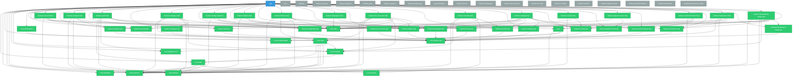

# FinanceManager module graph

```mermaid
%% Generated by Aalekh - https://github.com/shivathapaa/aalekh
%% Solid arrows are production dependencies; dashed arrows are test-only.
graph TD
  n0[":app"]
  n1[":core"]
  n2[":core:auth"]
  n3[":core:common"]
  n4[":core:data"]
  n5[":core:database"]
  n6[":core:domain"]
  n7[":core:feature-api"]
  n8[":core:logging-error"]
  n9[":core:network"]
  n10[":core:notifications"]
  n11[":core:security"]
  n12[":core:uikit"]
  n13[":core:workmanager"]
  n14[":feature"]
  n15[":feature:account"]
  n16[":feature:account:api"]
  n17[":feature:account:impl"]
  n18[":feature:analysis"]
  n19[":feature:analysis:api"]
  n20[":feature:analysis:impl"]
  n21[":feature:auth"]
  n22[":feature:auth:api"]
  n23[":feature:auth:impl"]
  n24[":feature:category"]
  n25[":feature:category:api"]
  n26[":feature:category:impl"]
  n27[":feature:design-app"]
  n28[":feature:design-app:api"]
  n29[":feature:design-app:impl"]
  n30[":feature:haptics"]
  n31[":feature:haptics:api"]
  n32[":feature:haptics:impl"]
  n33[":feature:history"]
  n34[":feature:history:api"]
  n35[":feature:history:impl"]
  n36[":feature:languages"]
  n37[":feature:languages:api"]
  n38[":feature:languages:impl"]
  n39[":feature:my-accounts"]
  n40[":feature:my-accounts:api"]
  n41[":feature:my-accounts:impl"]
  n42[":feature:security"]
  n43[":feature:security:api"]
  n44[":feature:security:impl"]
  n45[":feature:settings"]
  n46[":feature:settings:api"]
  n47[":feature:settings:impl"]
  n48[":feature:sounds"]
  n49[":feature:sounds:api"]
  n50[":feature:sounds:impl"]
  n51[":feature:splash-screen"]
  n52[":feature:splash-screen:api"]
  n53[":feature:splash-screen:impl"]
  n54[":feature:synchronization"]
  n55[":feature:synchronization:api"]
  n56[":feature:synchronization:impl"]
  n57[":feature:transaction"]
  n58[":feature:transaction:api"]
  n59[":feature:transaction:impl"]
  n60[":feature:transactions-today"]
  n61[":feature:transactions-today:api"]
  n62[":feature:transactions-today:impl"]
  n63[":sync"]
  n0 --> n2
  n0 --> n3
  n0 --> n4
  n0 --> n5
  n0 --> n6
  n0 --> n8
  n0 --> n9
  n0 --> n10
  n0 --> n12
  n0 --> n16
  n0 --> n17
  n0 --> n19
  n0 --> n20
  n0 --> n22
  n0 --> n23
  n0 --> n25
  n0 --> n26
  n0 --> n28
  n0 --> n29
  n0 --> n31
  n0 --> n32
  n0 --> n34
  n0 --> n35
  n0 --> n37
  n0 --> n38
  n0 --> n40
  n0 --> n41
  n0 --> n43
  n0 --> n44
  n0 --> n46
  n0 --> n47
  n0 --> n49
  n0 --> n50
  n0 --> n52
  n0 --> n53
  n0 --> n55
  n0 --> n56
  n0 --> n58
  n0 --> n59
  n0 --> n61
  n0 --> n62
  n0 --> n63
  n2 --> n3
  n2 --> n5
  n2 --> n6
  n2 --> n11
  n4 --> n2
  n4 --> n3
  n4 --> n5
  n4 --> n6
  n4 --> n8
  n4 --> n9
  n9 --> n2
  n10 --> n13
  n16 --> n7
  n17 --> n6
  n17 --> n12
  n17 --> n16
  n17 --> n31
  n19 --> n7
  n20 --> n3
  n20 --> n6
  n20 --> n12
  n20 --> n19
  n22 --> n7
  n23 --> n2
  n23 --> n6
  n23 --> n8
  n23 --> n12
  n23 --> n22
  n23 --> n63
  n25 --> n7
  n26 --> n3
  n26 --> n4
  n26 --> n6
  n26 --> n9
  n26 --> n12
  n26 --> n25
  n28 --> n7
  n29 --> n3
  n29 --> n12
  n29 --> n28
  n29 --> n31
  n31 --> n7
  n32 --> n3
  n32 --> n12
  n32 --> n31
  n34 --> n7
  n35 --> n3
  n35 --> n4
  n35 --> n6
  n35 --> n12
  n35 --> n19
  n35 --> n34
  n35 --> n58
  n37 --> n7
  n38 --> n12
  n38 --> n37
  n40 --> n7
  n41 --> n3
  n41 --> n4
  n41 --> n6
  n41 --> n9
  n41 --> n12
  n41 --> n16
  n41 --> n31
  n41 --> n40
  n43 --> n7
  n44 --> n6
  n44 --> n9
  n44 --> n11
  n44 --> n12
  n44 --> n43
  n46 --> n7
  n47 --> n12
  n47 --> n22
  n47 --> n28
  n47 --> n31
  n47 --> n37
  n47 --> n43
  n47 --> n46
  n47 --> n49
  n47 --> n55
  n49 --> n7
  n50 --> n3
  n50 --> n12
  n50 --> n49
  n52 --> n7
  n53 --> n12
  n53 --> n52
  n55 --> n7
  n56 --> n6
  n56 --> n12
  n56 --> n55
  n56 --> n63
  n58 --> n7
  n59 --> n4
  n59 --> n6
  n59 --> n12
  n59 --> n31
  n59 --> n49
  n59 --> n58
  n61 --> n7
  n62 --> n3
  n62 --> n6
  n62 --> n9
  n62 --> n12
  n62 --> n31
  n62 --> n34
  n62 --> n58
  n62 --> n61
  n63 --> n3
  n63 --> n4
  n63 --> n13
  classDef android_app fill:#3498DB,color:#ffffff,stroke:#00000033
  class n0 android_app
  classDef android_library fill:#2ECC71,color:#ffffff,stroke:#00000033
  class n10,n11,n12,n13,n16,n17,n19,n2,n20,n22,n23,n25,n26,n28,n29,n3,n31,n32,n34,n35,n37,n38,n4,n40,n41,n43,n44,n46,n47,n49,n5,n50,n52,n53,n55,n56,n58,n59,n6,n61,n62,n63,n7,n8,n9 android_library
  classDef unknown fill:#95A5A6,color:#ffffff,stroke:#00000033
  class n1,n14,n15,n18,n21,n24,n27,n30,n33,n36,n39,n42,n45,n48,n51,n54,n57,n60 unknown
```
