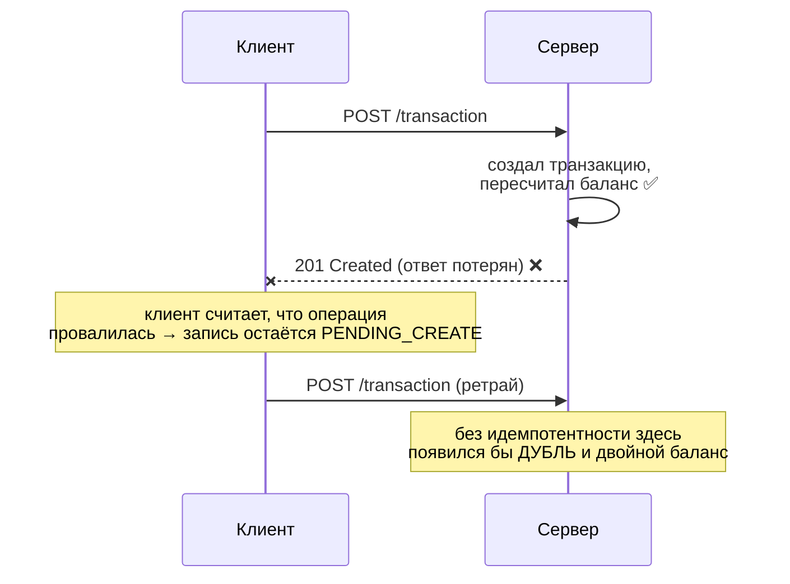
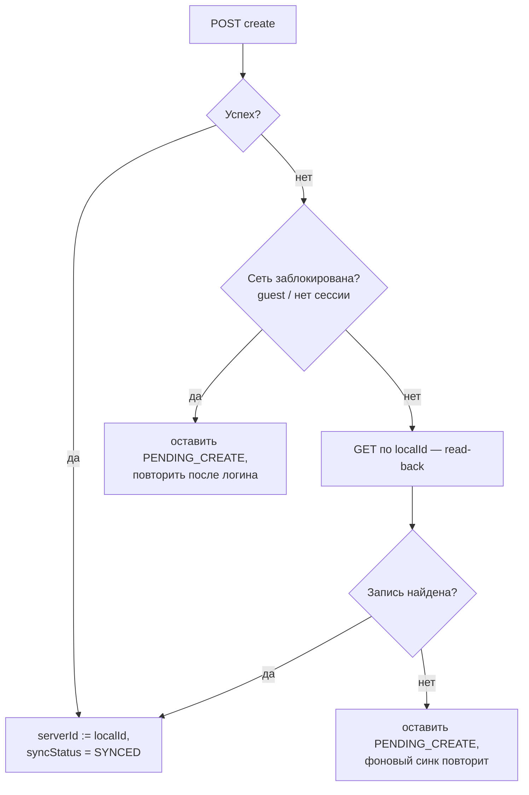

# Идемпотентность синхронизации: ACK, дедупликация и read-back

Документ объясняет, почему повторная отправка одной и той же операции не портит финансовые
данные, и какие механизмы за это отвечают на клиенте.

Связанные доки: [Outbox](./outbox.md), [Synchronization](./synchronization.md),
[Post-commit sync](./post-commit-sync.md).

## Словарь

### ACK (acknowledgement) — подтверждение

**ACK** — ответ сервера о том, что запрос **дошёл и обработан**. В нашем случае это HTTP-ответ
`200/201` на `POST /transaction`: он одновременно и подтверждение, и носитель результата
(серверная сущность с `id`, `createdAt`, `updatedAt`).

**Потеря ACK** — ситуация, когда запрос долетел, сервер **успешно всё применил**, но ответ
**не вернулся** к клиенту: оборвалась сеть, истёк таймаут, процесс приложения умер сразу после
отправки. Клиент не может отличить это от «запрос вообще не дошёл» — он видит одинаковую
ошибку и в том, и в другом случае.



Потеря ACK — практически единственная причина, по которой корректный клиент вообще отправляет
одну и ту же операцию создания дважды. Именно под неё затачивается идемпотентность.

### Идемпотентность

Операция **идемпотентна**, если её повторное выполнение с теми же входными данными оставляет
систему в том же состоянии, что и однократное: `f(f(x)) == f(x)`.

По семантике HTTP `GET`, `PUT`, `DELETE` идемпотентны **по определению метода**, а `POST` —
**нет** (`POST` = «создай новое»). Поэтому опасен именно `POST`: без дополнительной защиты
каждый ретрай создаёт новую сущность.

Почему у нас это особенно критично: бэкенд пересчитывает баланс счёта **дельтой**
(`Balance += amount` при создании транзакции). Дубль транзакции → сумма применяется дважды →
**баланс пользователя становится неверным**. Это не «лишняя строка в списке», а порча денег.

### Дедупликация (deduplication)

**Дедупликация** — распознавание сервером повторной доставки одной и той же логической операции
и отказ применять её второй раз. Чтобы это было возможно, повторы должны быть **узнаваемы** —
нужен **ключ идемпотентности**: стабильный идентификатор операции, одинаковый во всех попытках.

Два распространённых способа передать ключ:

| Способ | Как работает | Требует от сервера |
|---|---|---|
| `Idempotency-Key` header (стиль Stripe) | клиент шлёт UUID в заголовке; сервер хранит `key → ответ` и на повтор отдаёт сохранённый результат | отдельное хранилище ключей + middleware |
| **Client-generated id (upsert-by-id)** | клиент сам генерирует `id` сущности и присылает его в теле; уникальность держит первичный ключ | приём клиентского `id` |

**Мы используем оба, и они отвечают за разное.**

Дедупликацию **сегодня несёт второй способ**: сервер принимает клиентский `id`, и уникальность
держит первичный ключ таблицы. Отдельного хранилища ключей для этого не нужно.

Первый способ уже **работает на проводе**, но пока в одну сторону: каждый мутирующий запрос несёт
заголовок `Idempotency-Key`, сервер его игнорирует. Это не задел «на потом», а закрытие
конкретной дыры: `id` в теле адресует **сущность** и потому не различает операции над ней.
Создание строки и её последующая правка приезжают с одним и тем же `id`, и сервер, научившись
отвечать на повтор «уже существует», молча проглотил бы правку как дубль создания. Ключ в
заголовке — это адрес **операции**, и он их различает.

Пока сервер заголовок не читает, вреда от расхождения нет: правка уходит через `PUT` по своему
адресу. Дыра открылась бы ровно в тот момент, когда на сервере появится дедупликация по `id` —
поэтому клиентская половина сделана заранее.

## Как это реализовано на клиенте

### 0. Два адреса: сущности и операции

Запись очереди хранит оба, и путать их нельзя:

| Поле | Что адресует | Откуда берётся | Куда уходит |
|---|---|---|---|
| `entityLocalId` | **сущность** — какую строку меняем | `localId` доменной строки | `id` в теле `POST`, путь в `PUT`/`DELETE` |
| `idempotencyKey` | **операцию** — какое именно изменение | новый UUID на каждую постановку в очередь | заголовок `Idempotency-Key` |

Ключ генерируется один раз в [`OutboxEnqueuer`](../core/data/src/main/java/soft/divan/financemanager/core/data/outbox/OutboxEnqueuer.kt)
и хранится вместе с записью, поэтому переживает все повторы отправки: сервер видит один и тот же
ключ на каждой попытке и может распознать повторную доставку. Две операции над одной сущностью
получают **разные** ключи — иначе правку было бы не отличить от повтора создания.

Read-back — обычный `GET`, ключ ему не нужен: чтение безопасно по определению.

### 1. Стабильный ключ: `id = localId`

Каждая сущность получает `localId` (UUID) в момент создания в Room — **один раз**, и он
переживает перезапуск приложения. Этот же `localId` отправляется на сервер как `id` создаваемой
сущности:

| Маппер | Что делает |
|---|---|
| [`TransactionEntity.toDto`](../core/data/src/main/java/soft/divan/financemanager/core/data/mapper/TransactionDataMapper.kt) | `id = localId` в `POST /transaction` |
| [`Account.toDto` / `AccountEntity.toDto`](../core/data/src/main/java/soft/divan/financemanager/core/data/mapper/AccountDataMapper.kt) | `id = localId` в `POST /account` |

Ключевое правило: **ключ генерируется один раз при создании записи, а не на каждую HTTP-попытку.**
Новый id на каждую попытку полностью обесценил бы механизм — сервер видел бы каждый ретрай как
новую сущность.

Побочный эффект: после успешной синхронизации `serverId == localId`, то есть разделение
`localId`/`serverId` для новых записей схлопывается в одно значение.

### 2. Дедупликация на сервере

Сервер принимает клиентский `id` и создаёт сущность именно с ним; уникальность гарантирует
первичный ключ. Повторный `POST` с тем же `id` **не создаёт вторую строку** — сервер отвечает
ошибкой «уже существует». Данные не портятся: дубля нет, баланс применён один раз.

### 2a. Что клиент гарантирует серверной сверке payload

Дедупликация по одному лишь ключу опасна: запрос с тем же ключом, но **другим** телом сервер
молча зачтёт как «уже сделано». Поэтому правильная серверная реализация сверяет ещё и payload
(замечание ревьюера №2). Чтобы такая сверка не давала ложных срабатываний, клиент обязан
выполнять простое правило: **один ключ — всегда одно и то же тело**.

Правило держится на двух свойствах записи очереди, и оба зафиксированы тестами
([`OutboxPayloadContractTest`](../core/data/src/test/java/soft/divan/financemanager/core/data/outbox/OutboxPayloadContractTest.kt)):

| Свойство | Почему выполняется |
|---|---|
| Тело — **снимок**, а не ссылка на строку | `payload` сериализуется в момент постановки в очередь; правка доменной строки его не трогает |
| Ключ и тело рождаются и живут **вместе** | оба поля одной строки `outbox`, после вставки не меняются |

Следствие: повтор отправки всегда байт-в-байт совпадает с первой попыткой, а другое тело
физически не может уехать под старым ключом — у новой операции своя строка очереди и свой ключ.

### 3. Read-back: подтверждение после неуспешного create

Дедупликация защищает **данные**, но не решает вопрос «а применилась ли операция?» на стороне
клиента: после потери ACK запись остаётся `PENDING_CREATE`, и каждый цикл синка будет получать
ошибку — запись «залипает» в pending навсегда.

Поэтому при неуспешном create клиент делает **read-back** — перечитывает сущность по её
`localId` (`GET /transaction/{id}`, `GET /account/{id}`):



Логика: **если запись на сервере есть, значит операция фактически удалась** — независимо от того,
дошёл ли ответ. Это надёжнее, чем разбирать текст/код серверной ошибки: read-back не зависит от
формата ответа об ошибке и одинаково корректно отрабатывает и таймаут, и обрыв, и «уже
существует».

**Почему подтверждение по факту существования, а не по содержимому.** Read-back отвечает ровно
на один вопрос: «долетел ли мой `POST`?». Доказательством служит клиентский `id` — это UUID,
сгенерированный нами, и запись под ним на сервере может быть только нашей. Сверять содержимое для
ответа на этот вопрос не нужно и вредно: расхождение означало бы не «`POST` не долетел», а «после
него запись изменили с другого устройства» — а это уже область last-write-wins по `updatedAt`,
и трактовать её как неуспех значило бы гонять операцию по кругу до dead-letter.

Сверка payload нужна **на сервере** и отвечает на другой вопрос — «тот ли это запрос, что я уже
выполнял под этим ключом»; см. пункт 2a выше и пункт 1 в требованиях к серверу.

Реализация — в отправителях очереди:
[`TransactionOutboxSender`](../core/data/src/main/java/soft/divan/financemanager/core/data/outbox/impl/TransactionOutboxSender.kt),
[`AccountOutboxSender`](../core/data/src/main/java/soft/divan/financemanager/core/data/outbox/impl/AccountOutboxSender.kt).

### 4. Pull распознаёт собственные неподтверждённые записи

У клиентских id есть неочевидное следствие для **pull**. После потери ACK запись существует
одновременно в двух местах: на сервере (с `id == localId`) и локально — всё ещё как
`PENDING_CREATE` с `serverId = null`.

Pull ищет локальное соответствие серверной записи по `serverId`. Для такой записи `serverId`
ещё `null`, поэтому поиск её **не находит** — и pull принимает собственную транзакцию за новую
серверную, вставляя **второй локальный экземпляр** с новым `localId`. Пользователь видит
операцию дважды, аналитика считает её дважды.

Поэтому сопоставление идёт **по двум признакам сразу**:

```sql
SELECT * FROM transactions
WHERE serverId IN (:ids) OR (localId IN (:ids) AND serverId IS NULL)
```

Первое условие — обычный случай (запись уже синхронизирована), второе — наша собственная запись,
ожидающая подтверждения. Оговорка `serverId IS NULL` здесь принципиальна: она не даёт ложно
сматчить уже подтверждённую запись, чей `localId` случайно совпал бы с чужим серверным id.
В коде результат раскладывается в map с ключом `serverId ?: localId`.

Реализация: `getBySyncIds` в
[`TransactionDao`](../core/database/src/main/java/soft/divan/financemanager/core/database/dao/TransactionDao.kt) /
[`AccountDao`](../core/database/src/main/java/soft/divan/financemanager/core/database/dao/AccountDao.kt),
используется в `pullFromRemoteForAccount` / `performPull`.

> Порядок внутри цикла синхронизации — `pull` перед `push` — делает этот сценарий не редким, а
> **типичным**: pull успевает увидеть запись раньше, чем push дойдёт до её подтверждения.

### 5. Идемпотентное удаление: 404 = успех

Удаление идемпотентно по своей природе: цель — **отсутствие** записи на сервере. Если сервер
отвечает `404` («такой записи нет»), цель уже достигнута — как правило, предыдущей попыткой,
ACK которой не дошёл. Поэтому `404` на `DELETE` трактуется как **успех**: локальная запись
удаляется (или архивируется — для счетов), а не остаётся вечно в `PENDING_DELETE`.

Трактовка ответов живёт в [`OutboxCallOutcome.kt`](../core/data/src/main/java/soft/divan/financemanager/core/data/outbox/OutboxCallOutcome.kt)
и работает **по HTTP-коду**, а не по доменной ошибке: доменные ошибки схлопывают «сервер прилёг»
и «сервер отверг данные» в одно, а очереди это различие необходимо.

| Ответ | Трактовка |
|---|---|
| `404` на `DELETE` | идемпотентный успех: записи на сервере уже нет |
| `401` | запрос не дошёл намеренно (сессия истекла) → read-back бессмыслен, попытка не тратится |
| `5xx`, обрыв сети | временный сбой → повтор с backoff |
| прочие `4xx` | отказ по существу → dead-letter |

## Два уровня ретрая

Один и тот же `POST` может быть отправлен повторно на **двух независимых уровнях**, и оба
безопасны только благодаря стабильному ключу:

| Уровень | Кто повторяет | Когда | Пауза между попытками |
|---|---|---|---|
| **Транспортный** | [`RetryInterceptor`](../core/network/src/main/java/soft/divan/financemanager/core/network/interceptor/RetryInterceptor.kt) (OkHttp) | ответ `5xx`, до 3 раз | экспоненциальный backoff + equal jitter |
| **Очереди** | [`OutboxProcessor`](../core/data/src/main/java/soft/divan/financemanager/core/data/outbox/OutboxProcessor.kt) | операция не подтверждена сервером | экспоненциальный backoff, до `MAX_ATTEMPTS`, затем dead-letter |

Важные свойства этой связки:

- **Ключ не меняется между попытками.** `RetryInterceptor` повторяет *тот же самый* объект
  запроса, а `localId` живёт в Room — значит все попытки обоих уровней несут один и тот же `id`.
  Если бы ключ генерировался на каждую попытку, транспортный ретрай сам создавал бы дубли.
  Инвариант закреплён тестом `resends the same body on every retry…`.
- **Ретраятся только `5xx`.** `4xx` — терминальные ошибки (валидация, «уже существует»): повтор
  не изменит исход, поэтому интерцептор возвращает их сразу.
- **Порядок перехватчиков.** `RetryInterceptor` подключён как *application interceptor* и только
  к основному клиенту — клиент авторизации (login/refresh) ретраев не имеет.

Известное ограничение: повторный create дубля прилетает как `5xx` (сервер сообщает «уже
существует» через общий обработчик ошибок), поэтому транспортный уровень честно потратит на него
свои попытки, прежде чем отдать ошибку выше. Дальше срабатывает read-back и помечает запись
`SYNCED`, так что расход ограничен одним циклом синка на запись.

## Что этот механизм гарантирует и чего не делает

**Гарантирует:**

- повторная отправка create **не создаёт дубль** на сервере и не применяет сумму к балансу дважды;
- операция, применённая сервером без доставленного ACK, рано или поздно будет распознана как
  успешная (read-back) — запись не залипает в `PENDING`;
- **локальный дубликат тоже не появляется**: pull опознаёт собственные неподтверждённые записи
  по клиентскому id;
- повторное удаление не считается ошибкой.

**Границы:**

1. **UPDATE** идемпотентен «по построению» — он отправляет абсолютные значения, а не дельту,
   поэтому повтор безопасен и специальной защиты не требует.
2. **Read-back стоит одного дополнительного запроса** — только в ветке ошибки. В офлайне он
   тоже провалится (быстро) и просто оставит запись `PENDING`.
3. **Гарантия доставки — за фоновым синком.** Идемпотентность отвечает за «ровно один эффект»,
   но не за «дошло»; доставку обеспечивает периодический push pending-записей (WorkManager).
4. **Дедупликацию сегодня держит `id` сущности, а не заголовок.** Это работает для операций,
   адресуемых идентификатором ресурса (create/update/delete). `Idempotency-Key` клиент уже шлёт,
   но сервер его пока не читает — до этого момента заголовок ни на что не влияет. Для операций
   **без** resource-id (например будущие переводы между счетами) он станет единственным способом
   распознать повтор — см. «Что требуется от сервера» ниже.

## Что требуется от сервера

Клиентская половина работает **и без изменений на сервере** — за счёт read-back и трактовки
`404-on-delete`. Но каждая из перечисленных доработок убирает лишнюю работу или закрывает
пограничный случай. Порядок — по практической пользе.

Всё ниже сверено с исходниками бека, а поведение клиента — прогонами тестов.

### Что на сервере уже правильно (менять не нужно)

- **Клиентский `id` принимается.** `BaseCreateRequest.Id` — `Guid?` («Try to create entity with id
  (if set)»), контроллер подставляет свой `Guid.NewGuid()` только для `Guid.Empty`. Наш `localId` —
  `UUID.randomUUID()`, то есть валидный `Guid`. На этом и держится вся идемпотентность создания.
- **Ошибки валидации уже отдают `400`.** `ConfigureExceptionHandlers` намеренно переставляет
  `GlobalExceptionHandler` в конец цепочки, поэтому `ValidationExceptionHandler` срабатывает раньше
  и возвращает `400` со словарём `errors`.
- **`400` на несуществующий `AccountId` — правильное поведение, его надо сохранить.**
  `TransactionValidator` проверяет существование счёта и категории. Клиент трактует `4xx` как
  терминальную ошибку и уводит операцию в dead-letter — это корректно ровно потому, что порядок
  отправки (счёт раньше своих транзакций) гарантирует клиент. Смягчать этот код до `5xx` или до
  «тихого успеха» **нельзя**: так мы потеряем сигнал о реальной рассинхронизации.
- **Баланс при `UPDATE` идемпотентен.** `ReplaceAccountAmountAsync` = откат старого + применение
  нового; на повторе старое читается уже обновлённым, нетто-эффект нулевой.

### 1. Дубль create должен отвечать не `5xx` (главное)

`EntityRepository.CreateAsync` при существующем `Id` бросает `EntityExistsException`, а обработчика
для него нет — доходит до `GlobalExceptionHandler`, который отдаёт `500`. Для клиента это выглядит
как «сервер прилёг»:

- транспортный `RetryInterceptor` повторяет `5xx` трижды с backoff до 8 с — заведомо безнадёжный
  запрос стоит четырёх обращений и до ~14 с ожидания;
- очередь классифицирует ответ как временный сбой, и только read-back выясняет правду.

Нужно: при существующем `Id` вернуть **уже существующую сущность (200)** — либо `409`.

Два условия, без которых лечение будет хуже болезни:

1. **Ответить до и без `UpdateAccountAmountAsync`.** Баланс считается дельтой (`Balance += amount`),
   повторное применение испортит деньги. Сегодня от этого спасает `throw` до пересчёта — при
   переходе на 200-replay инвариант нужно сохранить осознанно.
2. **Сверять payload.** Ответ «уже существует» без сравнения тела означает, что запрос с тем же `id`,
   но другим содержимым будет молча проглочен как «уже сделано». Совпало — `200` с существующей
   сущностью; разошлось — `409`. Клиент сейчас расхождение **не заметит**: read-back подтверждает
   операцию по факту существования записи, а не по её содержимому (проверено тестом). Эти две
   половины обязаны выехать одним куском.

**Отдельно про счета: проверка по `id` должна идти первой.** В `AccountController.CreateAsync`
проверка уникальности имени стоит **раньше** обращения к `CreateAsync`, где проверяется `id`:

```
1. валидация
2. проверка имени → if (entityWithName != null) return Conflict();   ← сработает первой
3. if (entity.Id == Guid.Empty) entity.Id = Guid.NewGuid();
4. accountRepository.CreateAsync(entity)                             ← проверка по id здесь
```

При повторной отправке создания счёта первой сработает проверка имени и вернёт `409` — до того,
как дело дойдёт до `id`. То есть пункт 1, реализованный только внутри `CreateAsync`, для счетов не
изменит ничего. «Этот же запрос уже применён» и «другой счёт занял имя» — разные ситуации, и
первую нужно распознавать раньше.

### 1a. Баланс счёта нужно менять атомарным `UPDATE`

`AccountTransactionService.UpdateAccountAmountAsync` читает счёт в память, меняет поле
(`account.Balance += transaction.Amount`) и пишет обратно. Транзакция открывается на уровне
READ COMMITTED (PostgreSQL по умолчанию), concurrency-токенов в схеме нет.

Под конкурентными запросами это **теряет обновления**: две транзакции читают баланс 1000, одна
прибавляет 100, другая 200, обе пишут — итог 1100 или 1200 вместо 1300. Деньги молча расходятся.

Пока нас спасает то, что клиент шлёт операции по одной. Но параллельные запросы уже возможны
(фоновый синк и отправка сразу после действия пользователя могут наложиться), а со снятием
головной блокировки независимых групп станут обычным делом.

Нужно: `UPDATE accounts SET balance = balance + @delta WHERE id = @id` одним выражением — либо
`SELECT ... FOR UPDATE`, либо `rowversion` с повтором транзакции при конфликте. Поднимать уровень
изоляции до `SERIALIZABLE` без retry-логики не годится: получим ошибки сериализации вместо
потерянных обновлений.

Это единственный пункт списка, где ошибка портит деньги, а не только стоит лишних round-trip'ов.

### 2. Доменным исключениям нужны свои обработчики

Обработчиков всего два — `ValidationExceptionHandler` и `GlobalExceptionHandler`. Собственные
исключения `EntityExistsException` и `EntityNotFoundException` не обрабатывает никто, поэтому оба
превращаются в `500`.

Очередь различает **временное** (повторить) и **терминальное** (в dead-letter) по коду ответа,
поэтому отвергнутая по существу операция сейчас проходит все 8 попыток с нарастающей паузой,
прежде чем сдаться.

Нужно: `EntityExistsException` → `409`, `EntityNotFoundException` → `404`, `5xx` оставить за
настоящими сбоями сервера. Заодно `GlobalExceptionHandler` кладёт `exception.Message` в `Detail` —
внутренние сообщения наружу светить не стоит.

### 3. Дедупликация должна быть атомарной

`CreateAsync` делает `AnyAsync` (проверка) и затем `AddAsync` (вставка) — между ними есть окно.
Два одновременных повтора одного запроса могут оба пройти проверку, и один упадёт на нарушении
первичного ключа уже в `SaveChangesAsync`.

Окно не теоретическое: аренда записи в очереди живёт 5 минут, и если первый запрос всё ещё в
полёте, когда аренда истекла, второй прогон отправит его повторно.

Нужно: ловить `DbUpdateException` (unique/PK violation) и отвечать тем же идемпотентным
результатом, что и в п.1. Первичный ключ по `Id` уже гарантирует уникальность — на него и стоит
опираться, а не на предварительную проверку.

### 4. `DELETE` отсутствующего — успех, а не `404`

Сейчас контроллер отвечает `NotFound()`. Клиент это переживает (трактует `404` на удалении как
успех), но семантически идемпотентный `DELETE` должен возвращать `204`: цель — отсутствие
записи — уже достигнута.

### 5. `PUT` затирает `CreatedAt`

`UpdateAsync` собирает новую сущность через `request.Adapt<Transaction>()`. У `Transaction`
`CreatedAt` инициализируется как `DateTimeOffset.UtcNow`, в `UpdateTransactionRequest` этого поля
нет, а `context.Update(entity)` помечает изменёнными **все** свойства. В результате каждая правка
переписывает `CreatedAt` временем правки.

Клиент хранит `createdAt` и получает его обратно при pull, так что дата создания операции меняется
у пользователя на глазах. Нужно: сохранять `CreatedAt` исходной сущности (или обновлять только
реально изменённые поля).

### 6. Мелочи для полноты

- **`409` на дублирующееся имя счёта.** `AccountController.CreateAsync` отвечает `Conflict()`, если
  счёт с таким именем у пользователя уже есть. Клиент трактует `409` как терминальную ошибку, и от
  dead-letter его спасает только read-back (`AccountOutboxSender.create`). После п.1 этот код станет
  осмысленным ответом «уже создано» — но проверку по имени и проверку по `id` нужно различать.
- **Транзакция БД не обёрнута в `using`.** `BeginTransaction` возвращает `IDbContextTransaction`,
  который при исключении не откатывается явно — откат происходит только при освобождении scope'а
  `DbContext`. Работает, но полагаться на это не стоит.
- **Сквозной `id` не покрыт тестом.** Mapster переносит `BaseCreateRequest.Id → Transaction.Id` по
  соглашению об именах (явная конфигурация в `MapsterConfiguration` закомментирована как `todo`).
  Это несущая деталь всей схемы — её стоит закрепить тестом, а не оставлять на соглашение.
- **Хранилище ключей** (`idempotency_keys`) — клиент уже шлёт `Idempotency-Key` на каждый
  мутирующий запрос, сервер его пока игнорирует. Сегодня без него можно: дедупликацию делает
  первичный ключ. Оно станет **обязательным** для операций **без идентификатора ресурса** —
  например будущих переводов между счетами, где одна операция меняет два счёта.

  Когда дойдёт: ключ + user_id + хеш тела + снимок ответа, TTL сутки (клиент сдаётся за час-два).
  Ключ обязан сохраняться **в той же транзакции**, что и сам эффект, иначе получится та же
  проблема двойной записи, которую клиент лечит у себя Outbox'ом. И одна тонкость про коды:
  «ключ есть, тело другое» → `409`, а вот «запрос с этим ключом ещё выполняется» → **`503`
  с `Retry-After`, не `409`**: клиент считает любой `4xx` кроме `401` терминальным и уведёт
  здоровую операцию в dead-letter навсегда.
- **Оптимистичная блокировка** (`rowversion` / `If-Match`) — если понадобится защита от тихой
  перезаписи при правке с двух устройств; сейчас конфликты решает last-write-wins по `UpdatedAt`.

### Что разделение ключей меняет в контракте

**Клиент шлёт заголовок; сервер пока волен его игнорировать.** Совместимость односторонняя:
добавление заголовка ничего не ломает, а его чтение — отдельная работа на сервере.

Роль дедупликатора сегодня во всех трёх операциях играет **идентификатор ресурса**:

| Операция | Чем дедуплицируется на сервере сейчас | Где в контракте |
|---|---|---|
| `CREATE` | `id` в теле (первичный ключ) | `BaseCreateRequest.Id` |
| `UPDATE` | `PUT /{id}` + абсолютные значения — идемпотентен по построению | id в URL |
| `DELETE` | `DELETE /{id}` — идемпотентен по построению | id в URL |

Поэтому сверка payload из пункта 1 — это сверка **по id ресурса**, а не по заголовку: пункт 1
самодостаточен и от `Idempotency-Key` не зависит.

**Зачем тогда заголовок уже сейчас.** `id` адресует сущность, а не операцию. Как только сервер
научится отвечать на повторный `POST` с известным `id` «уже существует», он перестанет различать
«это повтор создания» и «это другая операция над той же строкой». Ключ операции даёт ему то
измерение, которого в `id` нет. Плюс операция становится адресуемой в логах и dead-letter —
сегодня две правки одной сущности в них неразличимы.

**Триггер, после которого сервер обязан начать его читать:** первая операция **без идентификатора
ресурса** — например перевод между счетами, где одна операция меняет два счёта и назначить ей
единственный `id` нельзя. Тогда понадобятся таблица `idempotency_keys` (ключ → снимок ответа +
хэш payload) и middleware, короткозамыкающий повтор **до** бизнес-логики. См. «Хранилище ключей»
в пункте 6.

Остальные планируемые доработки клиента — барьер порядка по ключу зависимости и атомарное
подтверждение — контракт не затрагивают вовсе.

## Литература

- Stripe API — Idempotent requests: https://docs.stripe.com/api/idempotent_requests
- Stripe blog — Designing robust and predictable APIs with idempotency: https://stripe.com/blog/idempotency
- Brandur Leach — Implementing Stripe-like Idempotency Keys in Postgres: https://brandur.org/idempotency-keys
- MDN — Idempotent: https://developer.mozilla.org/en-US/docs/Glossary/Idempotent
