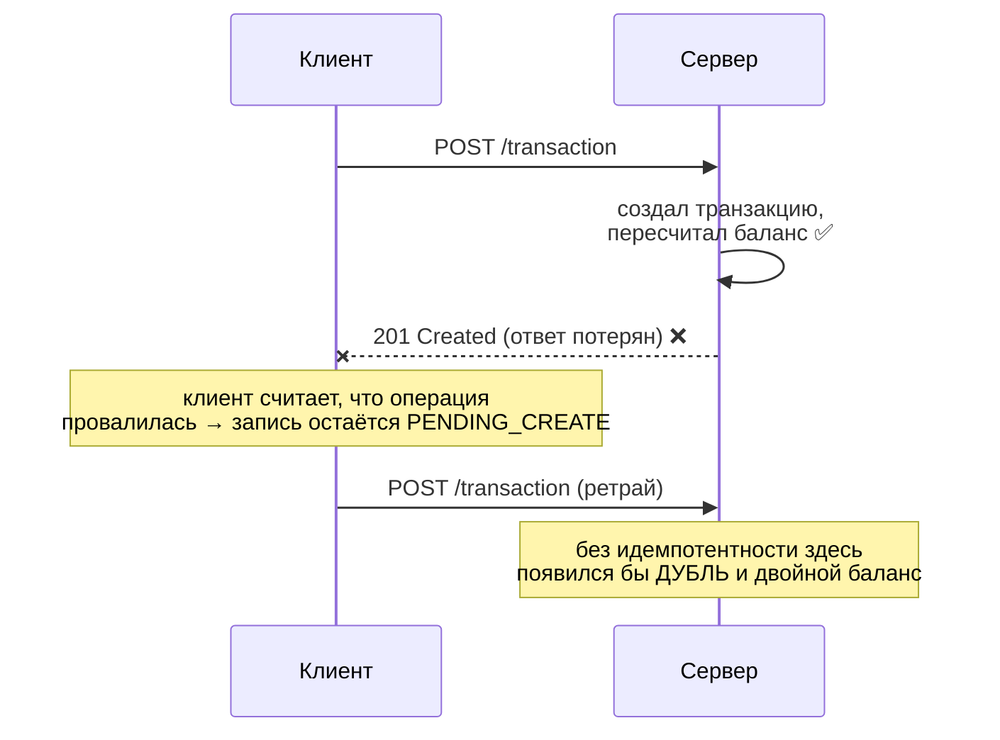
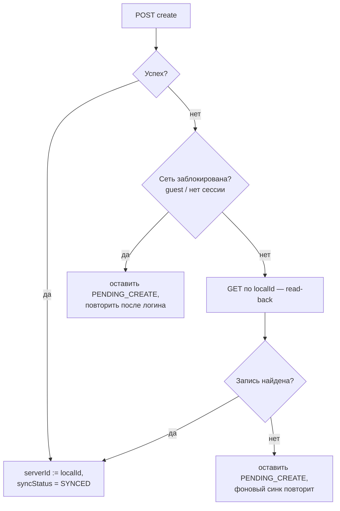

# Идемпотентность синхронизации: ACK, дедупликация и read-back

Документ объясняет, почему повторная отправка одной и той же операции не портит финансовые
данные, и какие механизмы за это отвечают на клиенте.

Связанные доки: [Outbox](./outbox.md), [Synchronization](./synchronization.md),
[Post-commit sync](./post-commit-sync.md).

## Словарь

### ACK (acknowledgement) — подтверждение

**ACK** — ответ сервера о том, что запрос **дошёл и обработан**. В нашем случае это HTTP-ответ
`200/201` на `POST /transaction`: он одновременно и подтверждение, и носитель результата
(серверная сущность с `id`, `createdAt`, `updatedAt`).

**Потеря ACK** — ситуация, когда запрос долетел, сервер **успешно всё применил**, но ответ
**не вернулся** к клиенту: оборвалась сеть, истёк таймаут, процесс приложения умер сразу после
отправки. Клиент не может отличить это от «запрос вообще не дошёл» — он видит одинаковую
ошибку и в том, и в другом случае.



Потеря ACK — практически единственная причина, по которой корректный клиент вообще отправляет
одну и ту же операцию создания дважды. Именно под неё затачивается идемпотентность.

### Идемпотентность

Операция **идемпотентна**, если её повторное выполнение с теми же входными данными оставляет
систему в том же состоянии, что и однократное: `f(f(x)) == f(x)`.

По семантике HTTP `GET`, `PUT`, `DELETE` идемпотентны **по определению метода**, а `POST` —
**нет** (`POST` = «создай новое»). Поэтому опасен именно `POST`: без дополнительной защиты
каждый ретрай создаёт новую сущность.

Почему у нас это особенно критично: бэкенд пересчитывает баланс счёта **дельтой**
(`Balance += amount` при создании транзакции). Дубль транзакции → сумма применяется дважды →
**баланс пользователя становится неверным**. Это не «лишняя строка в списке», а порча денег.

### Дедупликация (deduplication)

**Дедупликация** — распознавание сервером повторной доставки одной и той же логической операции
и отказ применять её второй раз. Чтобы это было возможно, повторы должны быть **узнаваемы** —
нужен **ключ идемпотентности**: стабильный идентификатор операции, одинаковый во всех попытках.

Два распространённых способа передать ключ:

| Способ | Как работает | Требует от сервера |
|---|---|---|
| `Idempotency-Key` header (стиль Stripe) | клиент шлёт UUID в заголовке; сервер хранит `key → ответ` и на повтор отдаёт сохранённый результат | отдельное хранилище ключей + middleware |
| **Client-generated id (upsert-by-id)** | клиент сам генерирует `id` сущности и присылает его в теле; уникальность держит первичный ключ | приём клиентского `id` — **это наш случай** |

**У нас используется второй способ.** Он дешевле: «ключ идемпотентности» и «идентификатор
сущности» — это одно и то же значение, отдельное хранилище ключей не нужно, дедупликацию
выполняет первичный ключ таблицы.

## Как это реализовано на клиенте

### 1. Стабильный ключ: `id = localId`

Каждая сущность получает `localId` (UUID) в момент создания в Room — **один раз**, и он
переживает перезапуск приложения. Этот же `localId` отправляется на сервер как `id` создаваемой
сущности:

| Маппер | Что делает |
|---|---|
| [`TransactionEntity.toDto`](../core/data/src/main/java/soft/divan/financemanager/core/data/mapper/TransactionDataMapper.kt) | `id = localId` в `POST /transaction` |
| [`Account.toDto` / `AccountEntity.toDto`](../core/data/src/main/java/soft/divan/financemanager/core/data/mapper/AccountDataMapper.kt) | `id = localId` в `POST /account` |

Ключевое правило: **ключ генерируется один раз при создании записи, а не на каждую HTTP-попытку.**
Новый id на каждую попытку полностью обесценил бы механизм — сервер видел бы каждый ретрай как
новую сущность.

Побочный эффект: после успешной синхронизации `serverId == localId`, то есть разделение
`localId`/`serverId` для новых записей схлопывается в одно значение.

### 2. Дедупликация на сервере

Сервер принимает клиентский `id` и создаёт сущность именно с ним; уникальность гарантирует
первичный ключ. Повторный `POST` с тем же `id` **не создаёт вторую строку** — сервер отвечает
ошибкой «уже существует». Данные не портятся: дубля нет, баланс применён один раз.

### 3. Read-back: подтверждение после неуспешного create

Дедупликация защищает **данные**, но не решает вопрос «а применилась ли операция?» на стороне
клиента: после потери ACK запись остаётся `PENDING_CREATE`, и каждый цикл синка будет получать
ошибку — запись «залипает» в pending навсегда.

Поэтому при неуспешном create клиент делает **read-back** — перечитывает сущность по её
`localId` (`GET /transaction/{id}`, `GET /account/{id}`):



Логика: **если запись на сервере есть, значит операция фактически удалась** — независимо от того,
дошёл ли ответ. Это надёжнее, чем разбирать текст/код серверной ошибки: read-back не зависит от
формата ответа об ошибке и одинаково корректно отрабатывает и таймаут, и обрыв, и «уже
существует».

Реализация — в отправителях очереди:
[`TransactionOutboxSender`](../core/data/src/main/java/soft/divan/financemanager/core/data/outbox/TransactionOutboxSender.kt),
[`AccountOutboxSender`](../core/data/src/main/java/soft/divan/financemanager/core/data/outbox/AccountOutboxSender.kt).

### 4. Pull распознаёт собственные неподтверждённые записи

У клиентских id есть неочевидное следствие для **pull**. После потери ACK запись существует
одновременно в двух местах: на сервере (с `id == localId`) и локально — всё ещё как
`PENDING_CREATE` с `serverId = null`.

Pull ищет локальное соответствие серверной записи по `serverId`. Для такой записи `serverId`
ещё `null`, поэтому поиск её **не находит** — и pull принимает собственную транзакцию за новую
серверную, вставляя **второй локальный экземпляр** с новым `localId`. Пользователь видит
операцию дважды, аналитика считает её дважды.

Поэтому сопоставление идёт **по двум признакам сразу**:

```sql
SELECT * FROM transactions
WHERE serverId IN (:ids) OR (localId IN (:ids) AND serverId IS NULL)
```

Первое условие — обычный случай (запись уже синхронизирована), второе — наша собственная запись,
ожидающая подтверждения. Оговорка `serverId IS NULL` здесь принципиальна: она не даёт ложно
сматчить уже подтверждённую запись, чей `localId` случайно совпал бы с чужим серверным id.
В коде результат раскладывается в map с ключом `serverId ?: localId`.

Реализация: `getBySyncIds` в
[`TransactionDao`](../core/database/src/main/java/soft/divan/financemanager/core/database/dao/TransactionDao.kt) /
[`AccountDao`](../core/database/src/main/java/soft/divan/financemanager/core/database/dao/AccountDao.kt),
используется в `pullFromRemoteForAccount` / `performPull`.

> Порядок внутри цикла синхронизации — `pull` перед `push` — делает этот сценарий не редким, а
> **типичным**: pull успевает увидеть запись раньше, чем push дойдёт до её подтверждения.

### 5. Идемпотентное удаление: 404 = успех

Удаление идемпотентно по своей природе: цель — **отсутствие** записи на сервере. Если сервер
отвечает `404` («такой записи нет»), цель уже достигнута — как правило, предыдущей попыткой,
ACK которой не дошёл. Поэтому `404` на `DELETE` трактуется как **успех**: локальная запись
удаляется (или архивируется — для счетов), а не остаётся вечно в `PENDING_DELETE`.

Трактовка ответов живёт в [`OutboxCallOutcome.kt`](../core/data/src/main/java/soft/divan/financemanager/core/data/outbox/OutboxCallOutcome.kt)
и работает **по HTTP-коду**, а не по доменной ошибке: доменные ошибки схлопывают «сервер прилёг»
и «сервер отверг данные» в одно, а очереди это различие необходимо.

| Ответ | Трактовка |
|---|---|
| `404` на `DELETE` | идемпотентный успех: записи на сервере уже нет |
| `401` | запрос не дошёл намеренно (сессия истекла) → read-back бессмыслен, попытка не тратится |
| `5xx`, обрыв сети | временный сбой → повтор с backoff |
| прочие `4xx` | отказ по существу → dead-letter |

## Два уровня ретрая

Один и тот же `POST` может быть отправлен повторно на **двух независимых уровнях**, и оба
безопасны только благодаря стабильному ключу:

| Уровень | Кто повторяет | Когда | Пауза между попытками |
|---|---|---|---|
| **Транспортный** | [`RetryInterceptor`](../core/network/src/main/java/soft/divan/financemanager/core/network/interceptor/RetryInterceptor.kt) (OkHttp) | ответ `5xx`, до 3 раз | экспоненциальный backoff + equal jitter |
| **Очереди** | [`OutboxProcessor`](../core/data/src/main/java/soft/divan/financemanager/core/data/outbox/OutboxProcessor.kt) | операция не подтверждена сервером | экспоненциальный backoff, до `MAX_ATTEMPTS`, затем dead-letter |

Важные свойства этой связки:

- **Ключ не меняется между попытками.** `RetryInterceptor` повторяет *тот же самый* объект
  запроса, а `localId` живёт в Room — значит все попытки обоих уровней несут один и тот же `id`.
  Если бы ключ генерировался на каждую попытку, транспортный ретрай сам создавал бы дубли.
  Инвариант закреплён тестом `resends the same body on every retry…`.
- **Ретраятся только `5xx`.** `4xx` — терминальные ошибки (валидация, «уже существует»): повтор
  не изменит исход, поэтому интерцептор возвращает их сразу.
- **Порядок перехватчиков.** `RetryInterceptor` подключён как *application interceptor* и только
  к основному клиенту — клиент авторизации (login/refresh) ретраев не имеет.

Известное ограничение: повторный create дубля прилетает как `5xx` (сервер сообщает «уже
существует» через общий обработчик ошибок), поэтому транспортный уровень честно потратит на него
свои попытки, прежде чем отдать ошибку выше. Дальше срабатывает read-back и помечает запись
`SYNCED`, так что расход ограничен одним циклом синка на запись.

## Что этот механизм гарантирует и чего не делает

**Гарантирует:**

- повторная отправка create **не создаёт дубль** на сервере и не применяет сумму к балансу дважды;
- операция, применённая сервером без доставленного ACK, рано или поздно будет распознана как
  успешная (read-back) — запись не залипает в `PENDING`;
- **локальный дубликат тоже не появляется**: pull опознаёт собственные неподтверждённые записи
  по клиентскому id;
- повторное удаление не считается ошибкой.

**Границы:**

1. **UPDATE** идемпотентен «по построению» — он отправляет абсолютные значения, а не дельту,
   поэтому повтор безопасен и специальной защиты не требует.
2. **Read-back стоит одного дополнительного запроса** — только в ветке ошибки. В офлайне он
   тоже провалится (быстро) и просто оставит запись `PENDING`.
3. **Гарантия доставки — за фоновым синком.** Идемпотентность отвечает за «ровно один эффект»,
   но не за «дошло»; доставку обеспечивает периодический push pending-записей (WorkManager).
4. **Ключ = id сущности.** Это работает для операций, адресуемых идентификатором ресурса
   (create/update/delete). Для операций **без** resource-id (например будущие переводы между
   счетами) понадобится отдельный ключ идемпотентности — см. «Что требуется от сервера» ниже.

## Что требуется от сервера

Клиентская половина работает **и без изменений на сервере** — за счёт read-back и трактовки
`404-on-delete`. Но каждая из перечисленных доработок убирает лишнюю работу или закрывает
пограничный случай. Порядок — по практической пользе.

### 1. Дубль create должен отвечать не `5xx` (главное)

Сейчас `EntityRepository.CreateAsync` при существующем `Id` бросает `EntityExistsException`,
а `GlobalExceptionHandler` превращает **любое** исключение в `500`. Для клиента это выглядит как
«сервер прилёг»:

- транспортный `RetryInterceptor` тратит на заведомо безнадёжный запрос все свои попытки;
- очередь классифицирует ответ как временный сбой, и только read-back выясняет правду.

Нужно: при существующем `Id` вернуть **уже существующую сущность (200)** — либо `409`. Критично
сделать это **до и без** `UpdateAccountAmountAsync`: баланс считается дельтой (`Balance += amount`),
и повторное применение испортит деньги. Сейчас от этого спасает `throw` до пересчёта — при
переходе на 200-replay инвариант нужно сохранить осознанно.

### 2. Таксономия ошибок: `4xx` не должны выглядеть как `5xx`

Тот же `GlobalExceptionHandler` кладёт в `500` и ошибки валидации. Очередь различает
**временное** (повторить) и **терминальное** (в dead-letter) по коду ответа, поэтому отвергнутая
по существу операция сейчас проходит все 8 попыток с нарастающей паузой, прежде чем сдаться.

Нужно: бизнес-ошибки → корректные `4xx`, `5xx` оставить за настоящими сбоями сервера. Заодно
проверить, что `exception.Message` не утекает наружу в `Detail`.

### 3. Дедупликация должна быть атомарной

`CreateAsync` делает `AnyAsync` (проверка) и затем `AddAsync` (вставка) — между ними есть окно.
Два одновременных повтора одного запроса могут оба пройти проверку, и один упадёт на нарушении
первичного ключа уже в `SaveChangesAsync`.

Нужно: ловить `DbUpdateException` (unique/PK violation) и отвечать тем же идемпотентным
результатом, что и в п.1. Первичный ключ по `Id` уже гарантирует уникальность — на него и стоит
опираться, а не на предварительную проверку.

### 4. `DELETE` отсутствующего — успех, а не `404`

Сейчас контроллер отвечает `NotFound()`. Клиент это переживает (трактует `404` на удалении как
успех), но семантически идемпотентный `DELETE` должен возвращать `204`: цель — отсутствие
записи — уже достигнута.

### 5. Мелочи для полноты

- **`UPDATE`** уже идемпотентен по балансу (`ReplaceAccountAmountAsync` = откат старого +
  применение нового даёт нетто-ноль на повторе) — менять нечего, стоит закрепить тестом.
- **Сквозной `id`**: проверить, что Mapster переносит `BaseCreateRequest.Id → Transaction.Id`, а
  server-managed `CreatedAt`/`UpdatedAt` не затираются при replay.
- **Хранилище ключей** (`idempotency_keys`) сейчас не нужно: дедупликацию делает первичный ключ.
  Оно станет **обязательным** для операций **без идентификатора ресурса** — например будущих
  переводов между счетами, где одна операция меняет два счёта.
- **Оптимистичная блокировка** (`rowversion` / `If-Match`) — если понадобится защита от тихой
  перезаписи при правке с двух устройств; сейчас конфликты решает last-write-wins по `UpdatedAt`.

## Литература

- Stripe API — Idempotent requests: https://docs.stripe.com/api/idempotent_requests
- Stripe blog — Designing robust and predictable APIs with idempotency: https://stripe.com/blog/idempotency
- Brandur Leach — Implementing Stripe-like Idempotency Keys in Postgres: https://brandur.org/idempotency-keys
- MDN — Idempotent: https://developer.mozilla.org/en-US/docs/Glossary/Idempotent
