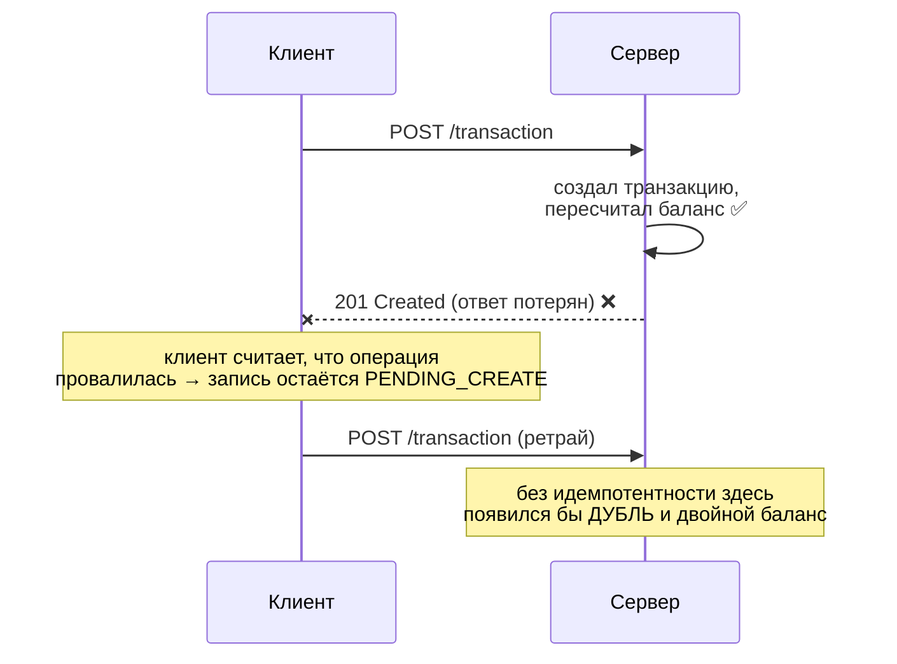
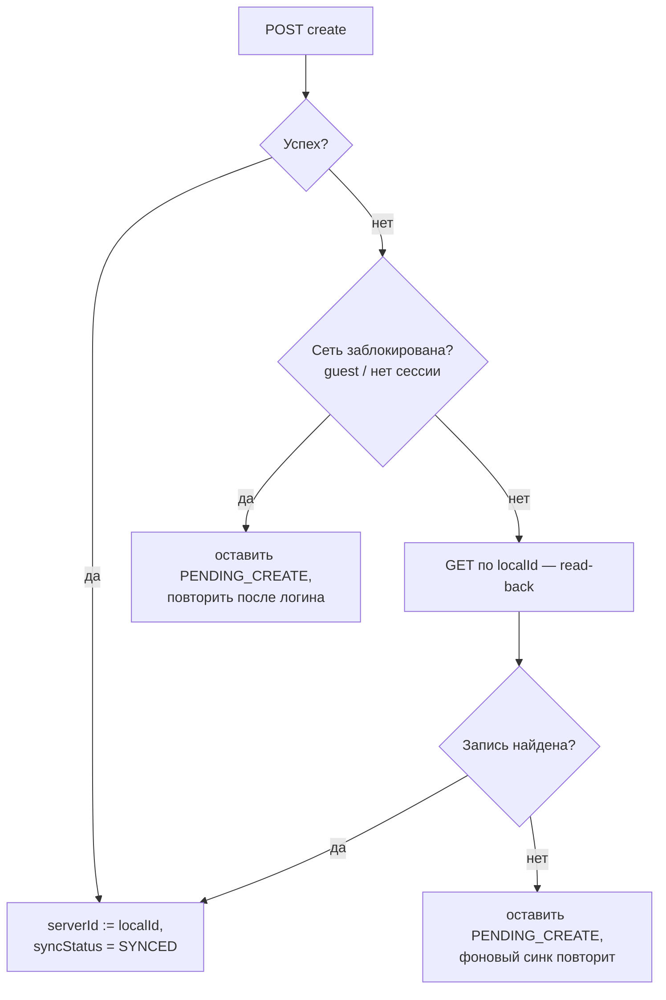

# Идемпотентность синхронизации: ACK, дедупликация и read-back

Документ объясняет, почему повторная отправка одной и той же операции не портит финансовые
данные, и какие механизмы за это отвечают на клиенте.

Связанные доки: [Synchronization](./synchronization.md), [Post-commit sync](./post-commit-sync.md),
[План: Outbox + идемпотентность](./outbox-plan.md).

## Словарь

### ACK (acknowledgement) — подтверждение

**ACK** — ответ сервера о том, что запрос **дошёл и обработан**. В нашем случае это HTTP-ответ
`200/201` на `POST /transaction`: он одновременно и подтверждение, и носитель результата
(серверная сущность с `id`, `createdAt`, `updatedAt`).

**Потеря ACK** — ситуация, когда запрос долетел, сервер **успешно всё применил**, но ответ
**не вернулся** к клиенту: оборвалась сеть, истёк таймаут, процесс приложения умер сразу после
отправки. Клиент не может отличить это от «запрос вообще не дошёл» — он видит одинаковую
ошибку и в том, и в другом случае.

Потеря ACK — практически единственная причина, по которой корректный клиент вообще отправляет
одну и ту же операцию создания дважды. Именно под неё затачивается идемпотентность.

### Идемпотентность

Операция **идемпотентна**, если её повторное выполнение с теми же входными данными оставляет
систему в том же состоянии, что и однократное: `f(f(x)) == f(x)`.

По семантике HTTP `GET`, `PUT`, `DELETE` идемпотентны **по определению метода**, а `POST` —
**нет** (`POST` = «создай новое»). Поэтому опасен именно `POST`: без дополнительной защиты
каждый ретрай создаёт новую сущность.

Почему у нас это особенно критично: бэкенд пересчитывает баланс счёта **дельтой**
(`Balance += amount` при создании транзакции). Дубль транзакции → сумма применяется дважды →
**баланс пользователя становится неверным**. Это не «лишняя строка в списке», а порча денег.

### Дедупликация (deduplication)

**Дедупликация** — распознавание сервером повторной доставки одной и той же логической операции
и отказ применять её второй раз. Чтобы это было возможно, повторы должны быть **узнаваемы** —
нужен **ключ идемпотентности**: стабильный идентификатор операции, одинаковый во всех попытках.

Два распространённых способа передать ключ:

| Способ | Как работает | Требует от сервера |
|---|---|---|
| `Idempotency-Key` header (стиль Stripe) | клиент шлёт UUID в заголовке; сервер хранит `key → ответ` и на повтор отдаёт сохранённый результат | отдельное хранилище ключей + middleware |
| **Client-generated id (upsert-by-id)** | клиент сам генерирует `id` сущности и присылает его в теле; уникальность держит первичный ключ | приём клиентского `id` — **это наш случай** |

**У нас используется второй способ.** Он дешевле: «ключ идемпотентности» и «идентификатор
сущности» — это одно и то же значение, отдельное хранилище ключей не нужно, дедупликацию
выполняет первичный ключ таблицы.

## Как это реализовано на клиенте

### 1. Стабильный ключ: `id = localId`

Каждая сущность получает `localId` (UUID) в момент создания в Room — **один раз**, и он
переживает перезапуск приложения. Этот же `localId` отправляется на сервер как `id` создаваемой
сущности:

| Маппер | Что делает |
|---|---|
| [`TransactionEntity.toDto`](../core/data/src/main/java/soft/divan/financemanager/core/data/mapper/TransactionDataMapper.kt) | `id = localId` в `POST /transaction` |
| [`Account.toDto` / `AccountEntity.toDto`](../core/data/src/main/java/soft/divan/financemanager/core/data/mapper/AccountDataMapper.kt) | `id = localId` в `POST /account` |

Ключевое правило: **ключ генерируется один раз при создании записи, а не на каждую HTTP-попытку.**
Новый id на каждую попытку полностью обесценил бы механизм — сервер видел бы каждый ретрай как
новую сущность.

Побочный эффект: после успешной синхронизации `serverId == localId`, то есть разделение
`localId`/`serverId` для новых записей схлопывается в одно значение.

### 2. Дедупликация на сервере

Сервер принимает клиентский `id` и создаёт сущность именно с ним; уникальность гарантирует
первичный ключ. Повторный `POST` с тем же `id` **не создаёт вторую строку** — сервер отвечает
ошибкой «уже существует». Данные не портятся: дубля нет, баланс применён один раз.

### 3. Read-back: подтверждение после неуспешного create

Дедупликация защищает **данные**, но не решает вопрос «а применилась ли операция?» на стороне
клиента: после потери ACK запись остаётся `PENDING_CREATE`, и каждый цикл синка будет получать
ошибку — запись «залипает» в pending навсегда.

Поэтому при неуспешном create клиент делает **read-back** — перечитывает сущность по её
`localId` (`GET /transaction/{id}`, `GET /account/{id}`):

Логика: **если запись на сервере есть, значит операция фактически удалась** — независимо от того,
дошёл ли ответ. Это надёжнее, чем разбирать текст/код серверной ошибки: read-back не зависит от
формата ответа об ошибке и одинаково корректно отрабатывает и таймаут, и обрыв, и «уже
существует».

Реализация — в `syncCreate`:
[`TransactionSyncManagerImpl`](../core/data/src/main/java/soft/divan/financemanager/core/data/sync/impl/TransactionSyncManagerImpl.kt),
[`AccountSyncManagerImpl`](../core/data/src/main/java/soft/divan/financemanager/core/data/sync/impl/AccountSyncManagerImpl.kt).

### 4. Идемпотентное удаление: 404 = успех

Удаление идемпотентно по своей природе: цель — **отсутствие** записи на сервере. Если сервер
отвечает `404` («такой записи нет»), цель уже достигнута — как правило, предыдущей попыткой,
ACK которой не дошёл. Поэтому `404` на `DELETE` трактуется как **успех**: локальная запись
удаляется (или архивируется — для счетов), а не остаётся вечно в `PENDING_DELETE`.

Хелперы трактовки ответов — [`IdempotentSync.kt`](../core/data/src/main/java/soft/divan/financemanager/core/data/sync/util/IdempotentSync.kt):

| Функция | Смысл |
|---|---|
| `DomainError.isNotFound()` | сервер сообщил «записи нет» (404) → для delete это идемпотентный успех |
| `DomainError.isNetworkBlocked()` | запрос не дошёл до сервера намеренно (гостевой режим, нет сессии) → read-back бессмыслен |

## Что этот механизм гарантирует и чего не делает

**Гарантирует:**

- повторная отправка create **не создаёт дубль** и не применяет сумму к балансу дважды;
- операция, применённая сервером без доставленного ACK, рано или поздно будет распознана как
  успешная (read-back) — запись не залипает в `PENDING`;
- повторное удаление не считается ошибкой.

**Границы:**

1. **UPDATE** идемпотентен «по построению» — он отправляет абсолютные значения, а не дельту,
   поэтому повтор безопасен и специальной защиты не требует.
2. **Read-back стоит одного дополнительного запроса** — только в ветке ошибки. В офлайне он
   тоже провалится (быстро) и просто оставит запись `PENDING`.
3. **Гарантия доставки — за фоновым синком.** Идемпотентность отвечает за «ровно один эффект»,
   но не за «дошло»; доставку обеспечивает периодический push pending-записей (WorkManager).
4. **Ключ = id сущности.** Это работает для операций, адресуемых идентификатором ресурса
   (create/update/delete). Для операций **без** resource-id (например будущие переводы между
   счетами) понадобится отдельный ключ идемпотентности — см. [outbox-plan](./outbox-plan.md).

## Литература

- Stripe API — Idempotent requests: https://docs.stripe.com/api/idempotent_requests
- Stripe blog — Designing robust and predictable APIs with idempotency: https://stripe.com/blog/idempotency
- Brandur Leach — Implementing Stripe-like Idempotency Keys in Postgres: https://brandur.org/idempotency-keys
- MDN — Idempotent: https://developer.mozilla.org/en-US/docs/Glossary/Idempotent
