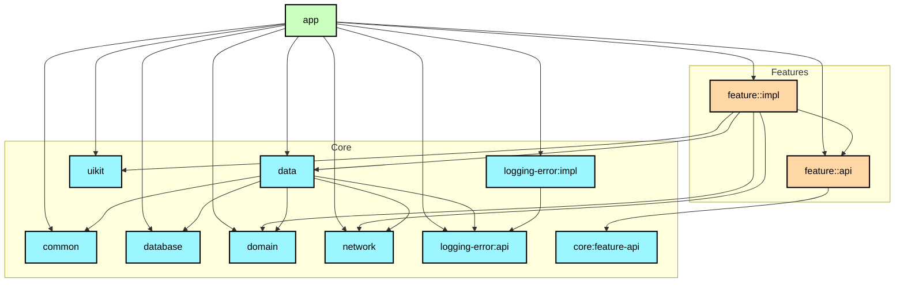

# Modularization

В этом документе описана модульная архитектура проекта **Finance Manager**:
какие есть типы модулей, как они зависят друг от друга и как мы применяем принципы
модульности на практике.

## Goals

- Ускорить сборку и упростить инкрементальную компиляцию.
- Обеспечить чёткие **границы ответственности** между частями приложения.
- Облегчить повторное использование кода (особенно общих `core`‑модулей и `feature`‑API).
- Упростить тестирование (возможность собирать и запускать отдельные модули).

## Module types

Ниже показана упрощённая диаграмма модулей и их связей.

Ниже показана полная диаграмма модулей и их связей.

```mermaid
graph LR

    core_common["core:common"]
    core_database["core:database"]
    core_network["core:network"]
    core_domain["core:domain"]
    core_data["core:data"]
    core_uikit["core:uikit"]
    core_feature_api["core:feature-api"]
    core_log_api["core:logging-error:api"]
    core_log_impl["core:logging-error:impl"]


    f_category_api["feature:category:api"]
    f_category_impl["feature:category:impl"]
    f_settings_api["feature:settings:api"]
    f_settings_impl["feature:settings:impl"]
    f_myacc_api["feature:my-accounts:api"]
    f_myacc_impl["feature:my-accounts:impl"]
    f_tt_api["feature:transactions-today:api"]
    f_tt_impl["feature:transactions-today:impl"]
    f_splash_api["feature:splash-screen:api"]
    f_splash_impl["feature:splash-screen:impl"]
    f_transaction_api["feature:transaction:api"]
    f_transaction_impl["feature:transaction:impl"]
    f_security_api["feature:security:api"]
    f_security_impl["feature:security:impl"]
    f_design_api["feature:design-app:api"]
    f_design_impl["feature:design-app:impl"]
    f_analysis_api["feature:analysis:api"]
    f_analysis_impl["feature:analysis:impl"]
    f_history_api["feature:history:api"]
    f_history_impl["feature:history:impl"]
    f_account_api["feature:account:api"]
    f_account_impl["feature:account:impl"]
    f_haptics_api["feature:haptics:api"]
    f_haptics_impl["feature:haptics:impl"]
    f_sounds_api["feature:sounds:api"]
    f_sounds_impl["feature:sounds:impl"]
    f_lang_api["feature:languages:api"]
    f_lang_impl["feature:languages:impl"]
    f_sync_api["feature:synchronization:api"]
    f_sync_impl["feature:synchronization:impl"]


    app["app"]
    sync["sync"]

    app --> core_common   
    app --> core_database 
    app --> core_network  
    app --> core_domain   
    app --> core_data    
    app --> core_uikit   
    app --> core_log_api  
    app --> core_log_impl 

    app --> f_category_api      
    app --> f_category_impl     
    app --> f_settings_api     
    app --> f_settings_impl      
    app --> f_myacc_api         
    app --> f_myacc_impl       
    app --> f_tt_api           
    app --> f_tt_impl         
    app --> f_splash_api       
    app --> f_splash_impl        
    app --> f_transaction_api  
    app --> f_transaction_impl   
    app --> f_security_api       
    app --> f_security_impl     
    app --> f_design_api     
    app --> f_design_impl       
    app --> f_analysis_api     
    app --> f_analysis_impl     
    app --> f_history_api       
    app --> f_history_impl      
    app --> f_account_api        
    app --> f_account_impl       
    app --> f_haptics_api        
    app --> f_haptics_impl      
    app --> f_sounds_api         
    app --> f_sounds_impl        
    app --> f_lang_api           
    app --> f_lang_impl         
    app --> f_sync_api           
    app --> f_sync_impl          

%% CORE INTERNAL
    core_data --> core_common    
    core_data --> core_database  
    core_data --> core_domain    
    core_data --> core_network  
    core_data --> core_log_api   
    core_log_impl --> core_log_api 

%% SYNC
    sync --> core_common 
    sync --> core_data   

%% FEATURE BASE
    f_category_api --> core_feature_api    
    f_settings_api --> core_feature_api    
    f_myacc_api --> core_feature_api       
    f_tt_api --> core_feature_api        
    f_splash_api --> core_feature_api      
    f_transaction_api --> core_feature_api 
    f_security_api --> core_feature_api    
    f_design_api --> core_feature_api      
    f_analysis_api --> core_feature_api    
    f_history_api --> core_feature_api    
    f_account_api --> core_feature_api     
    f_haptics_api --> core_feature_api     
    f_sounds_api --> core_feature_api     
    f_lang_api --> core_feature_api       
    f_sync_api --> core_feature_api        

%% FEATURE IMPLEMENTATIONS
    f_category_impl --> f_category_api
    f_category_impl --> core_network
    f_category_impl --> core_uikit
    f_category_impl --> core_data
    f_category_impl --> core_domain

    f_settings_impl --> f_settings_api
    f_settings_impl --> core_uikit
    f_settings_impl --> f_security_api
    f_settings_impl --> f_design_api
    f_settings_impl --> f_haptics_api
    f_settings_impl --> f_sounds_api
    f_settings_impl --> f_lang_api
    f_settings_impl --> f_sync_api

    f_myacc_impl --> f_myacc_api
    f_myacc_impl --> core_network
    f_myacc_impl --> core_uikit
    f_myacc_impl --> core_domain
    f_myacc_impl --> core_data
    f_myacc_impl --> f_account_api
    f_myacc_impl --> f_haptics_api

    f_tt_impl --> f_tt_api
    f_tt_impl --> core_network
    f_tt_impl --> core_uikit
    f_tt_impl --> core_domain
    f_tt_impl --> f_transaction_api
    f_tt_impl --> f_history_api
    f_tt_impl --> f_haptics_api

    f_splash_impl --> f_splash_api
    f_splash_impl --> core_uikit

    f_transaction_impl --> f_transaction_api
    f_transaction_impl --> core_domain
    f_transaction_impl --> core_data
    f_transaction_impl --> core_uikit
    f_transaction_impl --> f_haptics_api
    f_transaction_impl --> f_sounds_api

    f_security_impl --> f_security_api
    f_security_impl --> core_network
    f_security_impl --> core_uikit
    f_security_impl --> core_domain

    f_design_impl --> f_design_api
    f_design_impl --> core_uikit
    f_design_impl --> f_haptics_api

    f_analysis_impl --> f_analysis_api
    f_analysis_impl --> core_uikit
    f_analysis_impl --> core_domain

    f_history_impl --> f_history_api
    f_history_impl --> core_domain
    f_history_impl --> core_data
    f_history_impl --> core_uikit
    f_history_impl --> f_transaction_api
    f_history_impl --> f_analysis_api

    f_account_impl --> f_account_api
    f_account_impl --> core_domain
    f_account_impl --> core_uikit
    f_account_impl --> f_haptics_api

    f_haptics_impl --> f_haptics_api
    f_haptics_impl --> core_uikit
    f_haptics_impl --> core_common

    f_sounds_impl --> f_sounds_api
    f_sounds_impl --> core_common
    f_sounds_impl --> core_uikit

    f_lang_impl --> f_lang_api
    f_lang_impl --> core_uikit

    f_sync_impl --> f_sync_api
    f_sync_impl --> core_uikit
    f_sync_impl --> core_domain
    f_sync_impl --> sync

```

## Module documentation

Каждый модуль в проекте **обязан иметь собственный `README.md`**,
который описывает его назначение, ответственность и зависимости.

Это правило позволяет:

- быстро понять роль модуля без чтения кода;
- упростить навигацию по большому количеству модулей;
- снизить порог входа для новых разработчиков;
- поддерживать архитектурную дисциплину при росте проекта.

### README внутри модуля

`README.md` каждого модуля должен содержать как минимум:

- краткое описание назначения модуля;
- тип модуля (`app`, `core`, `feature:api`, `feature:impl`, `utils`);
- **явный список зависимостей** (на какие модули он ссылается);
- что именно модуль **предоставляет наружу**;
- важные архитектурные или технические ограничения.

### Список всех модулей проекта

- [modules list](modules.md)

### Типы модулей

#### Application module

- `:app`
    - Точка входа (`App`, `MainActivity`).
    - Конфигурация `Hilt`, навигация (`RootNavGraph`, `BottomNavGraph`, `FMNavigationBar`).
    - Зависит от всех `feature:*:api` и `core:*` модулей.

#### Core modules (`core:*`)

Общие инфраструктурные и доменные модули, не зависящие от конкретных фич:

- `core:common`
    - Общие утилиты, расширения, базовые классы.
- `core:domain`
    - Доменные модели (`Account`, `Transaction`, `Category`, `Period` и др.).
    - Интерфейсы репозиториев (`AccountRepository`, `TransactionRepository` и т.п.).
    - Use case’ы (`GetAccountsUseCase`, `GetTransactionsByPeriodUseCase`, и др.).
- `core:data`
    - Реализация репозиториев, работа с Room, Retrofit и DataStore.
    - Инкапсуляция источников данных (локальные/удалённые).
- `core:database`
    - Конфигурация Room: `FinanceManagerDatabase`, DAO, миграции.
- `core:network`
    - Сетевой стек на базе Retrofit + OkHttp.
    - Интерфейсы API, интерцепторы, мониторинг сети.
- `core:feature-api`
    - Общие контракты для навигации и интеграции фич.
- `core:uikit`
    - Общие визуальные компоненты, темы, утилиты для UI.
- `core:logging-error:(api|impl)`
    - Общий модуль для логирования и обработки ошибок.

Правила:

- `core:*` модули **не зависят от `feature:*` и `app`**.
- Допускаются зависимости `core:*` друг от друга (например, `core:data` → `core:database`).

#### Feature modules (`feature:*:api` и `feature:*:impl`)

Каждая фича разбита на два модуля:

- `feature:<name>:api`
    - Навигационные контракты и интерфейсы.
    - Общие типы, которые могут использовать другие фичи или `app`.
- `feature:<name>:impl`
    - UI (Compose‑экраны, компоненты).
    - ViewModel’и, DI‑модули.
    - Зависимости от `core:*` (domain/data/uikit и т.д.).

Примеры:

- `feature:my-accounts:api` / `feature:my-accounts:impl`
    - Экран и логика управления счетами пользователя.
- `feature:transaction:api` / `feature:transaction:impl`
    - Создание/редактирование транзакций.
- `feature:history:*`, `feature:analysis:*`, `feature:transactions-today:*`
    - Разные срезы истории и аналитики.
- `feature:settings:*`, `feature:languages:*`, `feature:design-app:*`, `feature:haptics:*`,
  `feature:sounds:*`
    - Настройки локали, темы, звука, вибрации.
- `feature:security:*`
    - Экран настройки безопасности, PIN, защита доступа.

Правила:

- `feature:*:api` **не** зависят от других `feature:*` (только от `core:*`).
- `feature:*:impl` могут зависеть от:
    - своего `:api`;
    - `core:*` модулей;
    - других `feature:*:api` (но не от `feature:*:impl`).

Такой паттерн упрощает **переиспользование фич** в других приложениях и предотвращает
циклические зависимости.

#### Utils modules

- `:sync`
    - Модуль фоновой синхронизации (WorkManager, планирование задач, нотификации).
    - Зависит от `core:data`, `core:network`, `core:domain`.
- `:lint`
    - Собственный Android Lint‑модуль.

## Build logic

В директории `build-logic/` находится convention‑плагины:

- `:build-logic:conclusion`
    - `AndroidAppConventionPlugin`
    - `AndroidBaseConventionPlugin`
    - `FeatureApiConventionPlugin`
    - `FeatureImplConventionPlugin`
    - `CoreConventionPlugin`
    - `JvmLibraryConventionPlugin`
    - `HiltConventionPlugin`
    - `BuildTimeTrackerConventionPlugin`

Через эти плагины автоматически:

- применяются нужные плагины (`com.android.application`, `com.android.library`,
  `org.jetbrains.kotlin.android`, `ksp`, `hilt` и т.п.);
- подключаются общие зависимости (`core`/`uikit`/`logging-error` и др.);
- подключается `ktlint`‑плагин ко всем Android/JVM модулям;
- включаются общие настройки `Kotlin`/`Java` компилятора и Android Gradle Plugin.

Это снижает дублирование и упрощает добавление новых модулей: достаточно подключить
один из `soft.divan.*` плагинов в `build.gradle.kts` модуля.
// Revue me>>
