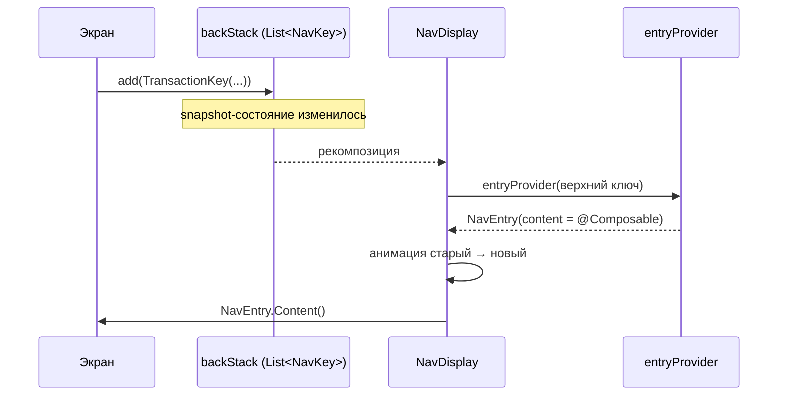
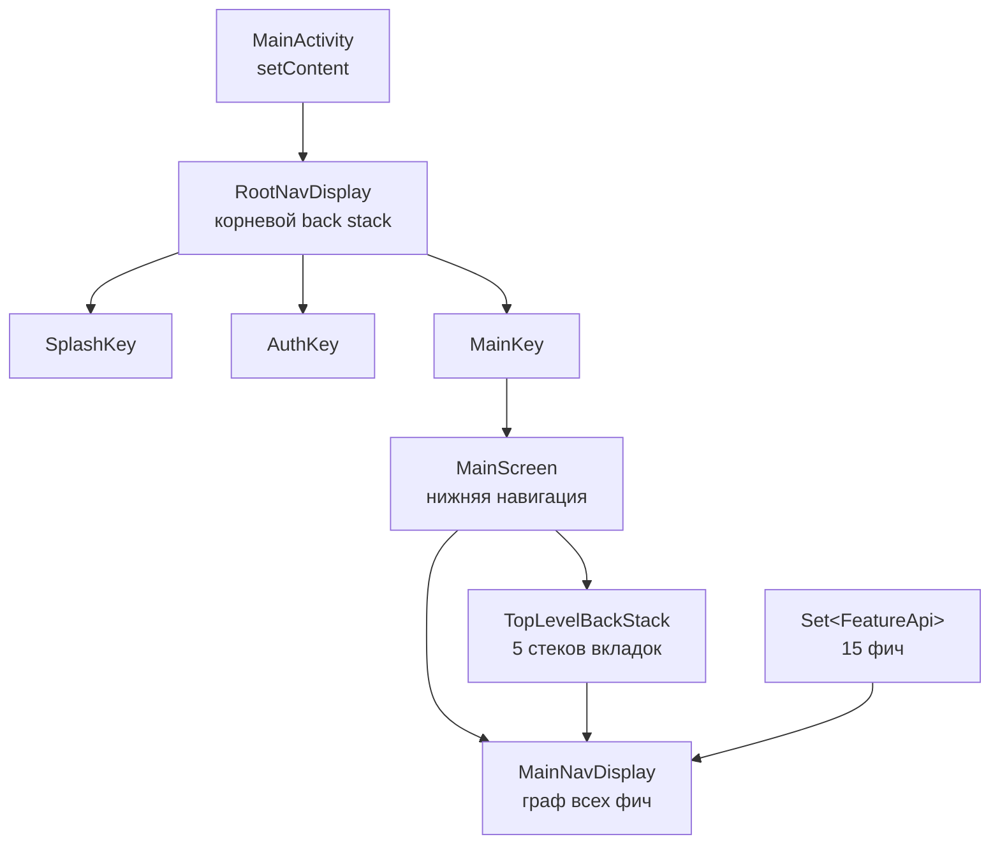

# Навигация (Navigation 3)

Полное описание навигации **Finance Manager**: как устроена сама библиотека
**Navigation 3** (`androidx.navigation3`), как на ней собран граф приложения и как с ним
работать.

Документ состоит из трёх частей:

1. [Часть I — как работает Navigation 3](#часть-i--как-работает-navigation-3) — библиотека
   с нуля, для тех, кто с ней не работал.
2. [Часть II — навигация Finance Manager](#часть-ii--навигация-finance-manager) — конкретная
   архитектура проекта.
3. [Часть III — практика](#часть-iii--практика) — как добавить экран, аргумент, фичу и что
   ломается чаще всего.

> 🗺️ Визуальная карта всех экранов и переходов (с миниатюрами) собирается автоматически из
> аннотаций — см. [`nav-graph.md`](./nav-graph.md). Готовая карта: 
> и интерактивный [`graphs/nav_graph/nav-graph.html`](graphs/nav_graph/nav-graph.html).

---

## Часть I — как работает Navigation 3

### 1. Главная идея: back stack — это ваш список

В Navigation 2 (`androidx.navigation:navigation-compose`) навигацией владела библиотека:

```kotlin
val navController = rememberNavController()      // состояние внутри библиотеки
NavHost(navController, startDestination = "expenses") {
    composable("transaction/{id}/{isIncome}") { entry -> ... }
}
navController.navigate("transaction/42/false")   // просим библиотеку сходить по строке
```

Что здесь неудобно:

- **экран адресуется строкой**, аргументы кодируются в URL-подобном маршруте и вручную
  парсятся (`navArgument`, `NavType`, `backStackEntry.arguments?.getBoolean(...)`);
- **back stack спрятан** внутри `NavController`. Хочешь «удалить второй снизу экран» или
  «две независимые стопки для вкладок» — сражаешься с `popUpTo`/`saveState`/`restoreState`;
- **граф — дерево** (`navigation(...)` внутри `NavHost`), и вложенность обязана совпадать с
  тем, как экраны реально открываются.

Navigation 3 переворачивает модель. Back stack — это **обычный список**, которым владеет
приложение:

```kotlin
val backStack = rememberNavBackStack(ExpensesKey)   // это MutableList<NavKey>

backStack.add(TransactionKey(id = "42"))            // «навигация вперёд»
backStack.removeAt(backStack.lastIndex)             // «назад»
```

Никакого `NavController`. Навигация — это операции над списком, а `NavDisplay` просто рисует
то, что в списке лежит сверху. Отсюда все различия: состояние читаемо, back stack можно
менять как угодно (вставить экран в середину, склеить два стека, показать «список + деталь»),
и всё это обычным Kotlin-кодом.

### 2. Три кита

#### `NavKey` — что показать

Ключ экрана. Обычный сериализуемый Kotlin-класс:

```kotlin
@Serializable
data object CategoryKey : NavKey                                  // экран без аргументов

@Serializable
data class TransactionKey(                                        // экран с аргументами
    val isIncome: Boolean,
    val transactionId: String? = null
) : NavKey
```

`NavKey` — это интерфейс-маркер (внутри пусто). Аргументы экрана — просто поля класса,
их типы проверяет компилятор. Строк-маршрутов больше нет вообще.

#### `entryProvider` — как показать

Отображение «ключ → контент». Строится DSL-блоком:

```kotlin
val provider = entryProvider {
    entry<CategoryKey> { CategoriesScreen() }

    entry<TransactionKey> { key ->                 // key типизирован: TransactionKey
        TransactionScreen(
            isIncome = key.isIncome,
            transactionId = key.transactionId
        )
    }
}
```

`entryProvider` возвращает функцию `(NavKey) -> NavEntry`. `NavEntry` — это ключ + контент +
метаданные (например, кастомная анимация именно для этого экрана).

Важное правило: **один ключ регистрируется ровно один раз**. Попытка добавить `entry<X>`
дважды — ошибка. Дерева графов больше нет, есть плоская «таблица экранов».

#### `NavDisplay` — где показать

Композабл, который берёт список ключей и рисует верхний:

```kotlin
NavDisplay(
    backStack = backStack,
    onBack = { backStack.removeAt(backStack.lastIndex) },
    entryDecorators = listOf(
        rememberSaveableStateHolderNavEntryDecorator(),
        rememberViewModelStoreNavEntryDecorator()
    ),
    entryProvider = provider
)
```

Всё. Это полный аналог `NavHost` — но `NavDisplay` не хранит состояние, а только отображает
переданный список, анимирует переходы между «прошлым верхом» и «новым верхом» и обрабатывает
системный «назад» (включая предиктивный жест).

### 3. Что происходит на каждом кадре



Обратно — то же самое: системный «назад» вызывает `onBack`, тот удаляет последний элемент
списка, `NavDisplay` рекомпозируется и показывает предыдущий ключ.

### 4. Декораторы: откуда у экрана ViewModel и `rememberSaveable`

В Navigation 2 у каждого экрана был `NavBackStackEntry`, который сам был
`ViewModelStoreOwner` + `SavedStateRegistryOwner`. В Navigation 3 `NavEntry` — это просто
данные, а «обвязку» добавляют **декораторы**:

| Декоратор | Что даёт |
| --- | --- |
| `rememberSaveableStateHolderNavEntryDecorator()` | `rememberSaveable` внутри экрана переживает уход экрана вглубь стека и смерть процесса |
| `rememberViewModelStoreNavEntryDecorator()` | свой `ViewModelStore` + `SavedStateRegistry` на каждый `NavEntry`: `hiltViewModel()` и `viewModel()` работают как раньше, а VM очищается при уходе экрана из стека |

Декораторы передаются в `NavDisplay` списком и оборачивают контент каждого `NavEntry`
(«декоратор» = `CompositionLocalProvider` вокруг экрана). Именно поэтому обычный
`hiltViewModel()` внутри экранов продолжает работать без единого изменения — под капотом
декоратор подставляет `LocalViewModelStoreOwner`, реализующий `HasDefaultViewModelProviderFactory`.

Артефакт `rememberViewModelStoreNavEntryDecorator` лежит в
`androidx.lifecycle:lifecycle-viewmodel-navigation3` (отдельная зависимость).

### 5. Сохранение состояния и сериализация

`rememberNavBackStack(...)` — это `rememberSaveable` поверх списка ключей. Чтобы список
пережил смерть процесса, ключи должны быть **`@Serializable`** (kotlinx.serialization):
библиотека сохраняет `тип + поля`, а при восстановлении поднимает класс по имени
(`NavKeySerializer` → `Class.forName` → сгенерированный сериализатор).

Практические следствия:

- забыл `@Serializable` на ключе — приложение упадёт при сохранении стека, а не при
  навигации (то есть не сразу; это ловится ревью и тестом);
- при включённом R8 классы ключей нужно оставить в живых keep-правилом (в проекте оно есть,
  см. `app/proguard-rules.pro`);
- ключ — это **данные**, а не ссылка на объект. Нельзя класть в него лямбду, `Context`,
  доменную модель целиком. Кладут id и примитивы.

### 6. «Назад» и предиктивный жест

`NavDisplay` сам подписывается на системный back и вызывает `onBack`, **только если в стеке
больше одного элемента**. Если элемент один — событие уходит системе и приложение
сворачивается. Поэтому `onBack` не должен опустошать стек.

Предиктивный back (Android 14+) работает из коробки: `NavDisplay` анимирует «подглядывание»
на предыдущий экран через `predictivePopTransitionSpec`.

### 7. Scene: несколько экранов одновременно

`NavDisplay` умеет показывать не только верхний ключ. `SceneStrategy` может решить, что
верхние N ключей — это одна «сцена» (например, список слева и деталь справа на планшете, или
диалог поверх экрана). По умолчанию действует `SinglePaneSceneStrategy` — один экран на
экране. В проекте адаптивные сцены не используются.

### 8. Таблица соответствий

| Navigation 2 | Navigation 3 |
| --- | --- |
| `NavController` | ваш `NavBackStack` (обычный `MutableList<NavKey>`) |
| `NavHost` | `NavDisplay` |
| `composable("route/{id}")` | `entry<Key> { key -> }` |
| строковый маршрут + `navArgument` | поля `data class`-ключа |
| `navigate("route")` | `backStack.add(Key)` |
| `popBackStack()` | `backStack.removeAt(lastIndex)` |
| `popUpTo(0) { inclusive = true }` | `backStack.clear(); backStack.add(Key)` |
| вложенные графы `navigation(...)` | плоский `entryProvider` + композиция стеков в коде |
| `NavBackStackEntry` как VM-owner | `entryDecorators` |
| `saveState`/`restoreState` для вкладок | несколько списков, по одному на вкладку |
| deep links из коробки | руками: `Intent` → ключи → стек |

---

## Часть II — навигация Finance Manager

### 1. Общая картина



Два независимых `NavDisplay`:

- **корневой** — что показать вместо приложения: старт, авторизация или оболочку;
- **основной** — что показать внутри оболочки с нижней навигацией.

### 2. Контракт фичи

`:core:feature-api` — два интерфейса и одно расширение:

```kotlin
interface FeatureApi {
    fun registerEntries(
        scope: EntryProviderScope<NavKey>,   // куда добавлять свои экраны
        navigator: Navigator,                // как уходить на другие экраны
        modifier: Modifier = Modifier
    )
}

interface Navigator {
    fun goTo(key: NavKey)   // открыть экран
    fun back()              // вернуться назад
}

fun EntryProviderScope<NavKey>.register(featureApi: FeatureApi, navigator: Navigator, modifier: Modifier = Modifier)
```

Почему `Navigator`, а не сам `NavBackStack`: у приложения **пять** стеков (по одному на
вкладку), и «добавить экран» означает «добавить в стек текущей вкладки». Фича об этом знать
не должна — она получает интерфейс, а реализует его хост (`TopLevelBackStack`).

Типичная фича целиком:

```kotlin
class HistoryFeatureImpl @Inject constructor() : HistoryFeatureApi {

    override fun registerEntries(
        scope: EntryProviderScope<NavKey>,
        navigator: Navigator,
        modifier: Modifier
    ) {
        scope.entry<HistoryKey> { historyKey ->
            val isIncome = historyKey.isIncome

            HistoryScreen(
                modifier = modifier,
                isIncome = isIncome,
                onNavigateBack = navigator::back,
                onNavigateToTransaction = { id ->
                    navigator.goTo(TransactionKey(isIncome = isIncome, transactionId = id))
                },
                onNavigateToAnalysis = { navigator.goTo(AnalysisKey(isIncome = isIncome)) }
            )
        }
    }
}
```

Фича регистрирует **только свои** экраны. Чтобы открыть чужой экран, ей нужен только ключ из
чужого `:api` модуля — не его `FeatureApi`, не его screen-композабл.

### 3. Все ключи приложения

| Ключ | Модуль | Аргументы | Где живёт |
| --- | --- | --- | --- |
| `SplashKey` | `feature:splash-screen:api` | — | корневой стек |
| `AuthKey` | `feature:auth:api` | — | корневой стек |
| `MainKey` | `app` (internal) | — | корневой стек |
| `TransactionsTodayKey` | `feature:transactions-today:api` | `isIncome` | вкладки «Расходы»/«Доходы» |
| `HistoryKey` | `feature:history:api` | `isIncome` | стек вкладки |
| `AnalysisKey` | `feature:analysis:api` | `isIncome` | стек вкладки |
| `TransactionKey` | `feature:transaction:api` | `isIncome`, `transactionId?` | стек вкладки |
| `MyAccountsKey` | `feature:my-accounts:api` | — | вкладка «Счета» |
| `AccountKey` | `feature:account:api` | `accountId?` | стек вкладки |
| `CategoryKey` | `feature:category:api` | — | вкладка «Категории» |
| `SettingsKey` | `feature:settings:api` | — | вкладка «Настройки» |
| `AboutTheProgramKey` | `feature:settings:api` | — | стек вкладки |
| `SecurityKey`, `CreatePinKey` | `feature:security:api` | — | стек вкладки |
| `DesignAppKey` | `feature:design-app:api` | — | стек вкладки |
| `HapticsKey` | `feature:haptics:api` | — | стек вкладки |
| `SoundsKey` | `feature:sounds:api` | — | стек вкладки |
| `LanguagesKey` | `feature:languages:api` | — | стек вкладки |
| `SynchronizationKey` | `feature:synchronization:api` | — | стек вкладки |
| `ProfileKey`, `ProfileAuthKey` | `feature:auth:api` | — | стек вкладки «Настройки» |

Два ключа для авторизации — не дубль, а два разных сценария одного экрана:

- `AuthKey` — вход как точка входа в приложение (корневой стек, без нижней навигации);
  после успеха хост заменяет стек на `MainKey`;
- `ProfileAuthKey` — повторный вход из профиля (внутри вкладки «Настройки», нижняя навигация
  на месте); после успеха просто `back()`.

Раньше это различие выражалось двумя строковыми маршрутами (`auth-screen` и
`settings/profile-screen/auth-screen`), теперь — двумя типами.

### 4. Сборка графа: `Set<FeatureApi>`

Так как ключ можно зарегистрировать только один раз, а `TransactionKey` открывается и из
«Операций за сегодня», и из «Истории», регистрация вынесена из фич наверх. Состав графа —
это Hilt-мультибиндинг:

```kotlin
// app/di/FeatureNavigationModule.kt
@Module
@InstallIn(SingletonComponent::class)
interface FeatureNavigationModule {
    @Binds @IntoSet fun bindTransactionsTodayFeature(impl: TransactionsTodayFeatureApi): FeatureApi
    @Binds @IntoSet fun bindTransactionFeature(impl: TransactionFeatureApi): FeatureApi
    // ... 15 фич
}
```

```kotlin
// app/presenter/navigation/MainNavDisplay.kt
entryProvider = entryProvider<NavKey> {
    features.forEach { feature -> register(featureApi = feature, navigator = backStack) }
}
```

Что это даёт:

- фича не может «потеряться» — её экраны в графе, как только есть привязка;
- фича не может занять чужой ключ;
- добавление фичи не требует правок в других фичах.

Splash и корневая авторизация в набор **не входят**: они регистрируются явно в
`RootNavDisplay`, потому что живут в другом back stack и сообщают о завершении коллбэком.

### 5. Корневой back stack

```kotlin
val backStack = rememberNavBackStack(SplashKey)

NavDisplay(backStack = backStack, onBack = { backStack.removeAt(backStack.lastIndex) }, ...) {
    splashFeatureApi.registerEntries(scope = this, onFinish = { /* → AuthKey или MainKey */ })
    authFeatureApi.registerRootEntries(scope = this, onAuthSuccess = { backStack.replaceAll(MainKey) })
    entry<MainKey> { mainScreen() }
}
```

Переходы здесь — это не «положить сверху», а **заменить стек целиком**:

```kotlin
private fun NavBackStack<NavKey>.replaceAll(key: NavKey) {
    clear()
    add(key)
}
```

Полный аналог `popUpTo(0) { inclusive = true }` из Navigation 2, только видно, что именно
происходит.

Логика:

| Событие | Действие |
| --- | --- |
| splash закончился, пользователь не авторизован | `replaceAll(AuthKey)` |
| splash закончился, пользователь авторизован | `replaceAll(MainKey)` |
| успешный вход на `AuthKey` | `replaceAll(MainKey)` |
| `AuthStatus.UNAUTHORIZED` (разлогин в любой момент) | `replaceAll(AuthKey)` — реактивно, через `LaunchedEffect` |

### 6. Back stack вкладок

`TopLevelBackStack` — реализация `Navigator`, у которой пять независимых стеков:

```kotlin
class TopLevelBackStack(
    private val tabKeys: List<NavKey>,                 // 5 корневых ключей вкладок
    private val tabStacks: List<NavBackStack<NavKey>>, // 5 стеков
    private val currentTabIndex: MutableIntState       // выбранная вкладка
) : Navigator
```

Ключевая функция — какой список отдать в `NavDisplay`:

```kotlin
val displayStack: List<NavKey>
    get() = if (currentTabIndex.intValue == START_TAB_INDEX) {
        currentStack.toList()
    } else {
        listOf(tabKeys[START_TAB_INDEX]) + currentStack
    }
```

То есть: экраны текущей вкладки, а под ними — корень стартовой вкладки («Расходы»), если мы
не на ней. Пример состояний:

| Что делает пользователь | `displayStack` |
| --- | --- |
| открыл приложение | `[Расходы]` |
| Расходы → История | `[Расходы, История(расходы)]` |
| переключился на «Настройки» | `[Расходы, Настройки]` |
| Настройки → Безопасность → PIN | `[Расходы, Настройки, Безопасность, PIN]` |
| вернулся на «Расходы» | `[Расходы, История(расходы)]` — стек вкладки сохранён |

Отсюда бесплатно получается поведение «назад», совпадающее со старым
`popUpTo(startDestination) { saveState = true }`:

```kotlin
override fun back() {
    when {
        currentStack.size > 1 -> currentStack.removeAt(currentStack.lastIndex)  // назад внутри вкладки
        currentTabIndex.intValue != START_TAB_INDEX ->
            currentTabIndex.intValue = START_TAB_INDEX                          // с корня вкладки → на стартовую
    }
    // на корне стартовой вкладки не делаем ничего: NavDisplay не вызовет onBack,
    // событие уйдёт системе и приложение свернётся
}
```

Подсветка вкладки идёт по `currentTabKey` (корню стека), а не по текущему экрану — поэтому
на «Истории» или «Аналитике» подсвечена та вкладка, из которой их открыли.

Вкладки «Расходы» и «Доходы» — это один экран с разными ключами
(`TransactionsTodayKey(isIncome = false / true)`), то есть две полностью независимые
стопки экранов.

### 7. Аргументы и ViewModel

`NavEntry` не носит `Bundle`, поэтому **`SavedStateHandle` больше не содержит аргументов
навигации**. Экранам аргументы приходят из ключа, а ViewModel получают их через
assisted-фабрики Hilt:

```kotlin
@HiltViewModel(assistedFactory = HistoryViewModel.Factory::class)
class HistoryViewModel @AssistedInject constructor(
    private val getTransactionsByPeriodUseCase: GetTransactionsByPeriodUseCase,
    @param:IoDispatcher private val ioDispatcher: CoroutineDispatcher,
    @Assisted private val isIncome: Boolean
) : ViewModel() {

    @AssistedFactory
    interface Factory {
        fun create(isIncome: Boolean): HistoryViewModel
    }
}
```

```kotlin
@Composable
fun HistoryScreen(
    isIncome: Boolean,
    ...
    viewModel: HistoryViewModel =
        hiltViewModel<HistoryViewModel, HistoryViewModel.Factory> { factory ->
            factory.create(isIncome = isIncome)
        }
)
```

Так сделано в `Transaction`, `History`, `Analysis`, `Account`. Плюс: аргумент виден в
сигнатуре конструктора, и юнит-тест просто передаёт значение вместо мока `SavedStateHandle`.

Экраны без аргументов навигации по-прежнему используют обычный `hiltViewModel()`.

### 8. Что и где сохраняется

| Состояние | Как сохраняется |
| --- | --- |
| корневой стек (`SplashKey`/`AuthKey`/`MainKey`) | `rememberNavBackStack` в `RootNavDisplay` |
| стек каждой вкладки | `rememberNavBackStack` на вкладку в `rememberTopLevelBackStack` |
| выбранная вкладка | `rememberSaveable { mutableIntStateOf(0) }` |
| `rememberSaveable` внутри экрана | `rememberSaveableStateHolderNavEntryDecorator` |
| ViewModel экрана | `rememberViewModelStoreNavEntryDecorator` (живёт, пока ключ в стеке) |

Проверено вручную: после `adb shell am kill` и возврата из recents приложение открывается на
том же экране той же вкладки, стеки остальных вкладок целы.

### 9. Анимации

В графе вкладок переходы отключены (`EnterTransition.None` / `ExitTransition.None`) — так же,
как было на Navigation 2, где `NavHost` нижней навигации задавал `None` для всех четырёх
переходов. Корневой граф использует анимации Navigation 3 по умолчанию.

Если понадобится анимация для отдельного экрана — она задаётся метаданными конкретного
`entry`, а не глобально:

```kotlin
scope.entry<TransactionKey>(
    metadata = NavDisplay.transitionSpec { slideInHorizontally() togetherWith slideOutHorizontally() }
) { ... }
```

---

## Часть III — практика

### 1. Добавить экран в существующую фичу

1. Ключ в `:api` модуле фичи:
   ```kotlin
   @Serializable
   data object AboutTheProgramKey : NavKey
   ```
2. Регистрация в `<Feature>Impl.registerEntries`:
   ```kotlin
   scope.entry<AboutTheProgramKey> { AboutTheProgramScreen(modifier = modifier) }
   ```
3. Переход туда, откуда экран открывается: `navigator.goTo(AboutTheProgramKey)`.

Больше ничего: экран уже в графе, потому что фича уже в `Set<FeatureApi>`.

### 2. Добавить экран с аргументом

```kotlin
@Serializable
data class AccountKey(val accountId: String? = null) : NavKey
```

```kotlin
scope.entry<AccountKey> { accountKey ->
    AccountScreenScreen(accountId = accountKey.accountId, onNavigateBack = navigator::back)
}
```

```kotlin
navigator.goTo(AccountKey(accountId = "42"))   // редактирование
navigator.goTo(AccountKey())                   // создание
```

Если аргумент нужен ViewModel — assisted-фабрика (см. часть II, п. 7).

### 3. Добавить новую фичу

Полный чек-лист — в скилле `new-module`. Навигационная часть:

1. `<Name>Key.kt` в `:api` (`@Serializable`);
2. `<Name>FeatureImpl : <Name>FeatureApi` с `registerEntries`;
3. `@Binds` в `<Name>BinderModule` (как и раньше);
4. **`@Binds @IntoSet fun bind<Name>Feature(impl: <Name>FeatureApi): FeatureApi`** в
   `app/di/FeatureNavigationModule.kt` — без этого экраны фичи не попадут в граф;
5. если это новая вкладка — строка в `app/presenter/navigation/ScreenBottom.kt`.

### 4. Открыть экран другой фичи

`:impl` фичи-инициатора добавляет зависимость на `:api` фичи-получателя (это разрешено
правилами модульности) и вызывает `navigator.goTo(ЧужойKey)`. Инжектить чужой `FeatureApi`
не нужно — раньше это было нужно только чтобы получить строку маршрута.

### 5. Частые ошибки

| Симптом | Причина |
| --- | --- |
| падение при навигации: нет `NavEntry` для ключа | фича не привязана `@IntoSet` в `FeatureNavigationModule`, либо `entry<Key>` не добавлен |
| падение при регистрации графа: ключ уже добавлен | два `entry<Key>` для одного ключа — например, фича регистрирует чужой экран «как раньше» |
| падение при сворачивании приложения | у ключа нет `@Serializable` |
| после смерти процесса приложение открывается с нуля | стек создан через `remember`, а не `rememberNavBackStack` |
| ViewModel не пересоздаётся при смене аргумента | у `hiltViewModel(...)` один и тот же `NavEntry` — проверь, что аргумент реально в ключе, а ключи различаются (`data class` даёт разный `equals`) |
| экран не подсвечивает свою вкладку | вкладка определяется корнем стека; экран открыт `goTo` не из своей вкладки |

### 6. Тесты

| Тест | Что проверяет |
| --- | --- |
| `core/feature-api/.../NavExtTest` | `register` делегирует в `FeatureApi.registerEntries` |
| `app/.../ScreenBottomTest` | состав и порядок вкладок, ключи «Расходы»/«Доходы» различимы |
| `app/.../TopLevelBackStackTest` | `goTo`/`back`, независимость стеков вкладок, возврат на стартовую вкладку, `displayStack` |
| тесты ViewModel (`Transaction`, `History`, `Analysis`, `Account`) | поведение с аргументами навигации, переданными в конструктор |

---

## Ключевые файлы

| Файл | Роль |
| --- | --- |
| `core/feature-api/.../FeatureApi.kt` | контракт фичи: регистрация `NavEntry` |
| `core/feature-api/.../Navigator.kt` | `goTo` / `back`, доступные фиче |
| `core/feature-api/.../NavExt.kt` | `EntryProviderScope.register(featureApi, ...)` |
| `feature/*/api/.../*Key.kt` | публичные ключи экранов фичи (`@Serializable`) |
| `feature/*/impl/.../navigation/*FeatureImpl.kt` | регистрация экранов фичи |
| `app/di/FeatureNavigationModule.kt` | состав графа: `Set<FeatureApi>` |
| `app/presenter/navigation/RootNavDisplay.kt` | корневой граф (старт / авторизация / главный) |
| `app/presenter/navigation/MainNavDisplay.kt` | граф экранов под нижней навигацией |
| `app/presenter/navigation/TopLevelBackStack.kt` | отдельный back stack на вкладку |
| `app/presenter/navigation/ScreenBottom.kt` | вкладки нижней навигации |
| `app/presenter/navigation/MainKey.kt` | ключ оболочки приложения |

## Версии и ограничения

- `androidx.navigation3:navigation3-runtime` / `navigation3-ui` — **1.1.5**.
- `androidx.lifecycle:lifecycle-viewmodel-navigation3` — **2.10.0**. Версия 2.11.0 требует
  `compileSdk 37` (а он же уходит в `targetSdk` проекта), поэтому зафиксирована 2.10.x.
- `androidx.hilt:hilt-navigation3` не существует — Hilt подключается обычным
  `hilt-navigation-compose`.
- Deep links не поддерживаются (как и раньше): в Navigation 3 их нужно разбирать
  самостоятельно — `Intent` → список ключей → back stack.
- Адаптивные раскладки (`Scene`/`SceneStrategy`) не используются: везде однопанельный режим.
