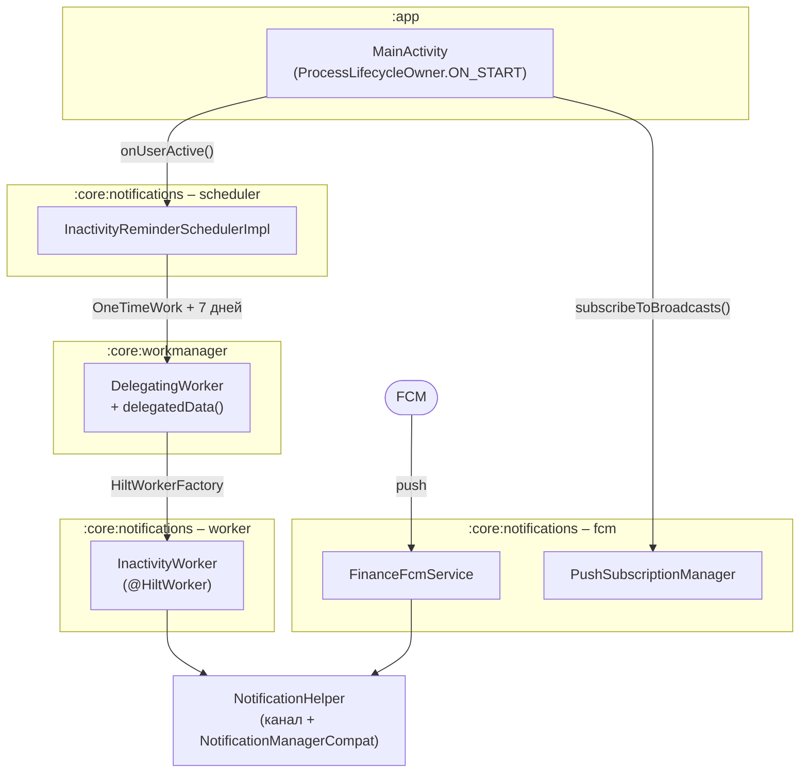

# Notifications

Этот документ описывает, как в **Finance Manager** устроены пользовательские уведомления:
локальное напоминание о неактивности, приём push-сообщений и модель адресации пушей.

## Goals

- Показывать пользователю уведомления из библиотечного модуля, не отдавая ему владение
  конфигурацией WorkManager и не размазывая работу с каналами по фичам.
- Напоминать о себе, если пользователь **давно не открывал приложение**, — и отсчитывать
  это от реальной активности, а не от технических стартов процесса.
- Принимать широковещательные пуши (Firebase Console и рассылки бэкенда).
- Не падать и не спамить, когда разрешения нет, уведомления выключены или Firebase
  не инициализирован.

## High-level overview

Уведомления живут в `:core:notifications` и опираются на:

- `:core:workmanager` — `DelegatingWorker`, позволяющий ставить в очередь `@HiltWorker`;
- `:app` — `MainActivity` как источник события «пользователь здесь» и место запроса
  runtime-разрешения.

Модуль намеренно не зависит ни от `core:data`, ни от фич: он ничего не знает о доменных
сущностях и только показывает то, что ему передали.



## Напоминание о неактивности

### Почему отсчёт идёт от `ON_START`, а не от старта процесса

Это главное проектное решение модуля, и оно неочевидно.

`Application.onCreate()` вызывается при **любом** старте процесса, а не только когда
пользователь открыл приложение. Процесс регулярно поднимает система: WorkManager ради
периодической синхронизации (по умолчанию раз в 4 часа, см.
[`synchronization.md`](./synchronization.md)), доставка пуша, broadcast.

Если взводить таймер в `App.onCreate()`, отсчёт сбрасывается чаще, чем истекает, и
напоминание **не может сработать никогда**. Поэтому источник события — `ON_START`
у `ProcessLifecycleOwner`, то есть выход приложения на передний план:

```kotlin
private val inactivityObserver = LifecycleEventObserver { _, event ->
    if (event == Lifecycle.Event.ON_START) {
        inactivityReminderScheduler.onUserActive()
    }
}
```

### Почему `OneTimeWork`, а не `PeriodicWork`

Нужная семантика — «напомнить через 7 дней после последнего визита», то есть
**перевзводимый таймер**. У периодической задачи период не сдвигается: она продолжает
тикать от момента постановки. К тому же `ExistingPeriodicWorkPolicy.REPLACE` признан
устаревшим.

```kotlin
val request = OneTimeWorkRequestBuilder<DelegatingWorker>()
    .setInitialDelay(INACTIVITY_THRESHOLD_DAYS, TimeUnit.DAYS)
    .setInputData(InactivityWorker::class.delegatedData())
    .build()

workManager.enqueueUniqueWork(
    InactivityWorker.WORK_NAME,
    ExistingWorkPolicy.REPLACE,
    request
)
```

`REPLACE` отменяет предыдущий отсчёт и начинает новый. Воркер себя **не перепланирует**:
за одну паузу пользователь получает одно напоминание, следующий отсчёт начнётся, когда он
снова откроет приложение.

## `DelegatingWorker` и `:core:workmanager`

`:app` не реализует `Configuration.Provider`, поэтому WorkManager инициализируется по
умолчанию и его фабрика умеет создавать только воркеры с конструктором
`(Context, WorkerParameters)`. `@HiltWorker` с внедрёнными зависимостями ей недоступен.

Обход (взят из [Now in Android](https://github.com/android/nowinandroid)): в очередь
ставится `DelegatingWorker`, а имя настоящего воркера едет в `inputData` и разрешается
через `HiltWorkerFactory`.

Раньше примитив лежал в `:sync` и был `internal`. Когда второму потребителю
(`:core:notifications`) понадобилось то же самое, он вынесен в `:core:workmanager`:
зависимость `core:* → :sync` означала бы, что базовая библиотека тянет прикладной сервис
вместе со всем его графом (`core:data`, Retrofit, Room, DataStore).

> **Альтернатива, не реализованная сознательно.** Если `:app` возьмёт на себя
> `Configuration.Provider` с `HiltWorkerFactory` и уберёт дефолтный
> `WorkManagerInitializer` из `androidx.startup`, посредник станет не нужен вовсе:
> `@HiltWorker` будут ставиться в очередь напрямую по классу. Это упростит и `:sync`, и
> `:core:notifications`, но затрагивает инициализацию приложения. Задача заведена в
> [`TODO.md`](../TODO.md).

## Push

### Модель адресации

| Способ | Кто шлёт | Нужен ли topic | Статус |
|---|---|---|---|
| Все пользователи из Firebase Console | Console (адресация по app ID) | нет | работает |
| Все пользователи с бэкенда | FCM HTTP v1 → `/topics/all` | **да** | работает |
| Конкретное устройство / пользователь | FCM HTTP v1 → `token` | нет, нужна база токенов | **не реализовано** |

Подписка на topic нужна именно для серверных рассылок: она позволяет слать всем одним
запросом и не хранить базу устройств. Токен при этом никуда не передаётся.

### Приём

`FinanceFcmService.onMessageReceived` читает и `notification`, и `data` payload:
для notification-сообщений система вызывает колбэк только когда приложение на переднем
плане (иначе уведомление рисует сам SDK), для data-сообщений — всегда.

Id уведомления выводится из `messageId`, чтобы разные пуши не затирали друг друга
в шторке. Пуш без текста игнорируется.

### Ленивое получение `FirebaseMessaging`

`FirebaseMessaging.getInstance()` требует поднятого `FirebaseApp`. Если внедрять его
напрямую, SDK дёргается уже при сборке Hilt-графа, и падает любой процесс без
инициализированного Firebase — включая Robolectric-тесты, которые поднимают граф целиком.
Поэтому в `PushSubscriptionManagerImpl` внедряется `Provider<FirebaseMessaging>`, а
подписка вызывается из `MainActivity`, где `FirebaseApp` гарантированно поднят своим
`ContentProvider`.

## Разрешения

`POST_NOTIFICATIONS` объявлено в манифесте `:core:notifications` и запрашивается в
`MainActivity` на Android 13+. Отказ — штатный сценарий: `NotificationHelper` молча
пропускает показ, вызывающему проверять ничего не нужно.

Проверка `checkSelfPermission` развёрнута прямо в `showNotification`, а не спрятана в
хелпер: lint-правило `MissingPermission` не отслеживает межпроцедурный поток. Случай
«разрешение есть, но уведомления выключены в системных настройках» закрывает
`areNotificationsEnabled()`.

## Что нужно для адресных пушей

Сценарий «отправить пуш конкретному пользователю» требует работы с обеих сторон.

### Бэкенд

1. **Хранилище токенов** — таблица `device_tokens`: `user_id`, `token` (unique),
   `platform`, `app_version`, `locale`, `timezone`, `created_at`, `last_seen_at`.
2. **Ручки** (авторизованные, под текущим `AuthInterceptor`):
    - `POST /api/v1/devices` — upsert токена с привязкой к текущему пользователю;
    - `DELETE /api/v1/devices/{token}` — при логауте.
3. **Отправка** — service-account credentials, `POST
   https://fcm.googleapis.com/v1/projects/{id}/messages:send` с таргетом `token`.
4. **Гигиена токенов.** На ответы `UNREGISTERED` и `INVALID_ARGUMENT` токен нужно удалять
   из базы, иначе она зарастает мёртвыми записями. `SENDER_ID_MISMATCH` — признак чужого
   токена.
5. **Несколько устройств на пользователя** — слать во все его токены.
6. **Переезд токена между пользователями.** Если на устройстве разлогинился А и зашёл Б,
   старая привязка обязана исчезнуть, иначе Б получит пуши, адресованные А. Это утечка
   персональных данных и самый лёгкий пункт для того, чтобы его проглядеть.
7. Ретраи с экспоненциальным backoff на `5xx` и `429`.

### Мобильное приложение

1. `FinanceFcmService.onNewToken` — не прямой сетевой вызов, а постановка задачи
   в WorkManager: сети в этот момент может не быть, а токен терять нельзя.
2. Регистрация также при старте и после логина — сервер мог потерять запись, тогда как
   токен не ротировался.
3. Логаут: на `AuthEvent.OnLogout` (см. [`auth.md`](./auth.md)) дёрнуть
   `DELETE /devices` и `FirebaseMessaging.deleteToken()`.
4. Локально хранить пару «последний отправленный токен + user id», чтобы не обращаться
   к серверу на каждый запуск.
5. Слой данных по конвенции проекта: `DeviceApiService` и DTO в `core:data`, репозиторий
   с `DomainResult` (см. [`domain-result.md`](./domain-result.md)),
   `RegisterPushTokenUseCase` в `core:domain`. `:core:notifications` зависит от
   `core:domain`, но не от `core:data`.
6. Если адресные пуши будут вести на конкретный экран — вернуть в `NotificationMessage`
   поле `deepLink` (сейчас его нет как неиспользуемого) и смапить на `NavKey`
   (см. [`navigation3.md`](./navigation3.md)).

## Ключевые файлы

| Файл | Роль |
|---|---|
| `core/notifications/.../NotificationHelperImpl.kt` | Канал, проверка разрешения, показ уведомления |
| `core/notifications/.../model/NotificationMessage.kt` | Модель уведомления и реестр `NotificationIds` |
| `core/notifications/.../scheduler/InactivityReminderSchedulerImpl.kt` | Перевзвод таймера неактивности |
| `core/notifications/.../worker/InactivityWorker.kt` | `@HiltWorker`, показывающий напоминание |
| `core/notifications/.../fcm/FinanceFcmService.kt` | Приём пушей, реакция на ротацию токена |
| `core/notifications/.../fcm/PushSubscriptionManager.kt` | Подписка на topic рассылок |
| `core/workmanager/.../DelegatingWorker.kt` | Постановка `@HiltWorker` в очередь |
| `app/.../presenter/MainActivity.kt` | `ON_START` → `onUserActive()`, запрос разрешения |

## Summary

- Неактивность отсчитывается от `ProcessLifecycleOwner.ON_START`, а не от старта процесса —
  иначе фоновые запуски сбрасывали бы таймер быстрее, чем он истекает.
- Таймер — одноразовая задача с `REPLACE`, потому что нужен сдвигаемый дедлайн,
  а не периодичность.
- `DelegatingWorker` вынесен в `:core:workmanager`, потому что потребителей стало два;
  от самого паттерна можно избавиться, если `:app` возьмёт конфигурацию WorkManager себе.
- Пуши широковещательные. Адресная доставка требует хранения токенов на бэкенде и
  аккуратной работы с их жизненным циклом.
