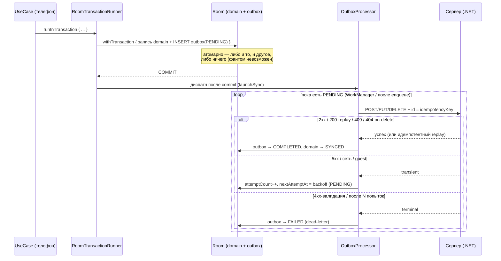

# План: Transactional Outbox + идемпотентность

Живой план работ по приведению синхронизации к «банковской» модели: **клиентский
Transactional Outbox** (события со статусами + ретрай) ⇄ **идемпотентный сервер** (дедуп
повторов). Документ — источник истины по задаче; отмечай сделанное галочками.

Связанные доки: [Synchronization](./synchronization.md), [Post-commit sync](./post-commit-sync.md)
(уже сделанный шаг 1 этой дороги), [Bd](./bd.md).

## Зачем

Синк — это **dual-write**: телефон атомарно должен и записать в Room, и отправить изменение
на сервер, но общей транзакции на две системы нет. Отсюда два класса сбоев:

- запись прошла, отправка не успела → данные есть локально, но не на сервере;
- отправка ушла, локальная транзакция откатилась → на сервере **фантом**.

Плюс ненадёжная сеть даёт **потерю ACK**: сервер создал транзакцию и списал баланс, но ответ
не дошёл → клиент повторяет `POST` → **дубль транзакции + двойной баланс** (бэкенд считает
баланс дельтой `+=/-=`). Это живой денежный баг, а не гипотеза.

Принцип решения — две половины одного механизма:

- **клиентский Outbox** гарантирует доставку *at-least-once* (событие лежит в БД, пока не
  отправлено; не теряется и не выдумывается);
- **серверная идемпотентность** превращает «хотя бы раз» в *ровно один эффект* (повтор с тем
  же ключом отбивается / реиграется).

## Целевой поток

Асимметрия: в нашей топологии dual-write делает именно телефон, поэтому **вся тяжесть outbox —
на клиенте**, а на сервере нужен лишь его сиблинг (дедуп). Полноценный серверный outbox
понадобится, только когда сервер начнёт эмитить события наружу (см. Сервер §2).

---

## СЕРВЕР (.NET, `FinanceManagerBackend.API`)

### 1. Идемпотентность
- [ ] **CREATE идемпотентен по client-id.** `TransactionController.CreateAsync` (+ Account/
  Category/Tag): если сущность с этим `Id` уже есть → вернуть её (200 OK) **до** и **без**
  `UpdateAccountAmountAsync`. Сохранить инвариант «баланс применяется ровно один раз».
- [ ] **Атомарный дедуп под конкурентность.** Не полагаться только на pre-check `AnyAsync`
  в `EntityRepository.CreateAsync` (race check-then-insert): ловить PK/unique-violation
  (`DbUpdateException`) на `SaveChangesAsync` → тот же идемпотентный ответ.
- [ ] **Правильный код на дубль.** Убрать `EntityExistsException` из общего
  `GlobalExceptionHandler` (сейчас всё → 500): 200-replay в контроллере либо отдельный handler
  → 409. Главное — **не 5xx**.
- [ ] **DELETE идемпотентен.** Удаление отсутствующего → 204/200, не `NotFound()`.
- [ ] **UPDATE — закрепить тестом.** `ReplaceAccountAmountAsync` (откат+применение) на повторе
  даёт нетто-ноль; менять не нужно, покрыть тестом.
- [ ] **Сквозной id.** Проверить маппинг Mapster `BaseCreateRequest.Id → Transaction.Id`;
  server-managed `CreatedAt/UpdatedAt` при replay не затираются.

### 2. Outbox
Полноценный transactional outbox на сервере **сейчас не нужен** — бэкенд пишет только в свою БД
и не публикует события наружу. Его сиблинг для идемпотентности — таблица-дедуп.
- [ ] **(Опц., «учебниковый» вариант) Idempotency-key store.** Таблица `idempotency_keys`
  (key, endpoint, отпечаток запроса, снимок ответа, status, createdAt/expiresAt) + middleware,
  отдающая сохранённый ответ на повтор ключа. Для текущего CRUD дедупа по PK достаточно;
  станет **обязательным** для операций **без resource-id** — например будущих **переводов**
  между счетами (сага на два аккаунта).
- [ ] **(Будущее) Настоящий transactional outbox** — когда сервер начнёт надёжно эмитить
  события наружу (push на другие устройства, шина, вебхуки, аналитика): domain-изменение +
  строка `outbox` в одной транзакции, relay (polling или CDC/Debezium) публикует. Пока — вне
  скоупа.

### 3. Другие фиксы
- [ ] **Таксономия ошибок.** `GlobalExceptionHandler` кладёт всё в 500 с `exception.Message` в
  `Detail` — аудит: бизнес-ошибки → корректные 4xx (валидация уже 400), внутренние сообщения не
  утекают. Зафиксировать контракт retryable (5xx) vs terminal (4xx).
- [ ] **(Опц.) Оптимистичная блокировка на UPDATE** (`rowversion` / `If-Match`) — сейчас LWW по
  `UpdatedAt`, правка с двух устройств тихо перезаписывается.
- [ ] Swagger/док новой семантики; миграция, если добавили `idempotency_keys`.

---

## МОБИЛКА (Android, `Finance-Manager`)

### 1. Идемпотентность
- [x] **Слать стабильный id на CREATE.** `TransactionEntity.toDto` и account-create отправляют
  `id = localId` (не `serverId`); после успеха `serverId := localId` (наступает само в
  `syncCreate.onSuccess`, т.к. ответный DTO несёт `id == localId`). Ключ = `localId`, генерится
  один раз и переживает перезапуск. ✅ *(итерация 1 — только мапперы, без схемы/версии БД)*
- [x] **Никогда не регенерить ключ на попытку** — на каждый ретрай тот же id (`localId` живёт в
  Room и переживает перезапуск). ✅ *(итерация 1)*
- [x] **Трактовать идемпотентные ответы как успех.** Реализовано client-only (бэкенд не трогаем):
  вместо разбора кода дубля — **read-back** `GET /{localId}` после неуспешного create (`GET`
  нашёл → `SYNCED`, не нашёл → остаётся `PENDING_CREATE`); `404-on-delete` → успех. Хелперы
  `isNotFound()` / `isNetworkBlocked()`. ✅ *(итерация 2 — см. [idempotency.md](./idempotency.md))*
- [x] **Pull распознаёт собственные неподтверждённые записи.** Найдено при сквозной перепроверке
  §1: pull искал локальную запись только по `serverId`, а у `PENDING_CREATE` он `null` → после
  потери ACK вставлялся **локальный дубликат** с новым `localId` (баг подтверждён тестом до фикса).
  Запрос `getBySyncIds` сопоставляет по `serverId` **или** по `localId` при `serverId IS NULL`.
  ✅ *(итерация 4 — см. [idempotency.md](./idempotency.md) §4)*
- [x] **Проверить `RetryInterceptor`** — со стабильным id транспортный ретрай 5xx безопасен;
  4xx он ретраить не должен. ✅ *(итерация 3: оба инварианта уже выполнялись — правок в проде не
  потребовалось; добавлены регрессионные тесты «тот же body на каждой попытке» и «терминальные 4xx
  не ретраятся», раздел «Два уровня ретрая» в [idempotency.md](./idempotency.md))*

### 2. Outbox
- [x] **Таблица `OutboxEntryEntity`** (`core:database`): `sequenceNo` (PK, autoGenerate — FIFO),
  `entityType`, `entityLocalId`, `operation`, `payload`, `idempotencyKey`, `status`,
  `attemptCount`, `nextAttemptAt`, `lastError`, `createdAt/updatedAt` (epoch millis) + `OutboxDao`
  (`getReadyToSend` с учётом backoff, `markInProgress` (CAS от двойной отправки), `markCompleted`,
  `scheduleRetry`, `markFailed`, `observeFailed`, `deleteCompleted`/`deleteAll`).
  Решение по payload: **снимок запроса** (канонический outbox, event-log), не re-read.
  Очередь чистится при логауте (`DatabaseCleanupManager`). ✅ *(итерация 5)*
- [x] **Bump версии БД** — было **4**, стало **5** (в плане ошибочно значилось «2 → 3»; строго
  > user_version ассета = 1; pre-release destructive — реальная миграция не нужна). ✅
- [x] **Enqueue в той же Room-транзакции**, что и domain-запись — через `RoomTransactionRunner`.
  `OutboxEnqueuer` (`core:data`) сериализует тело через Gson и пишет строку очереди; атомарность
  «данные + намерение отправить» закреплена тестами на реальном Room (commit → обе записи,
  rollback / `rollbackOnError` → ни одной). Добавлен `targetServerId` (адрес для `PUT`/`DELETE`),
  версия БД **5 → 6**. ✅ *(итерация 6)*
   Вызовы из репозиториев подключаются вместе с `OutboxProcessor` — чтобы не было промежуточного
  состояния, где записи копятся необработанными. Диспатч после commit (`launchSync`) — там же.
- [x] **`OutboxProcessor`** — движок очереди: drain по `sequenceNo`, атомарный захват записи
  (защита от двойной отправки), классификация исхода → COMPLETED / retry-with-backoff / FAILED.
  `OutboxRetryPolicy` — экспоненциальный backoff с equal jitter (30 c … 1 ч), dead-letter после
  8 попыток. Отдельный исход `Blocked` (гость / нет сессии) возвращает запись в очередь **без
  списания попытки**. Прогон **останавливается на первой временной неудаче** — операции связаны
  (счёт → его транзакции, создание → правка), обгонять нельзя; терминальные очередь не блокируют.
  ✅ *(итерация 7 — движок; отправка вынесена за интерфейс `OutboxSender`)*
- [x] **Реализации `OutboxSender`** для транзакций и счетов: разобрать снимок → эндпоинт по
  (entityType, operation) → применить ответ локально (`serverId`, `SYNCED` / удаление строки).
  `RoutingOutboxSender` выбирает отправитель по типу. Классификация ответа — по HTTP-коду
  (`OutboxCallOutcome`): `404` на delete → идемпотентный успех, `401` → `Blocked`, `5xx`/сеть →
  `Transient`, прочие `4xx` → `Terminal`. Read-back после неуспешного create перенесён из §1;
  архивная семантика удаления счёта сохранена. ✅ *(итерация 8)*
- [x] **Драйвер ретраев** — WorkManager (`:sync`) по расписанию + оппортунистический прогон
  после enqueue; уважать `nextAttemptAt`. `SyncWorker → syncAll → process()`, при неуспехе
  `Result.retry()`; оппортунистический прогон планирует сам `OutboxEnqueuer`. ✅ *(итерация 10–11)*
- [x] **Dead-letter surfacing** — FAILED → `ErrorLogger` (в `OutboxProcessor.giveUp`, без сумм в
  сообщении) + доменный контракт `OutboxRepository` (`observeFailedCount` / `retryFailed`) и
  use case'ы `ObserveUnsentOperationsUseCase` / `RetryUnsentOperationsUseCase`. Ручной повтор
  сбрасывает `attemptCount`/`nextAttemptAt`/`lastError` и сразу запускает прогон.
  ✅ *(итерация 11; сам индикатор в UI — отдельным шагом)*
- [x] **Ретир** per-manager `pushLocalChanges` (Account/Transaction/Category SyncManager); pull
  остаётся. Репозитории пишут в очередь внутри `runInTransaction`; `syncCreate/syncUpdate/syncDelete`
  удалены из интерфейсов менеджеров; `SyncCoordinator` разбирает очередь после pull — **всегда**,
  даже если pull не удался. ✅ *(итерация 10)*
- [ ] **(Опц.) Коалесинг** — CREATE+DELETE до синка → отменить оба; CREATE→UPDATE → смёрджить.
  v1 можно пропустить.
- [ ] **Тесты** (Robolectric + in-memory Room, как `RoomTransactionRunnerTest`): атомарность
  enqueue (rollback дропает outbox), переходы статусов, backoff/dead-letter, порядок,
  replay/404-as-success, poison→FAILED.

### 3. Другие фиксы
- [ ] **Pull-vs-push.** Pull не должен затирать domain-строку с незавершённой outbox-записью и
  сбрасывать её статус в `SYNCED` (потеря локальной правки). Либо push-before-pull, либо проверка
  outbox перед перезаписью.
- [ ] **Убрать тихий skip.** `transaction.syncCreate` при `accountServerId == null` — no-op.
  С `serverId := localId` id родителя известен на enqueue → отвязаться от `accountServerId`
  (снять TODO на `TransactionEntity`).
- [ ] **SyncCoordinator short-circuit.** `Category && Account && Transaction` — падение категории
  блокирует push аккаунтов и транзакций. Сделать шаги независимыми (порядок зависимостей
  сохранить, всё из-за одного не отменять).
- [ ] **(Опц., масштаб/позже)** delta-pull по `lastSyncTime`-курсору, N+1 в pull транзакций,
  батч-push. Корректность не блокируют.
- [ ] **Доки/качество.** Обновить этот план и `synchronization.md`, `post-commit-sync.md`,
  `bd.md`, README модулей; KDoc на новые классы; `@Preview` для UI-индикатора; полная верификация
  затронутых модулей.

---

## Порядок исполнения

1. **Phase 1 — денежный риск, дёшево:** Сервер §1 (200-replay + idempotent delete) + Мобилка §1
   (id на create, трактовка ответов). Устраняет дубли/двойной баланс **без** таблицы.
2. **Phase 2 — полный outbox:** Мобилка §2 целиком + ретир `pushLocalChanges`.
3. **Phase 3 — добивка:** Мобилка §3 (pull-vs-push, skip, coordinator) + Сервер §3; опц.
   серверный idempotency-key store под будущие переводы.

## Ключевые файлы

| Файл | Роль в задаче |
|---|---|
| `core/data/.../mapper/TransactionDataMapper.kt` | `toDto` — сюда добавить `id = localId` (клиентский ключ) |
| `core/data/.../mapper/AccountDataMapper.kt` | account-create — тоже слать id |
| `core/data/.../RoomTransactionRunner.kt` | атомарный enqueue outbox + диспатч после commit |
| `core/data/.../sync/impl/*SyncManagerImpl.kt` | ретир `pushLocalChanges`, источник логики для `OutboxProcessor` |
| `core/database/.../entity/OutboxEntryEntity.kt` | **новая** таблица событий (создать) |
| `core/database/.../FinanceManagerDatabase` | bump версии, регистрация entity + DAO |
| `sync/.../worker/SyncCoordinatorImpl.kt` | short-circuit фикс, запуск `OutboxProcessor` |
| `FinanceManagerBackend.API/Controllers/TransactionController.cs` | идемпотентный CREATE/DELETE |
| `FinanceManagerBackend.API/Infrastructure/EntityRepository.cs` | атомарный дедуп по PK |
| `FinanceManagerBackend.API/HttpPipelines/ExceptionHandlers/GlobalExceptionHandler.cs` | коды ответа на дубль (409/replay, не 500) |

## Теория (для погружения)

Идемпотентность:
- Stripe API — Idempotent requests: https://docs.stripe.com/api/idempotent_requests
- Stripe blog — Designing robust and predictable APIs with idempotency: https://stripe.com/blog/idempotency
- Brandur Leach — Implementing Stripe-like Idempotency Keys in Postgres: https://brandur.org/idempotency-keys
- MDN — Idempotent: https://developer.mozilla.org/en-US/docs/Glossary/Idempotent

Outbox:
- microservices.io — Transactional outbox: https://microservices.io/patterns/data/transactional-outbox.html
- Debezium — Reliable Microservices Data Exchange With the Outbox Pattern: https://debezium.io/blog/2019/02/19/reliable-microservices-data-exchange-with-the-outbox-pattern/
- MassTransit — Transactional Outbox (.NET): https://masstransit.io/documentation/patterns/transactional-outbox
- Android — Offline-first: https://developer.android.com/topic/architecture/data-layer/offline-first
