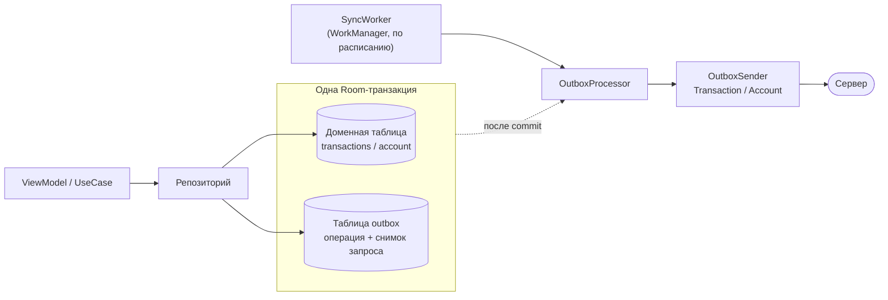
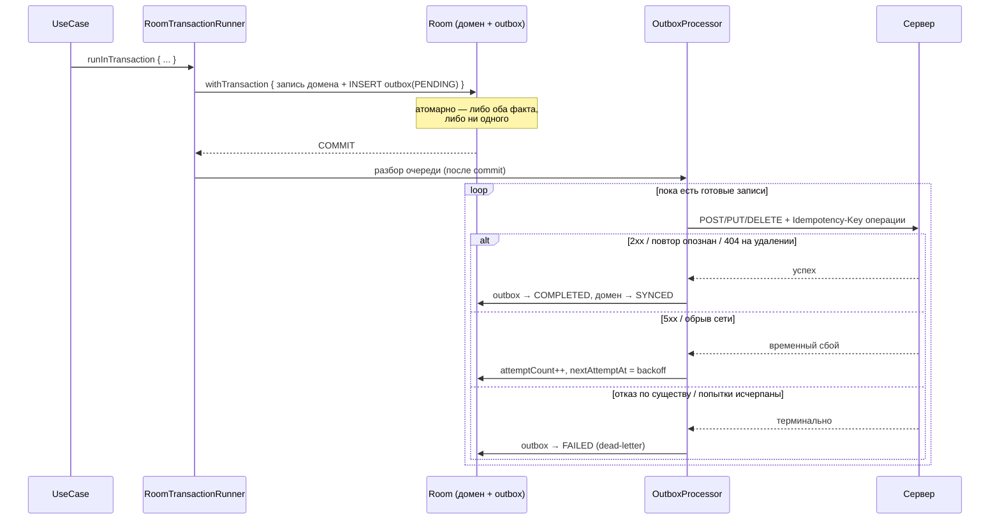
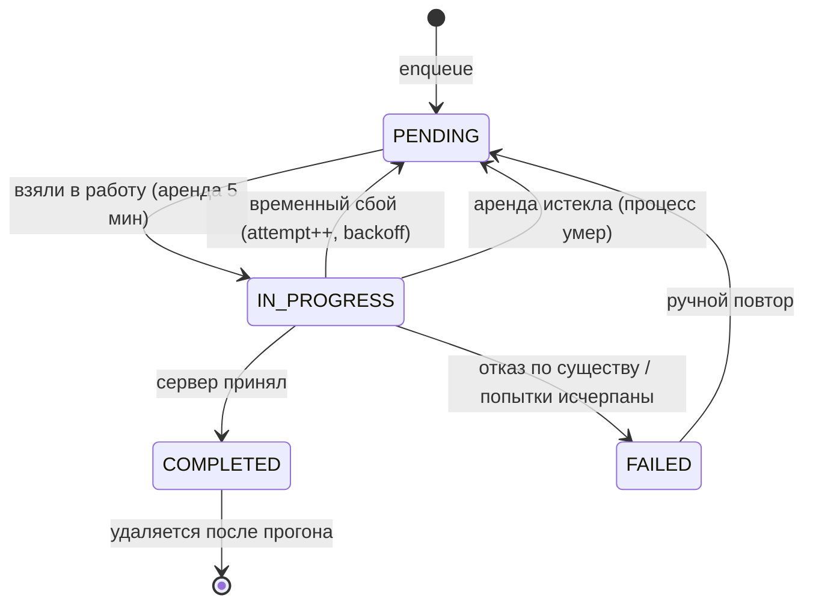

# Outbox — очередь исходящих операций

Как локальное изменение доезжает до сервера: что кладётся в очередь, кто её разбирает, что
происходит при сбоях и почему повтор безопасен.

Смежные документы: [Idempotency](./idempotency.md) (почему повтор не создаёт дублей),
[Post-commit sync](./post-commit-sync.md) (механизм отложенного запуска),
[Synchronization](./synchronization.md) (обратное направление — pull с сервера).

## Зачем это нужно

Приложение offline-first: запись всегда идёт в Room, а сервер узнаёт о ней потом. Значит на
каждое изменение нужно сделать **две** вещи в разных системах — записать в базу и отправить на
сервер, — но общей транзакции на них нет. Эта ситуация называется **dual-write**, и она ломается
двумя способами:

- записали в базу, но отправить не успели (приложение закрыли, сеть пропала) — **изменение
  осталось только на устройстве**;
- отправили на сервер, а локальная транзакция откатилась — на сервере появился **фантом**,
  которого нет локально.

Плюс отдельный случай: запрос дошёл, сервер его применил, а **ответ не вернулся**. Клиент считает,
что не получилось, и повторяет — так рождается дубль.

Идея outbox: **убрать ненадёжную сеть из момента записи**. Операция не отправляется сразу — она
*ставится в очередь в той же базе и той же транзакции*, что и сами данные. Дальше очередь
разбирает отдельный процесс, у которого есть право ошибаться и повторять.

## Как это устроено у нас



Ключевых участников пять.

| Компонент | Роль |
|---|---|
| [`OutboxEntryEntity`](../core/database/src/main/java/soft/divan/financemanager/core/database/entity/OutboxEntryEntity.kt) | строка очереди: что за операция, снимок тела запроса, статус, попытки |
| [`OutboxEnqueuer`](../core/data/src/main/java/soft/divan/financemanager/core/data/outbox/OutboxEnqueuer.kt) | кладёт операцию в очередь **внутри транзакции** доменной записи |
| [`OutboxProcessor`](../core/data/src/main/java/soft/divan/financemanager/core/data/outbox/OutboxProcessor.kt) | механика: порядок, захват, повторы, dead-letter |
| [`OutboxSender`](../core/data/src/main/java/soft/divan/financemanager/core/data/outbox/OutboxSender.kt) | знает про эндпоинты: разбирает снимок, ходит в сеть, применяет ответ локально |
| [`OutboxDao`](../core/database/src/main/java/soft/divan/financemanager/core/database/dao/OutboxDao.kt) | запросы очереди (выборка готовых, переходы статусов) |

### Что лежит в записи очереди

Главное решение: очередь хранит **снимок запроса** (`payload` — готовый JSON), а не ссылку на
доменную строку. Операция — это факт из прошлого, и последующие правки сущности не должны менять
то, что мы уже решили отправить.

Кроме тела, в строке есть `targetServerId` — адрес ресурса для `PUT`/`DELETE`. Он хранится, а не
вычисляется при отправке, чтобы операцию можно было выполнить, даже если доменной строки локально
уже нет.

Три идентификатора в записи легко перепутать, поэтому явно:

| Поле | Адресует | Пример значения |
|---|---|---|
| `entityLocalId` | **сущность** — какую строку меняем | `localId` транзакции |
| `dependencyKey` | **группу порядка** — за кем стоим в очереди | `localId` счёта этой транзакции |
| `idempotencyKey` | **операцию** — какое именно изменение | новый UUID на каждую постановку |

### Постановка в очередь

Репозиторий делает обе записи одной транзакцией:

```kotlin
transactionRunner.runInTransaction {
    safeDbCall(errorLogger) {
        localDataSource.insert(transactionEntity)      // данные
        outboxEnqueuer.enqueue(                        // намерение их отправить
            entityType = OutboxEntityType.TRANSACTION,
            entityLocalId = transactionEntity.localId,
            operation = OutboxOperation.CREATE,
            body = transactionEntity.toDto(...)
        )
        Unit
    }
}
```

Отсюда следует главная гарантия: **фантом невозможен**. Откатилась транзакция — исчезли оба
факта, и отправлять становится нечего.

`enqueue` заодно планирует разбор очереди — через `launchSync`, то есть **после commit**
(см. [post-commit-sync.md](./post-commit-sync.md)). Так «положили операцию» и «попробовали
отправить» нельзя рассинхронизировать, забыв второе.

### Подтверждение — тоже одной транзакцией

Успешная отправка меняет **два** факта: доменную строку (появился `serverId`, снят
pending-статус) и запись очереди (операция закрыта). Их тоже нельзя разносить: смерть процесса
между двумя записями оставит подтверждённую строку с незакрытой операцией, и та уедет на сервер
повторно, когда истечёт аренда. Потери данных нет — идемпотентность делает повтор безвредным, —
но это лишний round-trip и разъезжающиеся состояния.

Сложность в том, что между сетевым вызовом и записью в базу транзакцию держать нельзя: сеть
внутри транзакции — это заблокированная база на время таймаута. Поэтому обязанности разделены:

| Кто | Что делает |
|---|---|
| `OutboxSender` | ходит в сеть и **описывает** нужную локальную запись — [`OutboxLocalEffect`](../core/data/src/main/java/soft/divan/financemanager/core/data/outbox/OutboxLocalEffect.kt) |
| `OutboxProcessor` | применяет описание **и** закрывает запись очереди — одной транзакцией |

```kotlin
// OutboxProcessor: сеть уже позади, обе записи атомарны
transactionRunner.runInTransaction {
    result.localEffect?.apply()
    localDataSource.markCompleted(entry.sequenceNo, clock.millis())
}
```

Чтение состояния, от которого зависит запись, тоже отложено внутрь эффекта — чтобы решение
принималось по данным на момент транзакции, а не на момент ответа сервера.

### Адресация ещё не подтверждённых записей

Пока создание не подтверждено, `serverId` у записи `null`. Но сервер уже знает её под клиентским
`localId` — именно с ним ушёл `POST`. Поэтому правку и удаление можно адресовать сразу:

```kotlin
private fun TransactionEntity.syncId(): String = serverId ?: localId
```

Строгий порядок очереди гарантирует, что создание уедет раньше правок. Без этого приёма пришлось
бы слать второй `CREATE`, а сервер отбросил бы его как дубль — и правка потерялась бы.

### Полный путь одной операции



## Жизненный цикл записи



### Аренда вместо пометки навсегда

`IN_PROGRESS` — это **аренда на 5 минут**, а не конечное состояние. Если процесс умрёт во время
сетевого вызова (Android рутинно убивает фон, WorkManager снимает работу по таймауту), запись
осталась бы в работе навсегда: её не подобрал бы ни один запрос, она не попала бы ни в счётчик,
ни в лог — то есть **пропала бы молча**, хуже чем dead-letter.

Поэтому выборка берёт и `PENDING`, и `IN_PROGRESS` с истёкшей арендой, а захват может перехватить
только брошенную запись — живую увести нельзя, и это защищает от двойной отправки.

Возврат по аренде намеренно **не тратит попытку**: убийство фонового процесса — рядовое событие,
и списывать за него попытки значило бы отправлять исправные операции в dead-letter.

### Классификация ответа

Исход отправки определяется по HTTP-коду — доменные ошибки для этого слишком грубы, они
схлопывают «сервер прилёг» и «сервер отверг данные» в одно.

| Ответ | Исход | Что делаем |
|---|---|---|
| `2xx` | `Success` | запись выполнена |
| `404` на удалении | `Success` | ресурса уже нет — цель достигнута |
| `401` | `Blocked` | сессия истекла: возвращаем в очередь, **попытку не тратим** |
| `5xx`, обрыв сети | `Transient` | повтор с возрастающей паузой |
| прочие `4xx` | `Terminal` | повтор не поможет → dead-letter |

Отдельно: неуспешный `CREATE` перепроверяется чтением (`GET` по клиентскому id). Сервер мог
применить запрос и не доставить ответ — тогда запись уже там, и операция считается выполненной.

### Порядок: группы зависимости вместо глобальной очереди

Операции связаны не все со всеми, а **парами**: счёт должен появиться на сервере раньше своих
транзакций, создание — раньше правки той же сущности. Отправить операцию поверх неуехавшей
предыдущей значит обратиться к несуществующему ресурсу. А вот две правки разных счетов друг о
друге ничего не знают.

Поэтому у каждой записи есть `dependencyKey` — **группа обязательного порядка**:

| Сущность | `dependencyKey` | Смысл |
|---|---|---|
| Счёт | собственный `localId` | счёт возглавляет свою группу |
| Транзакция | `localId` её счёта | транзакция не уедет раньше своего счёта |

Внутри группы — строгий FIFO, между группами — независимость. Порядок держат два механизма:

1. **Барьер в выборке** (`getReadyToSend`): подзапрос `NOT EXISTS` отсекает запись, перед которой
   в её группе стоит любая незакрытая операция. Одного `ORDER BY sequenceNo` не хватало —
   запись, ушедшая в backoff или удерживающая аренду, из выборки выпадала, и следующая операция
   той же сущности её обгоняла.
2. **Пропуск застрявшей группы в прогоне**: если операция вернула временную ошибку, процессор
   помечает её группу застрявшей и пропускает остальные её операции — но продолжает с другими
   группами.

Это то, о чём говорил ревьюер: сбой одной операции больше не держит независимые.

**Исключения из правила «не блокировать»:**

- **Терминальная ошибка** очередь не блокирует: запись уходит в `FAILED` и в выборку не попадает.
  Вместе с ней в dead-letter уводятся **зависящие от неё** операции той же группы — без
  предшественника они всё равно обречены (`404` на правку, `400` на транзакцию без счёта).
  Это один SQL-запрос, поэтому окна между отказом головы и отменой зависимых не существует.
- **Заблокированная сеть** (гость, нет сессии) останавливает прогон **целиком**: это состояние
  клиента, а не сервера, и другие группы упрутся в ту же стену.

#### Что это чинит

| Сценарий | Было | Стало |
|---|---|---|
| Создание в backoff, следом правка | `PUT` по несуществующему id → `404` → dead-letter, правка потеряна | правка ждёт создания |
| Создание под арендой, следом удаление | `DELETE` → `404` = «успех», строка удалена локально, создание позже оставляет фантом на сервере | удаление ждёт создания |
| Сбой одной операции, две независимые готовы | прогон вставал целиком | независимые уезжают |

### Повторы и dead-letter

Пауза растёт экспоненциально с «equal jitter» (`OutboxRetryPolicy`): без размытия все устройства
повторяли бы синхронно и добивали бы сервер пачкой. После `MAX_ATTEMPTS` неудач запись уходит в
`FAILED`.

Бесконечные повторы недопустимы: «отравленная» запись жгла бы батарею и держала бы очередь, а
пользователь так и не узнал бы о проблеме. Попадание в `FAILED` пишется в `ErrorLogger` (без сумм
в сообщении) и видно через `OutboxRepository.observeFailedCount()`; вернуть записи в строй можно
через `retryFailed()`.

## Как очередь уживается с чтением с сервера

Синхронизация двусторонняя, и pull может прийти в момент, когда у записи ещё висит неотправленная
операция. Серверная версия про эту операцию заведомо не знает, поэтому принимать её поверх нельзя:

```kotlin
private fun TransactionEntity.canBeOverwritten(serverUpdatedAt: String): Boolean =
    syncStatus == SyncStatus.SYNCED && TimeMapper.isAfter(serverUpdatedAt, updatedAt)
```

К обычному last-write-wins добавлено условие «строка не ждёт отправки». Проверять очередь
отдельным запросом не нужно: `syncStatus` меняется с ней в лок-степ — репозиторий ставит
`PENDING_*` ровно когда кладёт операцию, отправитель ставит `SYNCED` ровно когда она выполнена.

Без этого условия ломался бы не сам обмен данными (очередь хранит снимок и всё равно доотправит
его), а то, что видит пользователь:

- правка **откатилась бы на экране** до серверной версии и вернулась лишь после отправки;
- запись в `PENDING_DELETE` стала бы `SYNCED` и **вернулась бы в списки** — они скрывают именно
  ожидающие удаления.

Дождаться отправки безопасно: после неё запись становится `SYNCED`, и ближайший pull разрешит
конфликт уже честно.

## Что запускает разбор очереди

1. **После каждой записи** — `OutboxEnqueuer` планирует прогон, срабатывающий после commit.
2. **По расписанию** — `SyncWorker` → `SyncCoordinator` → `process()`. Очередь разбирается
   **после** pull и **всегда**, даже если pull не удался: локальные изменения не должны ждать
   отправки из-за проблем с чтением.
3. **Вручную** — `retryFailed()` возвращает записи из dead-letter и сразу запускает прогон.

### Один прогон — несколько проходов

Выборка берётся один раз на проход, а барьер не выдаёт операцию, пока в её группе есть незакрытая
предыдущая. Значит успешная отправка **разблокирует** следующую операцию группы — но в уже
выбранный батч та не попала.

Поэтому прогон повторяет проход, пока предыдущий что-то закрыл. Иначе получалось бы обидное:
пользователь создал транзакцию и тут же её поправил, создание уехало сразу, а правка ждала бы
ближайшего фонового синка.

Две страховки от зацикливания:

- запись, о судьбе которой в этом прогоне уже решили, повторно не берётся — даже если выборка
  вернула её снова;
- число проходов ограничено (`MAX_PASSES`); остальное подберёт следующий прогон.

## Границы и гарантии

Что гарантируется:

- операция, которой нет в локальной базе, никогда не уйдёт на сервер;
- операция, попавшая в очередь, не потеряется — ни при закрытии приложения, ни при убийстве
  процесса во время отправки;
- доставка «хотя бы раз», а единственность эффекта обеспечивает идемпотентность
  ([idempotency.md](./idempotency.md)).

Что важно знать:

- **дубли операций не схлопываются.** Создать → дважды поправить → удалить даст четыре запроса
  вместо нуля. Это корректно, но расточительно; коалесинг сознательно не делали — для личных
  финансов объёмы малы, а схлопывание конфликтует с идеей неизменяемого снимка.
- **категории в очередь не попадают** — они приходят с сервера только на чтение.
- **очередь чистится при выходе из аккаунта** (`DatabaseCleanupManager`): отправлять операции
  прежнего пользователя под новой сессией нельзя.

## Ключевые файлы

| Файл | Роль |
|---|---|
| `core/database/.../entity/OutboxEntryEntity.kt` | строка очереди |
| `core/database/.../model/OutboxStatus.kt` | жизненный цикл записи |
| `core/database/.../dao/OutboxDao.kt` | выборка готовых (с учётом backoff и аренды), переходы статусов |
| `core/data/.../outbox/OutboxEnqueuer.kt` | постановка в очередь + планирование прогона |
| `core/data/.../outbox/OutboxProcessor.kt` | порядок, захват, повторы, dead-letter, атомарное подтверждение |
| `core/data/.../outbox/impl/TransactionOutboxSender.kt`, `AccountOutboxSender.kt` | отправка и описание локальной записи |
| `core/data/.../outbox/OutboxLocalEffect.kt` | описание локальной записи, применяемое в транзакции |
| `core/data/.../outbox/OutboxCallOutcome.kt` | классификация HTTP-ответа |
| `core/data/.../outbox/OutboxRetryPolicy.kt` | backoff и предел попыток |
| `core/data/.../repository/OutboxRepositoryImpl.kt` | счётчик застрявших + ручной повтор |
| `sync/.../worker/SyncCoordinatorImpl.kt` | запуск разбора очереди после pull |
