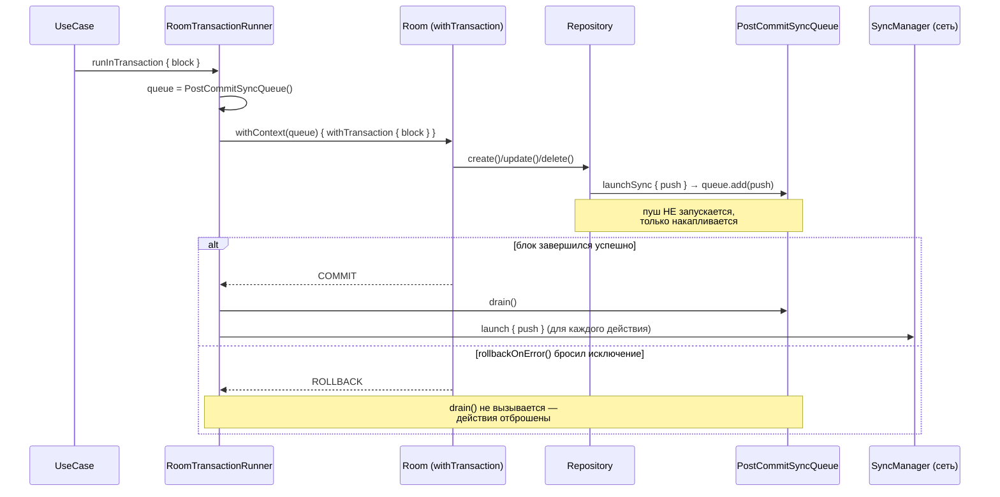

# Post-commit sync — отложенный запуск синхронизации до commit транзакции

Этот документ описывает механизм, который гарантирует, что fire-and-forget сетевые пуши,
инициированные внутри локальной БД-транзакции, уходят на сервер **только после успешного
commit** — и отбрасываются при rollback.

## Проблема

Репозитории (`core:data`) при каждой записи запускают фоновый пуш на сервер
(offline-first: локальная запись мгновенная, синк — в фоне). Одновременно составные
операции — «создать транзакцию + обновить баланс счёта» — выполняются атомарно внутри
Room-транзакции (`TransactionRunner.runInTransaction` + `rollbackOnError()`).

Эти два механизма конфликтовали: пуш запускался **немедленно**, ещё до commit.
Если следующий шаг блока откатывал транзакцию:

- локально всё откатывалось, но запрос уже улетел → на сервере появлялась
  **фантомная транзакция**, которую бэкенд ещё и применял к балансу
  (`AccountTransactionService` пересчитывает баланс сам);
- `onSuccess` пуша мог **перезаписать локальные данные после отката** (вернуть
  откатанный баланс и пометить его `SYNCED`);
- при следующем pull фантом «воскресал» локально (last-write-wins).

Сетевые вызовы нельзя откатить — значит, их нельзя запускать до commit.

## Решение: очередь в coroutine-контексте

Три компонента (все в `core:data`):

| Компонент | Роль |
|---|---|
| [`PostCommitSyncQueue`](../core/data/src/main/java/soft/divan/financemanager/core/data/PostCommitSyncQueue.kt) | `CoroutineContext.Element` с потокобезопасной очередью отложенных действий (`add`/`drain`) |
| [`AppCoroutineContext.launchSync`](../core/data/src/main/java/soft/divan/financemanager/core/data/util/coroutne/AppCoroutineContext.kt) | Точка входа для репозиториев: внутри транзакции — откладывает действие в очередь, вне — запускает сразу (обычный `launch`) |
| [`RoomTransactionRunner`](../core/data/src/main/java/soft/divan/financemanager/core/data/RoomTransactionRunner.kt) | Кладёт очередь в контекст блока; после успешного commit диспатчит её, при rollback — не диспатчит |

### Поток выполнения

### Почему очередь «видна» внутри `db.withTransaction`

Элементы coroutine-контекста наследуются вниз по всей suspend-цепочке: `withContext`
**мержит** контексты. Когда Room внутри `withTransaction` переключает выполнение на свой
транзакционный диспетчер, заменяется только диспетчер — `PostCommitSyncQueue` едет дальше
и доступен репозиториям через `currentCoroutineContext()[PostCommitSyncQueue]`.
Это поведение закреплено тестом на реальной in-memory Room
([`RoomTransactionRunnerTest`](../core/data/src/test/java/soft/divan/financemanager/core/data/RoomTransactionRunnerTest.kt)).

### Два режима одного кода

Репозитории вызывают `launchSync` и не знают, есть ли вокруг транзакция:

- **вне транзакции** (например, `MyAccountsViewModel` → `AccountRepository.create`):
  очередь в контексте не найдена → пуш запускается немедленно, поведение как раньше;
- **внутри `runInTransaction`** (use case'ы `feature:transaction`): действие
  откладывается и стартует только после commit.

## Гарантии и границы

Что механизм **гарантирует**:

- ни один пуш, добавленный через `launchSync` внутри транзакции, не уйдёт в сеть до commit;
- при rollback ни один такой пуш не уйдёт вообще;
- конкурентные транзакции не мешают друг другу (очередь создаётся на каждый
  `runInTransaction`, глобального состояния нет).

Что нужно **знать** (границы):

1. **Flow-методы репозиториев** (`getAll()`, `getByAccountAndPeriod()`) не suspend —
   из них нельзя прочитать coroutine-контекст, они остались на немедленном `launch`.
   Это pull-триггеры (чтение с сервера) и по построению вне транзакций. Не вызывайте их
   изнутри `runInTransaction`.
2. **Вложенные `runInTransaction` не поддерживаются.** Room присоединит внутренний
   `withTransaction` к внешней транзакции, но внутренний runner создаст свою очередь и
   задиспатчит её по завершении внутреннего блока — до реального commit внешней
   транзакции. Не вкладывайте `runInTransaction` друг в друга.
3. **Крэш процесса между commit и диспатчем** теряет немедленные пуши, но не данные:
   записи закоммичены со статусами `PENDING_*`, фоновый синк (`pushLocalChanges`,
   WorkManager) отправит их при следующем прогоне. Немедленный пуш — оптимизация
   скорости; гарантия доставки — за периодическим синком (eventual consistency).
4. **Ошибка внутри отложенного действия** не роняет приложение: действия запускаются на
   `applicationScope` (`SupervisorJob` + `CoroutineExceptionHandler`), запись остаётся
   `PENDING_*` и будет повторена фоновым синком.
5. **Порядок**: действия диспатчатся в порядке добавления (FIFO), но каждое — отдельной
   корутиной, поэтому между собой могут выполняться параллельно. Если понадобится строгая
   последовательность — диспатчить одной корутиной.
6. **Guest/offline**: отложенный пуш после commit запустится, но будет заблокирован
   `GuestAccessInterceptor` → `Failure`, статус останется `PENDING_*` до логина/сети.

## Правила для нового кода

- В suspend-методах репозиториев, запускающих фоновый синк после **записи**, используйте
  `appCoroutineContext.launchSync { … }`, а не `launch { … }`.
- Побочные эффекты, которые нельзя откатить (сеть, WorkManager, нотификации), никогда не
  запускайте напрямую внутри `runInTransaction` — только через `launchSync`.
- Составные локальные операции оборачивайте в `runInTransaction` + `rollbackOnError()`;
  сам блок должен возвращать `DomainResult`.
- Не пушьте баланс счёта при операциях с транзакциями: сервер пересчитывает его сам
  (см. `AccountRepository.updateBalanceLocal`), пуш баланса приведёт к двойному
  применению суммы.

## Тесты

- [`RoomTransactionRunnerTest`](../core/data/src/test/java/soft/divan/financemanager/core/data/RoomTransactionRunnerTest.kt)
  (Robolectric + in-memory Room): пуш не запускается внутри блока; запускается после
  commit; отбрасывается при rollback; несколько действий диспатчатся по порядку.
- [`DefaultAppCoroutineContextTest`](../core/data/src/test/java/soft/divan/financemanager/core/data/util/coroutne/impl/DefaultAppCoroutineContextTest.kt):
  маршрутизация `launchSync` (немедленный запуск без очереди / откладывание с очередью).
