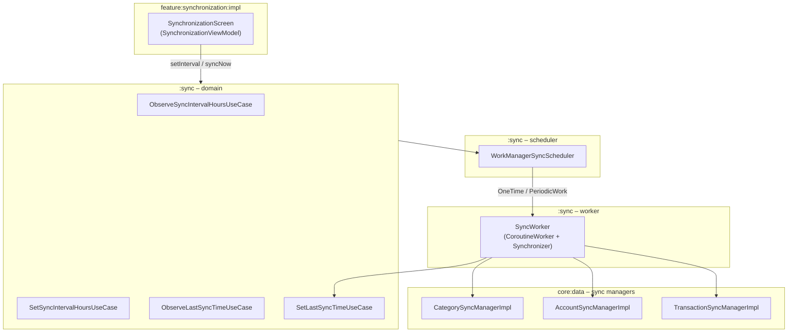

# Synchronization

Этот документ описывает, как в **Finance Manager** устроена синхронизация данных:
какие модули задействованы, как планируются фоновые задачи и в каком порядке
синхронизируются сущности.

## Goals

- Гарантировать **корректный порядок** синка:
    - сначала категории,
    - затем счета,
    - затем транзакции (которые зависят от счетов и категорий).
- Не блокировать UI — всё выполняется в фоне через WorkManager.
- Иметь централизованное место для управления:
    - интервалом периодической синхронизации;
    - триггером "одноразового" синка;
    - временем последней успешной синхронизации.

## High‑level overview

Синк реализован в отдельном модуле `:sync` и пересекается с:

- `core:data` — конкретные менеджеры синка для доменных сущностей;
- `core:network` — сетевые запросы;
- `core:database` — запись в Room;
- feature `synchronization:api/impl` — UI для управления синком.



### Порядок шагов в `SyncWorker`

Ключевая логика синка находится в `SyncWorker`:

1. Запускается `SyncWorker` (через `DelegatingWorker`) по расписанию или по требованию.
2. Внутри `doWork()`:
    - выполняется `CategorySyncManagerImpl.sync()` — категории не зависят ни от кого;
    - выполняется `AccountSyncManagerImpl.sync()` — счета опираются на категории;
    - выполняется `TransactionSyncManagerImpl.sync()` — транзакции зависят от счетов;
3. Каждый шаг оборачивается в `runStep(name) { ... }`:
    - логируем старт и завершение;
    - при ошибке возвращаем `Result.retry()`, чтобы WorkManager повторил задачу;
4. При успешном выполнении всех шагов вызывается `SetLastSyncTimeUseCase` с текущим временем.

Упрощённый псевдокод:

```kotlin
suspend fun doWork(): Result = withContext(ioDispatcher) {
    if (!runStep("CategorySync") { categorySyncManager.sync() }) return Result.retry()
    if (!runStep("AccountSync") { accountSyncManager.sync() }) return Result.retry()
    if (!runStep("TransactionSync") { transactionSyncManager.sync() }) return Result.retry()

    setLastSyncTimeUseCase(System.currentTimeMillis())
    Result.success()
}
```

### Планирование синка: `WorkManagerSyncScheduler`

Интервал и триггеры синка завязаны на `WorkManagerSyncScheduler`:

- **Периодический синк**:

```kotlin
val request = PeriodicWorkRequestBuilder<DelegatingWorker>(
    hours.toLong(),
    TimeUnit.HOURS
)
    .setConstraints(SyncConstraints)
    .setInputData(SyncWorker::class.delegatedData())
    .build()

WorkManager.getInstance(context)
    .enqueueUniquePeriodicWork(
        SYNC_PERIODIC_WORK,
        ExistingPeriodicWorkPolicy.KEEP,
        request
    )
```

- **Одноразовый синк** (например, по кнопке "Синхронизировать сейчас"):

```kotlin
val request = OneTimeWorkRequestBuilder<DelegatingWorker>()
    .setExpedited(OutOfQuotaPolicy.RUN_AS_NON_EXPEDITED_WORK_REQUEST)
    .setConstraints(SyncConstraints)
    .setInputData(SyncWorker::class.delegatedData())
    .build()

WorkManager.getInstance(context)
    .enqueueUniqueWork(
        SYNC_ONE_TIME_WORK,
        ExistingWorkPolicy.REPLACE,
        request
    )
```

### Constraints и foreground

- `SyncConstraints` — набор требований к окружению:
    - например, только при наличии сети / на зарядке (см. реализацию в `SyncConstraints.kt`);
- `SyncWorker.getForegroundInfo()` — использует `syncForegroundInfo()` для отображения
  foreground‑уведомления во время синка (особенно важно для длительных задач).

## Sync domain & UI

Модуль `:sync` содержит доменный слой вокруг синхронизации:

- **Use case’ы**:
    - `ObserveLastSyncTimeUseCase`, `ObserveSyncIntervalHoursUseCase`;
    - `SetLastSyncTimeUseCase`, `SetSyncIntervalHoursUseCase`.
- **Repository**:
    - `SyncRepository` / `SyncRepositoryImpl` — единая точка доступа к данным синка
      (например, хранит интервал в DataStore, время последнего синка и т.д.).

Фича `feature:synchronization:impl` подписывается на эти use case’ы, строит `SynchronizationUiState`
и позволяет пользователю:

- изменять интервал фоновой синхронизации;
- запускать синк вручную;
- видеть время последней успешной синхронизации и возможные ошибки.

## Summary

- Синк изолирован в модуле `:sync`, что упрощает поддержку и развитие.
- Порядок синка категорий → счетов → транзакций жёстко зафиксирован в `SyncWorker`.
- WorkManager используется как надёжный механизм планирования с retry‑логикой.
- Фичевая часть (`feature:synchronization:*`) работает только с use case’ами/репозиторием
  и не знает деталей реализации сетевых запросов или Room.

