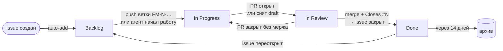
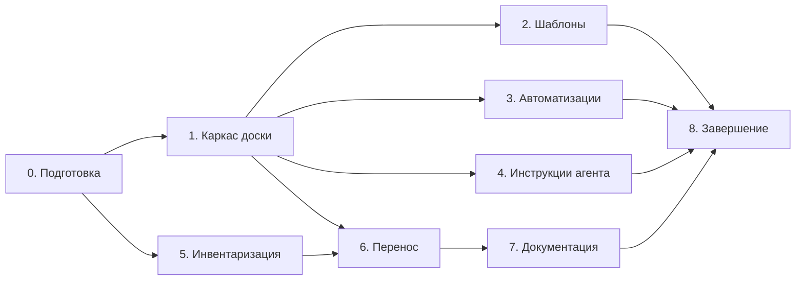

# План: доска задач на GitHub Projects

> Временный рабочий документ. После этапа 1 этапы 2–8 становятся эпиком на самой доске, и статус
> ведётся там, а не здесь. На этапе 8 файл удаляется; постоянное описание процесса живёт
> в `docs/task-tracking.md`.

## 1. Цель

- **Один источник правды по задачам** — доска GitHub Projects. Сейчас задачи разбросаны по
  `TODO.md`, Roadmap в `README.md`, чекбоксам в `docs/ci-cd.md`, разделам «Отложено» и
  «Ограничения» в других доках и по незакоммиченным планам в worktree.
- **Видно, что в работе** (не больше двух задач), **что брать следующим** (приоритет) и
  **что заблокировано** (лейблы).
- **Карточки двигаются сами** по веткам и PR. Агент создаёт карточки по шаблону и меняет статусы.
- **Документация описывает, как устроено и почему**, а не что ещё сделать, и оформлена
  в едином стиле.

**Готово, когда:** все источники перенесены, `TODO.md` удалён, в доках не осталось `- [ ]`
(кроме чек-листа в `docs/agents/release-process.md`), автоматизации проверены живым прогоном,
агент в новой сессии сам заводит карточку по шаблону.

## 2. Принятые решения

| Вопрос | Решение | Откуда |
| :--- | :--- | :--- |
| Методология | Personal Kanban: 4 колонки, лимит In Progress = 2, разбор раз в неделю по дайджесту | обсуждение |
| Колонки | Backlog → In Progress → In Review → Done | ответ |
| Что лежит на доске | Только issues. PR на доску не добавляем: когда открыт PR, issue сам переезжает в In Review. Черновики (draft items) не используем | по умолчанию |
| Сама доска | Проект пользователя `IliaVoskoboinikov` «Finance Manager», публичный, привязан к репозиторию | по умолчанию |
| Ключ задачи | `FM-<номер issue>`. Autolink `FM-` → issue, поэтому `FM-42` кликабелен в коммитах, PR и комментариях | ответ |
| Имя ветки | `FM-42-fix_navigation`: префикс, номер, понятное имя латиницей в snake_case | ответ |
| Коммит | Ключ в конце заголовка: `fix(navigation): починить возврат с экрана счёта (FM-42)` | по умолчанию |
| Находки аудита | Каждая из 59 — отдельная карточка, после перепроверки по `master`. Все — sub-issues эпика «Аудит багов 2026-10» | ответ |
| Права агента | Создаёт карточку после «да» (сначала показывает черновик), статусы и связи меняет сам | ответ |
| Документация | Единый стиль в Markdown, без сайта | ответ |
| Доп. автоматизации | Ветка → In Progress, дайджест в Telegram, красный `master` → баг. Release notes по лейблам не делаем | ответ |
| Бэкенд | У нас только READ на `chernykh-dev/finance-manager-backend`, поэтому задачи для бэкенда заводим у себя с лейблом `needs-backend` | по умолчанию |
| Находки безопасности | Публикуются обычными issues (например, C1 — обход PIN): реальных пользователей нет, релиз только после фикса | по умолчанию |
| Сделанное | Пункты `[x]` не переносим | по умолчанию |

## 3. Модель доски

### 3.1 Статусы



| Статус | Что значит | Как карточка туда попадает |
| :--- | :--- | :--- |
| Backlog | задача заведена, работа не начата | сама при создании issue; при переоткрытии |
| In Progress | работа идёт, есть ветка | push ветки `FM-N-…`; агент при старте работы; PR закрыт без мержа |
| In Review | открыт PR (не draft), идут CI и CodeRabbit | Action по PR из ветки `FM-N-…` |
| Done | issue закрыт | `Closes #N` при мерже закрывает issue, встроенное правило переводит в Done |

Лимит In Progress — 2. Доска подсвечивает превышение, дайджест о нём пишет, агент предупреждает
перед тем, как взять третью задачу.

### 3.2 Приоритет (поле Priority)

| Priority | Что значит | Что получит при переносе |
| :--- | :--- | :--- |
| P0 🔴 | Сломано сейчас: теряются или портятся данные и деньги, дыра безопасности, красный `master`. Берётся первым | C1–C8 из аудита; «Критично» из CI/CD; падение `assembleRelease` |
| P1 🟠 | Нужно до релиза v1.0 или заметный баг | S1–S19; этапы release-roadmap; «Важно» из CI/CD |
| P2 🟡 | Улучшение, техдолг, некритичный баг | M1–M20; «Улучшения» из CI/CD; архитектура; тесты |
| P3 ⚪ | Когда-нибудь | «Идеи на подумать»; часть U1–U12 |
| пусто | Не разобрано | новые карточки до еженедельного разбора |

### 3.3 Лейблы

| Группа | Лейблы | Правило |
| :--- | :--- | :--- |
| Тип | `bug`, `enhancement`, `documentation` (уже есть), `tech-debt` (новый) | ровно один |
| Область | `area:architecture`, `area:navigation`, `area:ui`, `area:data` (БД, сеть, репозитории), `area:sync`, `area:auth`, `area:security`, `area:notifications`, `area:ci`, `area:testing`, `area:release` | одна или несколько |
| Флаги | `blocked`, `needs-backend`, `needs-decision`, `epic`, `ci-failure` | по ситуации |
| Вне доски | `dependencies` | только Renovate |

- `blocked`: работу нельзя начать или продолжить. Если блокирует другая задача, дополнительно
  ставим штатную связь «blocked by».
- `needs-decision`: нужно решение владельца (например, валюта в v1). Агент такие задачи сам
  не берёт.
- `ci-failure`: ставит только автоматика «красный `master`».
- Удаляем неиспользуемые стандартные лейблы: `question`, `help wanted`, `good first issue`,
  `invalid`, `duplicate`, `wontfix`. Закрыть issue как дубль или «not planned» GitHub позволяет
  штатно.

### 3.4 Milestone и эпики

- **Milestone `v1.0 — Google Play`** — этапы из release-roadmap и всё, что обязано быть до релиза.
  Этап release-roadmap указывается в теле карточки.
- **Эпики** (лейбл `epic` + sub-issues): «Аудит багов 2026-10» (59), «Адресные пуши» (мобилка
  и `needs-backend`), «Валюта», «Доска задач» (этапы 2–8 этого плана). Остальные эпики
  определятся при инвентаризации, только для многошаговых результатов.

### 3.5 Представления (views)

| View | Вид | Фильтр | Группировка | Зачем |
| :--- | :--- | :--- | :--- | :--- |
| Board | Board | — | колонки по Status, лимит 2 на In Progress | работа каждый день |
| Backlog | Table | `status:Backlog` | по Priority, плюс колонка прогресса sub-issues | выбрать следующую задачу, разбор |
| Bugs | Table | `label:bug -status:Done` | по Priority | все баги одним списком |
| Release v1.0 | Board | `milestone:"v1.0 — Google Play"` | колонки по Status | сколько осталось до Play |
| Blocked | Table | `label:blocked,needs-backend,needs-decision -status:Done` | — | что ждёт внешнего |

### 3.6 Шаблон карточки

Одни и те же заголовки разделов в issue forms и в карточках, которые создаёт агент.
Заголовок карточки — действие по-русски, без префикса: «Починить балансы при смене счёта
в редактировании операции». Ключ `FM-N` даёт номер issue.

- **Баг:** Что происходит · Как воспроизвести · Ожидание · Где в коде · Источник
- **Фича / техдолг:** Зачем · Что сделать · Готово, когда · Затронутые модули · Вне задачи · Источник

«Источник» — откуда задача: `TODO.md → CI/CD`, `bug-audit C3`, «найдено при работе над FM-57».

## 4. Автоматизации

| Автоматизация | Триггер | Что делает | Где |
| :--- | :--- | :--- | :--- |
| Auto-add | новый или изменённый issue | `is:issue -label:dependencies` → на доску | встроенная, UI |
| Item added / reopened | карточка добавлена или переоткрыта | Status = Backlog | встроенная, UI |
| Item closed | issue закрыт | Status = Done | встроенная, UI |
| Auto-archive | `is:closed updated:<@today-2w` | Done старше 14 дней уходит в архив | встроенная, UI |
| Ветка → In Progress | создана ветка `FM-N-…` | #N: Backlog → In Progress (из других статусов не трогает) | `board.yml` |
| PR → In Review | PR открыт, переоткрыт или снят draft | #N → In Review; если в описании нет `Closes #N` — дописывает | `board.yml` |
| PR закрыт без мержа | `pull_request: closed`, не merged | #N → In Progress | `board.yml` |
| Ветка без ключа | PR не из `FM-N-…` (кроме `renovate/`, `releases/`, `tests/`) | замечание в summary джобы, сборку не валит | `board.yml` |
| Дайджест | понедельник 06:00 UTC (09:00 МСК) и вручную | сводка доски в Telegram | `board.yml` |
| Красный `master` | `workflow_run` для «CI» и «Security» на `master` | падение: issue `bug` + `ci-failure` + `area:ci`, P1, ссылка на прогон и упавшие джобы; если такой issue уже открыт — комментарий вместо дубля. Зелёный прогон закрывает открытый `ci-failure` | `ci-failure.yml` |
| Проверка связи PR и задачи | PR | CodeRabbit оценивает, закрывает ли PR связанный issue | `.coderabbit.yaml` |
| Dependency Dashboard | — | Renovate вешает на свой issue `dependencies`, иначе auto-add затянет его на доску | `renovate.json5` |
| Autolink | — | `FM-42` → ссылка на issue #42 | настройка репо |

**Общий помощник** `.github/scripts/board.py` (stdlib Python + `gh api graphql`): команды
`move <issue> <status>`, `priority <issue> <P>`, `add <issue>`, `digest`, флаг `--dry-run`.
Его вызывают и Actions, и агент локально, так что логика поиска карточки и смены полей
живёт в одном месте.

**Дайджест** (через новый `send-message-tg`, все значения передаются через `env:` — без
инъекции, которая есть в `send-file-tg`; её исправление — отдельная карточка P0 из `TODO.md`):

```
📋 Доска — неделя 41
🔨 В работе 2/2: FM-58 Балансы при смене счёта · FM-61 Гейт качества в cd_release
👀 На ревью: FM-63 Пин actions по SHA
⏳ Без движения >7 дней: FM-58
🔴 P0 в Backlog: 3   🆕 Без приоритета: 4 — пора разобрать
⛔ Заблокировано: 2 (needs-backend: 2)
✅ Закрыто за неделю: 5
```

**Токены и секреты**

| Что | Зачем | Кто заводит |
| :--- | :--- | :--- |
| `gh auth refresh -s project` | агенту локально читать и менять доску | ты |
| `PROJECT_TOKEN` (classic PAT, scope `project`) | `GITHUB_TOKEN` не может писать в доски пользователя, а fine-grained токены дают доступ к доскам только организаций | ты |
| `TG_TOKEN`, `TG_CHAT_BUILD` | дайджест | уже есть |
| `TG_THREAD_BOARD` | отдельная тема для дайджеста (без неё — в общий чат) | ты, по желанию |

## 5. Источники задач

| Источник | Где лежит | Пунктов | Примечание |
| :--- | :--- | :--- | :--- |
| `TODO.md` | worktree `analyze-update-todo` (сверен с кодом 2026-08-21) + правка про R8 из `bold-noyce`; сверить с `master` | ~60 | версия в `master` устарела |
| Roadmap | `README.md` | 7 | продуктовые задачи |
| «Что не сделано» | `docs/ci-cd.md` | 24 | дублирует `TODO.md` и уже разошёлся с ним (`permissions:`) |
| «Отложено», «Известные ограничения», адресные пуши | `docs/testing.md`, `docs/auth.md`, `docs/notifications.md`, `core/notifications/README.md` | ~10 | описание остаётся, задачи → карточки |
| Аудит багов | `docs/bug-audit.md` в worktree `app-bug-audit` | 59 | каждую перепроверить по `master` |
| Дорожная карта релиза | `docs/release-roadmap.md` в worktree `app-release-roadmap` | 37 + 6 решений | решения → `needs-decision` |
| Доки незамерженных веток | `post-commit-sync` (outbox, idempotency, post-commit-sync), `feature/encryption` | ? | только «хвосты»; карточки `blocked` до мержа |
| Незавершённая работа | PR #32, worktree с незакоммиченным кодом (`wonderful-vaughan` — auth, `competent-sinoussi` — data/DAO и другие) | ~5 | карточки In Progress / In Review — чтобы лимит WIP с первого дня был честным |
| План архитектурных правок | `docs/architecture-fix-plan.md` утерян: его нет ни в одной ветке и ни в одном worktree | — | восстановить из раздела «Архитектура» обновлённого `TODO.md` и зафиксированных решений |
| Хвост покрытия | ~115 непокрытых строк | 1 | P3 |

Для каждого пункта: актуален ли (проверка по коду в `master`) → нет ли дубля в другом источнике
→ тип, область, приоритет, флаги, milestone, эпик → текст по шаблону со строкой «Источник».
Результат — таблица `board-inventory.md` в корне worktree (не коммитится). Показываю её пачками
по источникам, карточки создаются только после «да».

## 6. Этапы



### Этап 0 — подготовка (ты)

1. `gh auth refresh -s project`.
2. Создать classic PAT со scope `project` и сохранить в секретах репо как `PROJECT_TOKEN`.
   Срок действия — себе в календарь.
3. По желанию: тема в Telegram-чате для дайджеста → секрет `TG_THREAD_BOARD`.
4. Подтвердить этот план или поправить решения из раздела 2.

### Этап 1 — каркас доски (агент после «да»; часть — ты в UI)

**Агент:**
1. Создать проект, сделать публичным, привязать к репо, заполнить описание и README проекта
   (короткие правила со ссылкой на `docs/task-tracking.md`).
2. Status: Backlog / In Progress / In Review / Done. Через GraphQL, если API позволяет изменить
   варианты, иначе — в твоём чек-листе.
3. Поле Priority: P0–P3 с описаниями.
4. Лейблы из 3.3 с цветами и описаниями. Удаление стандартных — отдельным «да» по списку.
5. Milestone `v1.0 — Google Play`, autolink `FM-`, `dependencyDashboardLabels` в `renovate.json5`.

**Ты в UI (~10 минут, по чек-листу, который я дам):** пять views из 3.5 с лимитом 2 на In Progress;
встроенные workflows из раздела 4 (auto-add, added/reopened → Backlog, closed → Done, архив).
Ни views, ни встроенные workflows через API не настраиваются.

**Затем:** эпик «Доска задач» с sub-issues = этапы 2–8. Дальше статус плана ведётся на доске.

**Проверка:** `gh project field-list` показывает поля и варианты; тестовый issue сам появляется
в Backlog.

### Этап 2 — шаблоны и соглашения (агент, файлы)

1. `.github/ISSUE_TEMPLATE/bug.yml`, `feature.yml`, `tech-debt.yml` — формы с разделами из 3.6,
   тип ставится лейблом, ключ `projects:` сразу кладёт issue на доску. `config.yml`.
2. `.github/pull_request_template.md`: `Closes #`, чек-лист готовности из
   `docs/agents/release-process.md` (тесты, ktlint, detekt, lint, `navDump`, README, KDoc), место
   под сводку CodeRabbit.
3. `.coderabbit.yaml`: оценка связанного issue. Ключ сверить со схемой; в текстах инструкций —
   без обратных кавычек.
4. `docs/task-tracking.md` — дизайн-документ процесса: статусы, приоритеты, лейблы, ветки,
   автоматизации, секреты. Ссылка из `docs/README.md`.

### Этап 3 — автоматизации (агент, файлы; живая проверка после твоего пуша)

1. `.github/scripts/board.py`.
2. `.github/actions/send-message-tg/action.yml`.
3. `.github/workflows/board.yml` (ветка, PR, дайджест) и `.github/workflows/ci-failure.yml`.
   Минимальный `permissions:`, `timeout-minutes`, `concurrency`.
4. **Локальная проверка:** `board.py --dry-run` на настоящей доске, разбор YAML; `actionlint` —
   если разрешишь его поставить.
5. **Живая проверка:** тестовый issue → ветка `FM-N-board_smoke_test` → draft PR → ready → закрыть
   без мержа → переоткрыть → закрыть issue. Дайджест — через `workflow_dispatch`. `ci-failure` —
   через `workflow_dispatch` с `dry_run`.

### Этап 4 — инструкции агента (агент)

1. `docs/agents/task-board.md` (на английском, как большинство `docs/agents/`):
   - когда заводить карточку: просьба пользователя, баг вне текущей задачи, отложенный хвост;
   - черновик по шаблону → «да» → создать, положить на доску, поставить Priority;
   - статусы: In Progress при старте (с проверкой лимита), остальное делает автоматика;
     вручную в Done не переводить и issues не закрывать;
   - `needs-decision` не брать;
   - в отчёте — `FM-N`, предлагаемое имя ветки и коммит с `(FM-N)`.
2. Корневые файлы инструкций агентов (включая `AGENTS.md`): подключить `task-board.md`, дополнить
   раздел о рабочем процессе. Правило «git делает только пользователь» не меняется: ветку
   `FM-N-…` создаёшь или переименовываешь ты.
3. Скилл проекта `board` рядом с `new-module`: готовые команды, номер проекта, ID полей и
   вариантов, тела карточек по шаблону, вызовы `board.py`.
4. `.github/copilot-instructions.md`: PR ссылается на задачу.
5. **Проверка в новой сессии:** «нашёл баг вне задачи» → черновик → «да» → карточка в Backlog
   с полями; «возьми FM-N» → In Progress.

### Этап 5 — инвентаризация (агент, без записи на GitHub)

Идёт параллельно с этапами 1–4. Самая долгая часть — перепроверка 59 находок аудита и ~60 пунктов
`TODO.md` по коду. Разбивка по источникам, 2–3 сессии. Результат — `board-inventory.md`.

### Этап 6 — перенос (агент, после «да» на каждую пачку)

1. Порядок: эпики → карточки → связи sub-issue → на доску → Priority → milestone.
2. Скрипт читает одобренную таблицу, идемпотентен (сохраняет соответствие «пункт → номер issue»),
   ~1 запрос в секунду из-за лимитов GitHub на создание контента.
3. **Проверка:** число карточек на доске совпадает с таблицей, у каждого пункта есть номер.

### Этап 7 — чистка и оформление документации (агент)

1. Удалить `TODO.md`. В `README.md` Roadmap → раздел «Задачи и планы» со ссылками на доску и
   milestone; бейджи CI, Security и доски.
2. `docs/ci-cd.md`: «Что не сделано» → абзац со ссылкой на фильтр `area:ci`; обоснования
   переехали в карточки.
3. `docs/testing.md`, `docs/auth.md`, `docs/notifications.md`, `core/notifications/README.md`:
   описание поведения остаётся, задачи заменяются ссылками `#N`.
4. Ссылки на `TODO.md` в `help_comand.md` (5 мест), `docs/agents/security.md`,
   `.github/copilot-instructions.md`, `docs/ci-cd.md` → на карточки.
5. **Единый стиль документа:**
   - порядок разделов: заголовок → аннотация в 2–3 строки (о чём и для кого) → схема →
     содержательные разделы → «Решения и почему» → «Ограничения» → «Связанные задачи» →
     «Ключевые файлы»;
   - оглавление руками не пишем — GitHub строит его сам;
   - `docs/README.md` становится каталогом по разделам (архитектура, данные и синхронизация,
     навигация, безопасность и авторизация, качество и CI, процесс);
   - исправить опечатки.
6. README модулей (50 штук) не переоформляем — только ссылки. Их выравнивание — отдельная
   карточка P3.
7. **Проверка:** grep — нет `TODO.md` и `- [ ]` (кроме `release-process.md`); скрипт проверки
   относительных ссылок и якорей.

### Этап 8 — завершение

1. Память агента: заметки-трекеры (аудит, дорожная карта, планы правок) заменить ссылкой на доску.
2. Worktree, содержимое которых перенесено (`app-bug-audit`, `app-release-roadmap`,
   `analyze-update-todo`, `bold-noyce`), можно удалить — решаешь ты.
3. Удалить этот план. Первый еженедельный разбор — по первому дайджесту.
4. Предлагаемые коммиты, по одному на этап:
   - `chore(github): шаблоны issue и PR для доски задач`
   - `ci(board): статусы карточек по веткам и PR, дайджест в Telegram, баг при красном master`
   - `docs(agents): правила работы с доской задач`
   - `docs: перенести бэклог на доску и привести документацию к единому стилю`

## 7. Риски

- **PAT истечёт** — автоматизации молча перестанут двигать карточки. Первым упадёт дайджест,
  это и будет сигналом; срок токена — в календарь.
- **Бесплатный план: один auto-add workflow.** Хватает на один репозиторий. Бэкенд-репо
  подключить так нельзя, да и прав нет.
- **Ветки worktree, которые создаёт приложение агента, называются не по шаблону** — автоматика
  их не видит. Агент двигает карточку сам, а при пуше ты называешь ветку `FM-N-…`.
- **Всё публично**, включая находки безопасности.
- **Конфликты:** этап 7 правит `docs/`, а их же меняют PR #32 и `feature/encryption`. Лучше
  влить их до этапа 7 — это и так первые P0-карточки.
- **Объём:** ~200 карточек. Перепроверка аудита — самая долгая часть; при создании — лимиты
  GitHub на частоту.
- **Views и встроенные workflows настраиваются только в UI.** Если доску пересоздавать —
  повторять руками по чек-листу из `docs/task-tracking.md`.

## 8. Ключевые файлы

| Файл | Этап | Роль |
| :--- | :--- | :--- |
| `.github/ISSUE_TEMPLATE/*.yml` | 2 | формы баг / фича / техдолг, сразу на доску |
| `.github/pull_request_template.md` | 2 | `Closes #N` и чек-лист готовности |
| `.coderabbit.yaml` | 2 | оценка связанного issue |
| `docs/task-tracking.md` | 2 | дизайн процесса — заменяет этот план |
| `.github/scripts/board.py` | 3 | общий помощник для Actions и агента |
| `.github/actions/send-message-tg/action.yml` | 3 | безопасная отправка текста в Telegram |
| `.github/workflows/board.yml` | 3 | ветка → In Progress, PR → In Review, дайджест |
| `.github/workflows/ci-failure.yml` | 3 | красный `master` → баг, зелёный → закрыть |
| `.github/renovate.json5` | 1 | лейбл на Dependency Dashboard |
| `docs/agents/task-board.md` | 4 | правила для агента |
| `TODO.md` | 7 | удаляется |
| `README.md`, `docs/README.md`, `docs/*.md` | 7 | ссылки на доску, единый стиль |
