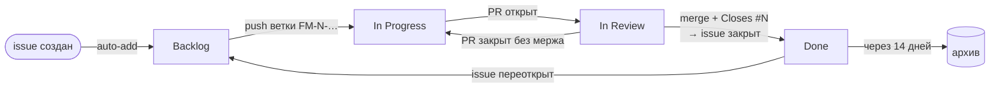

# Доска задач

Задачи **Finance Manager** живут в одном месте — на [GitHub Projects-доске](https://github.com/users/IliaVoskoboinikov/projects/5).
Это Personal Kanban для одного разработчика: четыре колонки, приоритет на каждой карточке и
минимум ручной работы — статусы двигаются по веткам и PR. Документ описывает модель (статусы,
приоритеты, лейблы), ключ задачи и имена веток, автоматизации и то, что нужно повторить руками,
если доску придётся пересоздать.

Документация описывает, **как устроено и почему**, а не что ещё предстоит сделать: список
задач — только на доске.

## Жизненный цикл карточки



На доску попадают только issues. PR отдельной карточкой не становится: когда к issue привязан
PR, переезжает сама задача.

## Статусы

| Статус | Что значит | Как карточка туда попадает |
| :--- | :--- | :--- |
| Backlog | задача заведена, работа не начата | сама, при создании или переоткрытии issue |
| In Progress | работа идёт, есть ветка | push ветки `FM-N-…` или старт работы агентом; PR, закрытый без мержа или переведённый в черновик, возвращает сюда |
| In Review | открыт PR (не черновик), идут CI и ревью | автоматика по PR |
| Done | issue закрыт | `Closes #N` при мерже закрывает issue, встроенное правило переводит в Done |

Жёсткого лимита на колонки нет. Ориентир — не больше двух задач в работе одновременно: чем
меньше начатого, тем быстрее закрывается начатое. Эпики в этот счёт не входят.

Карточку, брошенную на полпути, возвращаем в Backlog, а не оставляем в In Progress.

## Приоритет

Приоритет — поле проекта `Priority`, а не лейбл: по нему сортируется доска, и в колонке
Backlog следующая задача всегда сверху.

| Priority | Что значит |
| :--- | :--- |
| P0 | сломано сейчас: теряются или портятся данные и деньги, дыра в безопасности, красный `master`. Берётся первым |
| P1 | нужно до релиза v1.0 или заметный баг |
| P2 | улучшение, техдолг, некритичный баг |
| P3 | когда-нибудь: идеи и nice-to-have |
| пусто | не разобрано; разбирается раз в неделю |

## Лейблы

| Группа | Лейблы | Правило |
| :--- | :--- | :--- |
| Тип | `bug`, `enhancement`, `tech-debt`, `documentation` | ровно один |
| Область | `area:architecture`, `area:navigation`, `area:ui`, `area:data`, `area:sync`, `area:auth`, `area:security`, `area:notifications`, `area:ci`, `area:testing`, `area:release` | одна или несколько |
| Флаги | `blocked`, `needs-backend`, `needs-decision`, `epic`, `ci-failure` | по ситуации |
| Вне доски | `dependencies` | только Renovate; такие issues на доску не попадают |

- `blocked` — работу нельзя начать или продолжить; блокер указан в описании. Если блокирует
  другая задача, дополнительно ставится штатная связь «blocked by».
- `needs-backend` — нужны изменения на бэкенде. Доступа на запись в его репозиторий нет,
  поэтому такие задачи заводятся здесь.
- `needs-decision` — нужно решение владельца проекта. AI-агент такие карточки сам не берёт.
- `epic` — крупная задача; её части — sub-issues, прогресс виден на карточке.
- `ci-failure` — ставит только автоматика при красном `master`.

## Ключ задачи, ветки и коммиты

Ключ задачи — `FM-<номер issue>`. Автоссылка репозитория превращает `FM-42` в ссылку на
issue #42 в коммитах, PR и комментариях.

| Что | Формат | Пример |
| :--- | :--- | :--- |
| Ветка | `FM-<номер>-<понятное_имя>` латиницей в snake_case | `FM-42-fix_navigation` |
| Коммит | Conventional Commits, ключ в конце заголовка | `fix(navigation): починить возврат с экрана счёта (FM-42)` |
| PR | строка `Closes #42` в описании | — |

Ветки Renovate (`renovate/…`), релизные (`releases/…`) и тестовые (`tests/…`) в схему не
входят.

## Эпики и milestone

- **Эпик** — issue с лейблом `epic` и sub-issues. Нужен для многошаговых результатов
  («Перенести бэклог на доску»), а не для группировки по темам: тема — это `area:*`.
- **Milestone `v1.0 — Google Play`** — всё, что обязано быть сделано до первого релиза.
  Прогресс релиза — на странице milestone, отдельного представления на доске нет.

## Шаблон карточки

Одни и те же разделы в формах issue и в карточках, которые заводит агент. Заголовок — действие
по-русски, без префикса: «Починить балансы при смене счёта в редактировании операции».

| Тип | Разделы |
| :--- | :--- |
| Баг | Что происходит · Как воспроизвести · Ожидание · Где в коде · Источник |
| Фича, техдолг, эпик | Зачем · Что сделать · Готово, когда · Затронутые модули · Вне задачи · Источник |

«Источник» — откуда взялась задача: «найдено при работе над FM-57», «аудит C3», «сбой CI».

## Автоматизации

| Автоматизация | Что делает | Где |
| :--- | :--- | :--- |
| Auto-add | issue без лейбла `dependencies` попадает на доску (`is:issue is:open -label:dependencies`) | встроенная, UI |
| Item added / reopened | Status = Backlog | встроенная, UI |
| Item closed, PR merged | Status = Done | встроенная, UI |
| Auto-close issue | перенос карточки в Done закрывает issue | встроенная, UI |
| Auto-archive | закрытые карточки без движения две недели уходят в архив (`is:closed updated:<@today-2w`) | встроенная, UI |
| Auto-add sub-issues | подзадачи эпика попадают на доску | встроенная, UI |
| Ветка → In Progress | первый push ветки `FM-N-…` переводит задачу из Backlog; задачу в другом статусе не трогает | `board.yml` |
| PR → статус и `Closes #N` | открытый PR — In Review; черновик или PR, закрытый без мержа, — In Progress; в описание PR дописывается `Closes #N`, если его нет. PR из ветки не по схеме получает замечание в сводке джобы | `board.yml` |
| Дайджест | сводка доски в Telegram по понедельникам: в работе, на ревью, застрявшее, что брать дальше, P0, без приоритета, заблокированное, прогресс эпиков | `board.yml` |
| Красный `master` | issue с лейблами `bug` и `ci-failure` и приоритетом P1; повторное падение — комментарий; зелёный прогон того же workflow закрывает issue | `ci-failure.yml` |
| Связь PR и задачи | CodeRabbit проверяет, закрывает ли PR связанный issue | `.coderabbit.yaml` |

Дополнительно шаблон PR подставляет `Closes #` и чек-лист того, чего не видит CI.

Логика `board.yml` и `ci-failure.yml` живёт в скриптах `.github/scripts/` (stdlib Python и `gh`),
поэтому её можно запускать и локально, а флаг `--dry-run` показывает изменения, не внося их:

```bash
python3 .github/scripts/board.py digest
python3 .github/scripts/board.py --dry-run move "In Progress" --issue 42 --only-from Backlog
python3 .github/scripts/ci_failure.py --dry-run --run-id <id прогона на master>
python3 -m unittest discover -s .github/scripts -p 'test_*.py'
```

Операции с доской идут с секретом `PROJECT_TOKEN`, остальное — с токеном Actions и минимальными
правами. Для сводки в Telegram используются `TG_TOKEN` и `TG_CHAT_BUILD`; отдельную тему чата
задаёт необязательный `TG_THREAD_BOARD`.

## Еженедельный разбор

Раз в неделю, минут пятнадцать:

1. Карточки без приоритета: фильтр `no:priority` — проставить Priority и `area:*`.
2. Карточки с `blocked`, `needs-backend`, `needs-decision`: что-то изменилось?
3. Всё, что висит в In Progress без движения, — вернуть в Backlog или довести.

## Настройка доски

Представления, встроенные workflows и сортировка через API не настраиваются, поэтому при
пересоздании доски их нужно повторить руками.

- **Поля:** `Status` с вариантами Backlog / In Progress / In Review / Done, `Priority` с
  вариантами P0–P3. Описания у вариантов не заполняем.
- **Представление:** одно, `Board`: колонки по Status, карточки отсортированы по Priority по
  возрастанию, на карточке видны Priority, лейблы, прогресс подзадач и связанные PR.
- **Workflows** (меню доски → Workflows): включены все, кроме «Code changes requested»,
  «Code review approved» и «Pull request linked to issue».
  - Item added to project и Item reopened → Status = Backlog.
  - Item closed и Pull request merged → Status = Done.
  - Auto-close issue: при Status = Done закрыть issue.
  - Auto-add to project: репозиторий `Finance-Manager`, фильтр
    `is:issue is:open -label:dependencies`.
  - Auto-archive items: фильтр `is:closed updated:<@today-2w`.

Названия и описания колонок правим только в интерфейсе. После замены вариантов Status через API
встроенные workflows остаются без значений и перестают работать.

## Решения и почему

- **Personal Kanban, а не Scrum.** Спринты, оценки и роли нужны, чтобы синхронизировать людей;
  разработчик один, поэтому хватает потока задач и приоритета.
- **Одно представление.** Остальные срезы — фильтры в строке поиска (`label:bug`,
  `label:blocked`, `milestone:"v1.0 — Google Play"`); отдельные вкладки дублировали бы доску.
- **Приоритет — поле, а не лейбл.** Поле можно сортировать и показывать на карточке.
- **PR не карточки.** Иначе одна задача занимала бы две карточки; статус задачи определяется
  состоянием её PR.
- **Ключ `projects:` в формах issue не используется.** Добавление на доску делает Auto-add —
  одно правило вместо двух.
- **Для автоматизаций нужен PAT, а не `GITHUB_TOKEN`.** Токен Actions не может менять доски
  пользователя; у fine-grained токенов доступ к доскам есть только у организаций.

## Ограничения

- Токен автоматизаций (секрет `PROJECT_TOKEN`, classic PAT со scope `project`) истекает;
  срок действия стоит отслеживать. Когда он истечёт, карточки перестанут двигаться
  автоматически, а дайджест перестанет приходить.
- Бесплатный план: одно правило Auto-add на доску. Репозиторий бэкенда подключить нельзя, да и
  прав на него нет.
- Репозиторий публичный: карточки видны всем, включая находки по безопасности.
- Формы issue и шаблон PR начинают действовать только после попадания в `master`. То же верно
  для расписания сводки и события `workflow_run` (`ci-failure.yml`): GitHub берёт их из файла в
  ветке по умолчанию. Переходы по веткам и PR срабатывают уже из самой ветки. Сводку можно
  запустить вручную и с ветки: `gh workflow run board.yml --ref <ветка> -f dry_run=true`;
  `ci-failure.yml` для ручного запуска GitHub увидит только после мержа.
- Автоматика узнаёт задачу только по имени ветки `FM-N-…`. Ветка с другим именем карточку не
  двигает — статус тогда меняется вручную.
- PR из форков автоматику не запускают: у них нет доступа к секретам.

## Связанные задачи

Эпик [#47](https://github.com/IliaVoskoboinikov/Finance-Manager/issues/47) «Перенести бэклог на
доску задач» и его части: шаблоны и процесс (#48), автоматизации (#49), правила для
AI-агента (#50), инвентаризация (#51), перенос (#52), чистка документации (#53),
завершение (#54).

## Ключевые файлы

| Файл | Роль |
| :--- | :--- |
| [`.github/ISSUE_TEMPLATE/bug.yml`](../.github/ISSUE_TEMPLATE/bug.yml) | форма баг-репорта |
| [`.github/ISSUE_TEMPLATE/feature.yml`](../.github/ISSUE_TEMPLATE/feature.yml) | форма фичи |
| [`.github/ISSUE_TEMPLATE/tech-debt.yml`](../.github/ISSUE_TEMPLATE/tech-debt.yml) | форма техдолга |
| [`.github/ISSUE_TEMPLATE/config.yml`](../.github/ISSUE_TEMPLATE/config.yml) | пустые issue разрешены, ссылка на этот документ |
| [`.github/pull_request_template.md`](../.github/pull_request_template.md) | `Closes #` и чек-лист, место под сводку CodeRabbit |
| [`.github/workflows/board.yml`](../.github/workflows/board.yml) | статусы по веткам и PR, недельная сводка |
| [`.github/workflows/ci-failure.yml`](../.github/workflows/ci-failure.yml) | красный `master` → issue |
| [`.github/scripts/board.py`](../.github/scripts/board.py) | команды доски: `add`, `move`, `priority`, `pr-sync`, `digest` |
| [`.github/scripts/ci_failure.py`](../.github/scripts/ci_failure.py) | завести, дополнить и закрыть issue по прогону |
| [`.github/scripts/test_board.py`](../.github/scripts/test_board.py) | тесты чистой логики скриптов |
| [`.github/actions/send-message-tg/action.yml`](../.github/actions/send-message-tg/action.yml) | отправка текста в Telegram |
| [`.coderabbit.yaml`](../.coderabbit.yaml) | проверка связи PR и задачи (`issue_assessment`) |
| [`.github/renovate.json5`](../.github/renovate.json5) | лейбл `dependencies` на Dependency Dashboard, чтобы он не попадал на доску |
