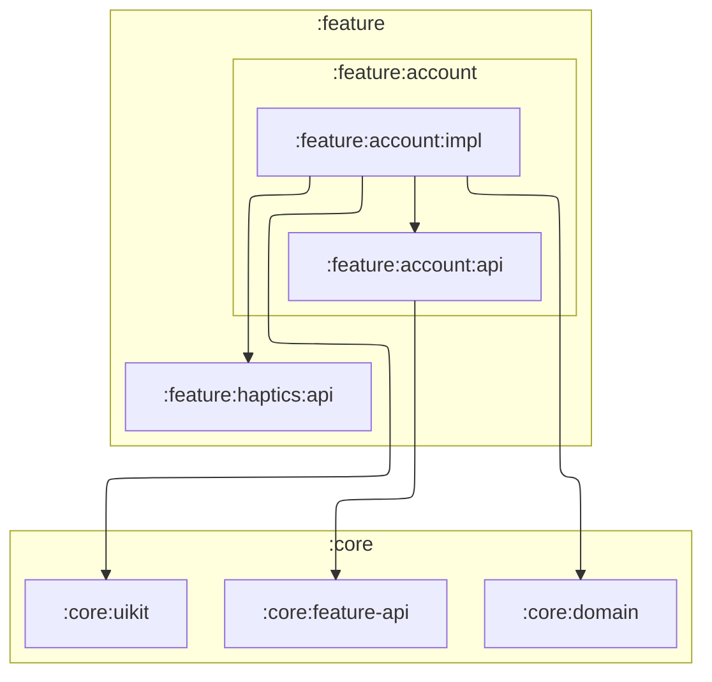

# `:feature:account:impl`

## Responsibility

Создание и редактирование счёта пользователя: экран `AccountScreen` и `AccountViewModel`
(режимы `AccountMode.Create` / `AccountMode.Edit` — имя, баланс, валюта), а также удаление
счёта с экрана редактирования.

Use case-ы модуля: `CreateAccountUseCase`, `UpdateAccountUseCase`, `GetAccountByIdUseCase`,
`DeleteAccountUseCase`. Удаление — мягкое (offline-first): в data-слое счёт помечается
`syncStatus = PENDING_DELETE` и не удаляется, пока по нему есть транзакции
(проверка в `AccountRepositoryImpl.delete`).

Модуль реализует `AccountFeatureApi` из `:feature:account:api` и регистрирует свой
навигационный граф в `app`.

## Module dependency graph

<!--region graph-->

