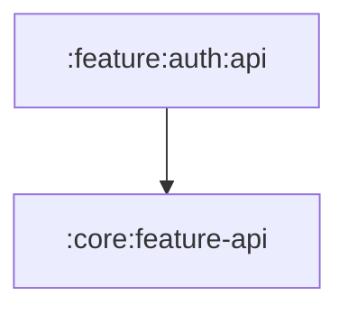

# `:feature:auth:api`

## Responsibility

Предоставление API для фичи авторизации: `AuthFeatureApi` (маршруты экранов входа и
профиля, регистрация навигационного графа с колбэком `onFinish`).

## Module dependency graph

<!--region graph-->

