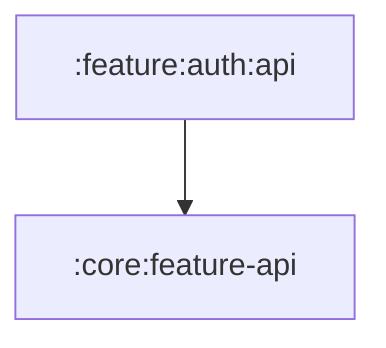

# `:feature:auth:api`

## Responsibility

Предоставление API для фичи авторизации: ключи экранов (`AuthKey` — вход как точка входа
в приложение, `ProfileKey`, `ProfileAuthKey`) и `AuthFeatureApi` с дополнительной
регистрацией корневого экрана входа (`registerRootEntries` с колбэком `onAuthSuccess`).

## Module dependency graph

<!--region graph-->

```mermaid
graph TB
    :feature:auth:api --> :core:feature-api

    classDef android-library fill:#9BF6FF,stroke:#000,stroke-width:2px,color:#000;
```
