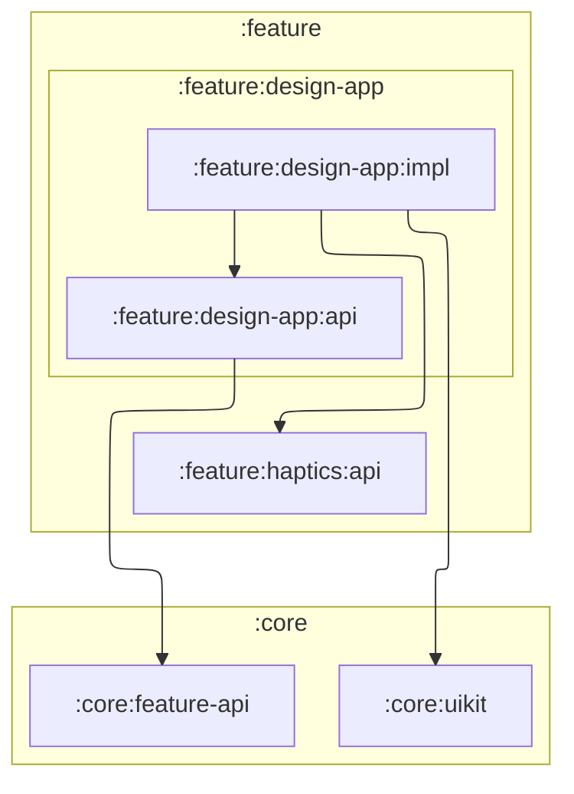

# `:feature:design-app:impl`

## Responsibility

Реализация визуальных компонентов и UI-дизайна приложения.

## Module dependency graph

<!--region graph-->

```mermaid
---
config:
  layout: elk
  elk:
    nodePlacementStrategy: SIMPLE
---
graph TB
    subgraph :feature
        subgraph :feature:design-app
            :feature:design-app:api
            :feature:design-app:impl
        end

        :feature:haptics:api
    end

    subgraph :core
        :core:uikit
        :core:feature-api
    end

    :feature:design-app:impl --> :feature:design-app:api
    :feature:design-app:impl --> :core:uikit
    :feature:design-app:impl --> :feature:haptics:api
    :feature:design-app:api --> :core:feature-api

    classDef android-library fill:#9BF6FF,stroke:#000,stroke-width:2px,color:#000;
```