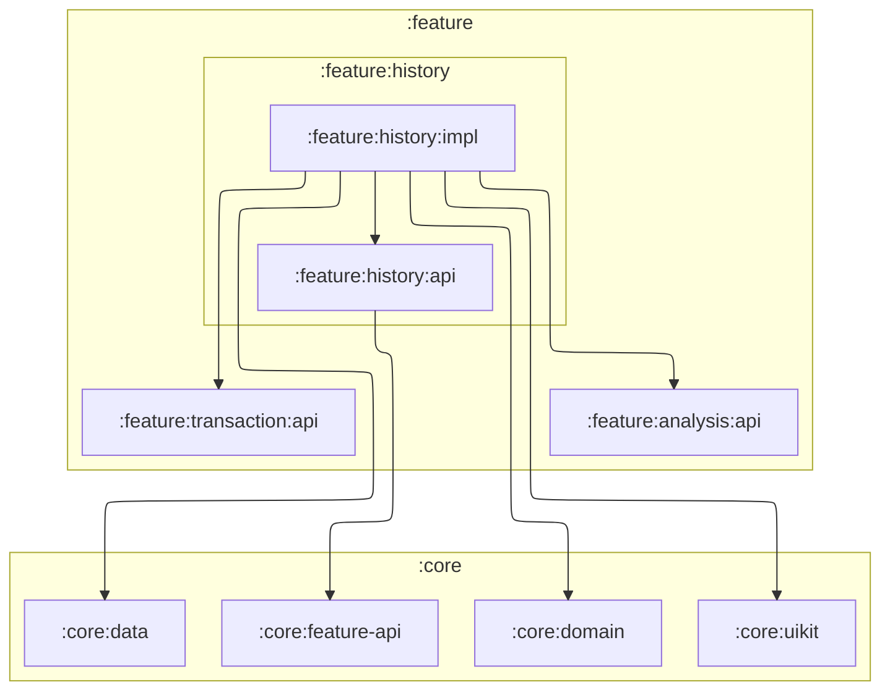

# `:feature:history:impl`

## Responsibility

Отображение и обработка истории операций пользователя.

## Module dependency graph

<!--region graph-->

```mermaid
---
config:
  layout: elk
  elk:
    nodePlacementStrategy: SIMPLE
---
graph TB
    subgraph :feature
        subgraph :feature:history
            :feature:history:api
            :feature:history:impl
        end

        :feature:transaction:api
        :feature:analysis:api
    end

    subgraph :core
        :core:domain
        :core:data
        :core:uikit
        :core:feature-api
    end

    :feature:history:impl --> :feature:history:api
    :feature:history:impl --> :core:domain
    :feature:history:impl --> :core:data
    :feature:history:impl --> :core:uikit
    :feature:history:impl --> :feature:transaction:api
    :feature:history:impl --> :feature:analysis:api

    :feature:history:api --> :core:feature-api

    classDef android-library fill:#9BF6FF,stroke:#000,stroke-width:2px,color:#000;
```