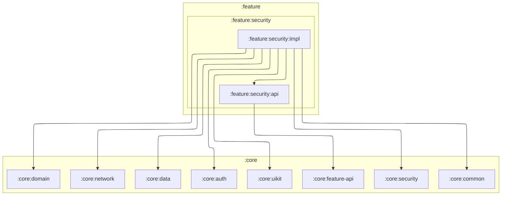

# `:feature:security:impl`

## Responsibility

Обеспечение безопасности приложения и пользовательских данных:

- **PIN-код** — хэш (PBKDF2 + salt, `PinHasher`) зашифрован `CryptoManager`; им проверяется
  UI-замок и подтверждения на уровнях защиты без PIN;
- **экран замка** (`PinLockScreen`) — UI-замок и разблокировка базы уровня PIN: учёт попыток и
  паузы, «Забыли PIN?» (стирание с выходом из аккаунта), вход по биометрии через
  `androidx.biometric` + `CryptoObject` (`BiometricAuthenticator`);
- **восстановление** (`KeyLostScreen`) — ключ базы утерян: повторить или стереть данные;
- **настройки** (`SecurityScreen`) — выбор уровня защиты данных (без защиты ключа / ключ
  устройства / PIN) с предупреждениями, смена и удаление PIN, вход по отпечатку, тумблер
  «Скрывать содержимое» (`FLAG_SECURE`, включён по умолчанию).

Ключи и сама база — в `:core:data` / `:core:security`; фича работает через доменные
репозитории и биометрический шлюз `LocalDataBiometrics`, ключ базы до неё не доходит. Дизайн —
[docs/encryption.md](../../docs/encryption.md).

## Module dependency graph

<!--region graph-->

