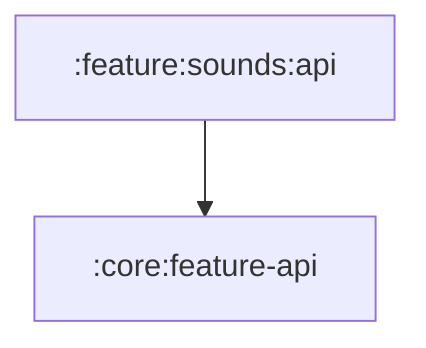

# `:feature:sounds:api`

## Responsibility

Предоставление API для звуковой обратной связи.

## Module dependency graph

<!--region graph-->

```mermaid
graph TB
    :feature:sounds:api --> :core:feature-api

    classDef android-library fill:#9BF6FF,stroke:#000,stroke-width:2px,color:#000;
```