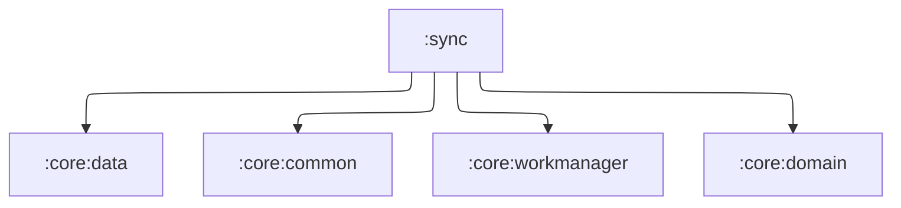

# `:sync`

## Responsibility

Служба синхронизации данных приложения.

- `SyncWorker` запускается только на открытых локальных данных: база уровня PIN заперта или ключ
  утерян — `Result.success()` без работы (`retry()` дал бы шторм повторов на закрытой базе).
  Воркер в свежем процессе ждёт конца инициализации ключей.
- `SyncInitializer` планирует периодический синк и запускает разовый **при каждом** переходе
  данных в `Open`: на уровне PIN это каждая разблокировка. См.
  [docs/encryption.md](../docs/encryption.md).

## Module dependency graph

<!--region graph-->

